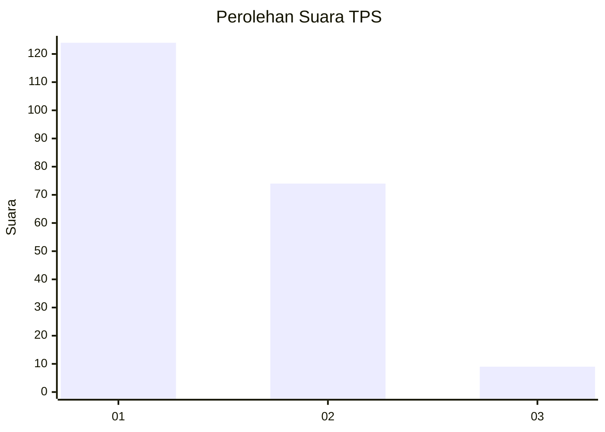
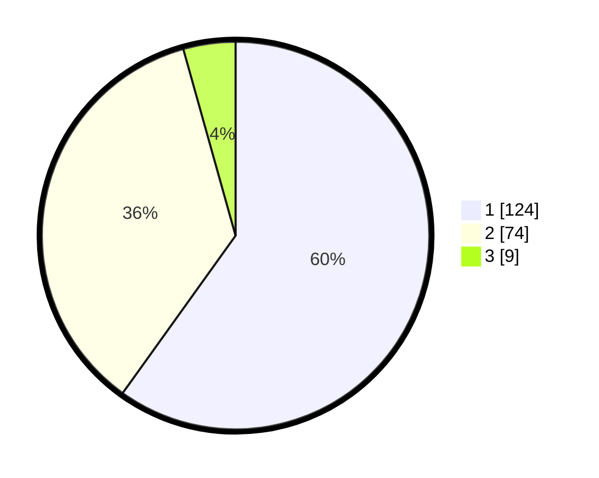

# Hasil

## Grafik

## Tabel

| No. | Nama Paslon    | Suara | Suara (raw) | Persentase |
|:--- |:-------------- | -----:| -----------:| ----------:|
| 1   | ANIES MUHAIMIN | 124   | [124][p-1]  | 59,90      |
| 2   | PRABOWO GIBRAN | 74    | [74][p-2]   | 35,75      |
| 3   | GANJAR MAHFUD  | 9     | [9][p-3]    | 4,35       |

[p-1]: https://github.com/gigit-pemilu/pemilu-2024/blob/main/pilpres/hitung-suara/sub/12-sumatera-utara/sub/71-kota-medan/sub/01-medan-kota/sub/1010-sudirejo-1/sub/006-tps/sub/paslon-1.txt
[p-2]: https://github.com/gigit-pemilu/pemilu-2024/blob/main/pilpres/hitung-suara/sub/12-sumatera-utara/sub/71-kota-medan/sub/01-medan-kota/sub/1010-sudirejo-1/sub/006-tps/sub/paslon-2.txt
[p-3]: https://github.com/gigit-pemilu/pemilu-2024/blob/main/pilpres/hitung-suara/sub/12-sumatera-utara/sub/71-kota-medan/sub/01-medan-kota/sub/1010-sudirejo-1/sub/006-tps/sub/paslon-3.txt

## Foto C Plano

https://sirekap-obj-formc.kpu.go.id/fc02/pemilu/ppwp/12/71/01/10/10/1271011010006-20240215-062113--a7684843-c26e-4c7b-8cee-4e99eff0a27f.jpg

https://sirekap-obj-formc.kpu.go.id/fc02/pemilu/ppwp/12/71/01/10/10/1271011010006-20240215-062252--7a5c940c-68ce-4a12-b290-21241dc730cd.jpg

https://sirekap-obj-formc.kpu.go.id/fc02/pemilu/ppwp/12/71/01/10/10/1271011010006-20240215-062415--e1266031-8f72-4176-99ba-a42c278bb798.jpg

## Metadata

| Key        | Value               |
| ---------- | ------------------- |
| Time Stamp | 2024-02-25 00:00:00 |

