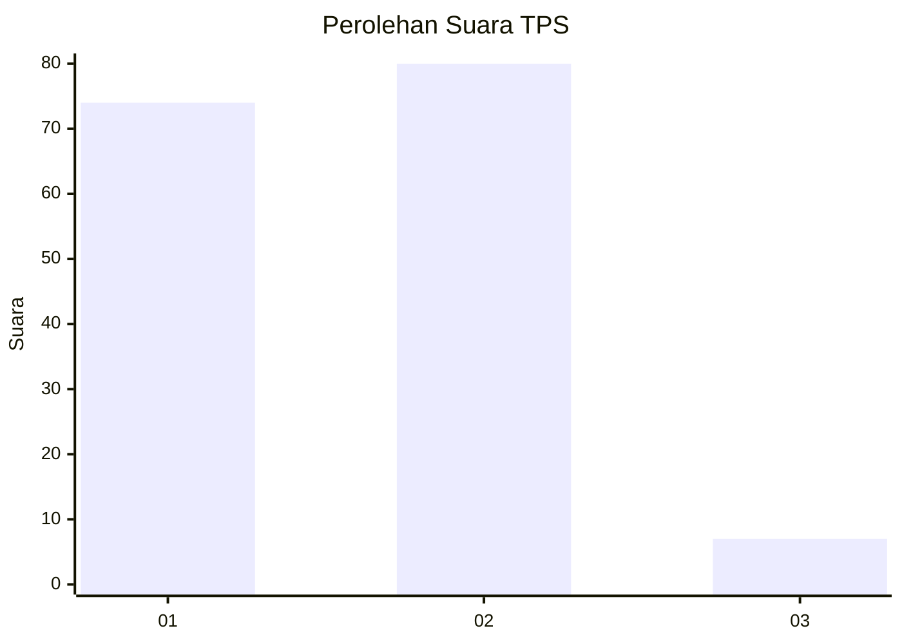
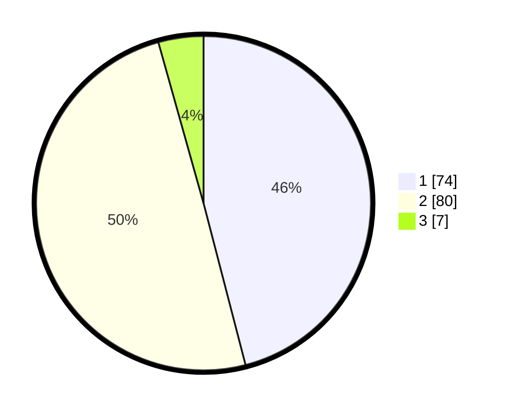

# Hasil

## Grafik

## Tabel

| No. | Nama Paslon    | Suara | Suara (raw) | Persentase |
|:--- |:-------------- | -----:| -----------:| ----------:|
| 1   | ANIES MUHAIMIN | 74    | [74][p-1]   | 45,96      |
| 2   | PRABOWO GIBRAN | 80    | [80][p-2]   | 49,69      |
| 3   | GANJAR MAHFUD  | 7     | [7][p-3]    | 4,35       |

[p-1]: https://github.com/gigit-pemilu/pemilu-2024/blob/main/pilpres/hitung-suara/sub/12-sumatera-utara/sub/71-kota-medan/sub/02-medan-sunggal/sub/1001-lalang/sub/006-tps/sub/paslon-1.txt
[p-2]: https://github.com/gigit-pemilu/pemilu-2024/blob/main/pilpres/hitung-suara/sub/12-sumatera-utara/sub/71-kota-medan/sub/02-medan-sunggal/sub/1001-lalang/sub/006-tps/sub/paslon-2.txt
[p-3]: https://github.com/gigit-pemilu/pemilu-2024/blob/main/pilpres/hitung-suara/sub/12-sumatera-utara/sub/71-kota-medan/sub/02-medan-sunggal/sub/1001-lalang/sub/006-tps/sub/paslon-3.txt

## Foto C Plano

https://sirekap-obj-formc.kpu.go.id/474a/pemilu/ppwp/12/71/02/10/01/1271021001006-20240215-023604--da3cce8d-099d-482a-87f2-79cb74a3b8f7.jpg

https://sirekap-obj-formc.kpu.go.id/474a/pemilu/ppwp/12/71/02/10/01/1271021001006-20240215-022804--f42fa060-6511-4cf3-888d-987c4de6f49f.jpg

https://sirekap-obj-formc.kpu.go.id/474a/pemilu/ppwp/12/71/02/10/01/1271021001006-20240215-022456--ddef6d16-1390-4e6c-8092-338deda501c3.jpg

## Metadata

| Key        | Value               |
| ---------- | ------------------- |
| Time Stamp | 2024-02-24 22:31:28 |

