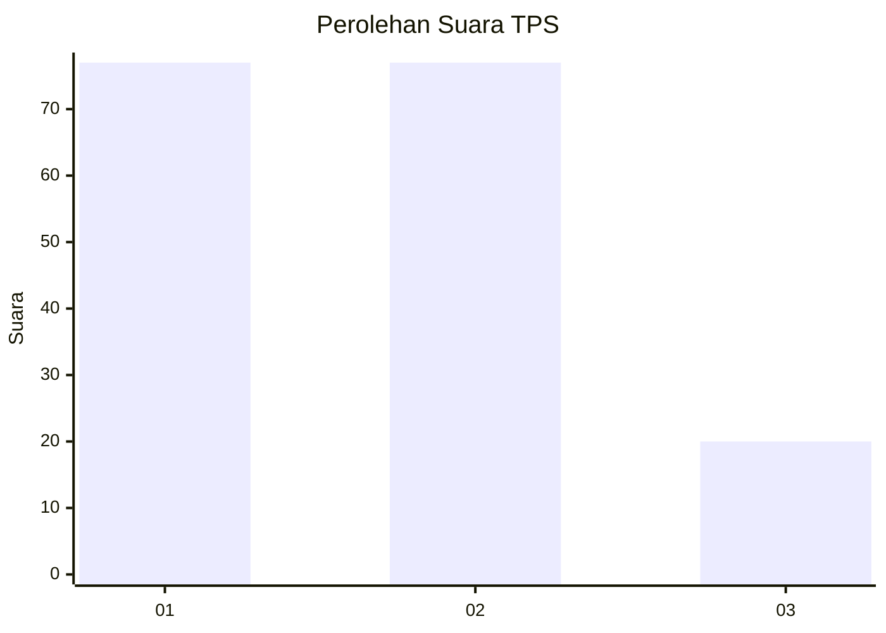
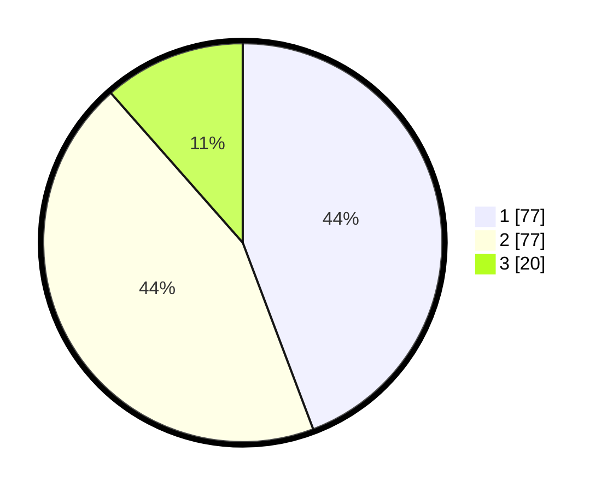

# Hasil

## Grafik

## Tabel

| No. | Nama Paslon    | Suara | Suara (raw) | Persentase |
|:--- |:-------------- | -----:| -----------:| ----------:|
| 1   | ANIES MUHAIMIN | 77    | [77][p-1]   | 44,25      |
| 2   | PRABOWO GIBRAN | 77    | [77][p-2]   | 44,25      |
| 3   | GANJAR MAHFUD  | 20    | [20][p-3]   | 11,49      |

[p-1]: https://github.com/gigit-pemilu/pemilu-2024/blob/main/pilpres/hitung-suara/sub/12-sumatera-utara/sub/71-kota-medan/sub/02-medan-sunggal/sub/1001-lalang/sub/008-tps/sub/paslon-1.txt
[p-2]: https://github.com/gigit-pemilu/pemilu-2024/blob/main/pilpres/hitung-suara/sub/12-sumatera-utara/sub/71-kota-medan/sub/02-medan-sunggal/sub/1001-lalang/sub/008-tps/sub/paslon-2.txt
[p-3]: https://github.com/gigit-pemilu/pemilu-2024/blob/main/pilpres/hitung-suara/sub/12-sumatera-utara/sub/71-kota-medan/sub/02-medan-sunggal/sub/1001-lalang/sub/008-tps/sub/paslon-3.txt

## Foto C Plano

https://sirekap-obj-formc.kpu.go.id/4989/pemilu/ppwp/12/71/02/10/01/1271021001008-20240214-215258--22798108-7df7-48e1-8774-486d07067d65.jpg

https://sirekap-obj-formc.kpu.go.id/4989/pemilu/ppwp/12/71/02/10/01/1271021001008-20240214-155742--43d618b6-50ac-4867-b918-dc8db5107407.jpg

https://sirekap-obj-formc.kpu.go.id/4989/pemilu/ppwp/12/71/02/10/01/1271021001008-20240214-155800--3ccdcd99-1e61-487e-811e-c2e72345802c.jpg

## Metadata

| Key        | Value               |
| ---------- | ------------------- |
| Time Stamp | 2024-02-16 22:30:00 |

