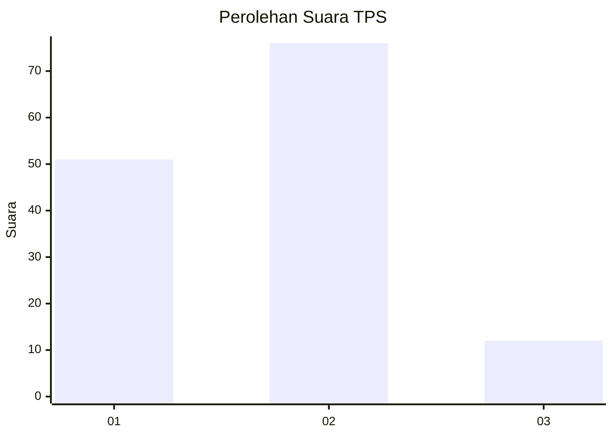

# Hasil

## Grafik

## Tabel

| No. | Nama Paslon    | Suara | Suara (raw) | Persentase |
|:--- |:-------------- | -----:| -----------:| ----------:|
| 1   | ANIES MUHAIMIN | 51    | [51][p-1]   | 36,69      |
| 2   | PRABOWO GIBRAN | 76    | [76][p-2]   | 54,68      |
| 3   | GANJAR MAHFUD  | 12    | [12][p-3]   | 8,63       |

[p-1]: https://github.com/gigit-pemilu/pemilu-2024-12-sumatera-utara/blob/main/pilpres/hitung-suara/sub/12-sumatera-utara/sub/71-kota-medan/sub/02-medan-sunggal/sub/1001-lalang/sub/010-tps/sub/paslon-1.txt
[p-2]: https://github.com/gigit-pemilu/pemilu-2024-12-sumatera-utara/blob/main/pilpres/hitung-suara/sub/12-sumatera-utara/sub/71-kota-medan/sub/02-medan-sunggal/sub/1001-lalang/sub/010-tps/sub/paslon-2.txt
[p-3]: https://github.com/gigit-pemilu/pemilu-2024-12-sumatera-utara/blob/main/pilpres/hitung-suara/sub/12-sumatera-utara/sub/71-kota-medan/sub/02-medan-sunggal/sub/1001-lalang/sub/010-tps/sub/paslon-3.txt

## Foto C Plano

https://sirekap-obj-formc.kpu.go.id/f10d/pemilu/ppwp/12/71/02/10/01/1271021001010-20240214-193300--2006a5fd-63d9-4494-a4da-1e686a4ab036.jpg

https://sirekap-obj-formc.kpu.go.id/f10d/pemilu/ppwp/12/71/02/10/01/1271021001010-20240214-192235--e75b450b-cf7c-4376-a86a-a9dc5780b3bd.jpg

https://sirekap-obj-formc.kpu.go.id/f10d/pemilu/ppwp/12/71/02/10/01/1271021001010-20240214-192408--45fe9c23-6bba-46ed-9a19-9e9a29ec2c6e.jpg

## Metadata

| Key        | Value               |
| ---------- | ------------------- |
| Time Stamp | 2024-02-16 23:00:00 |

