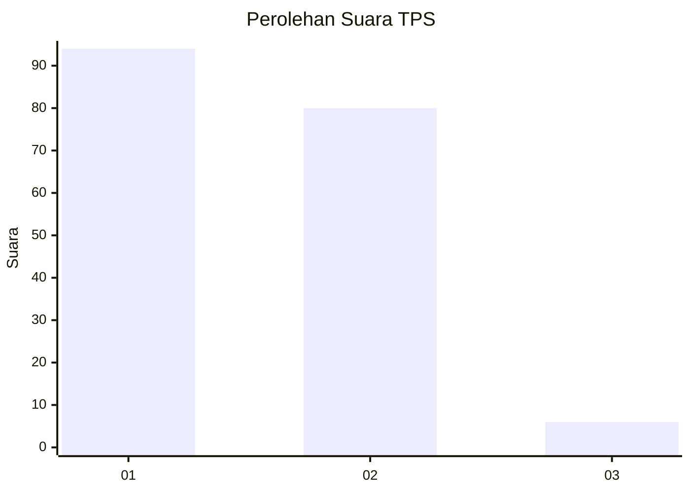
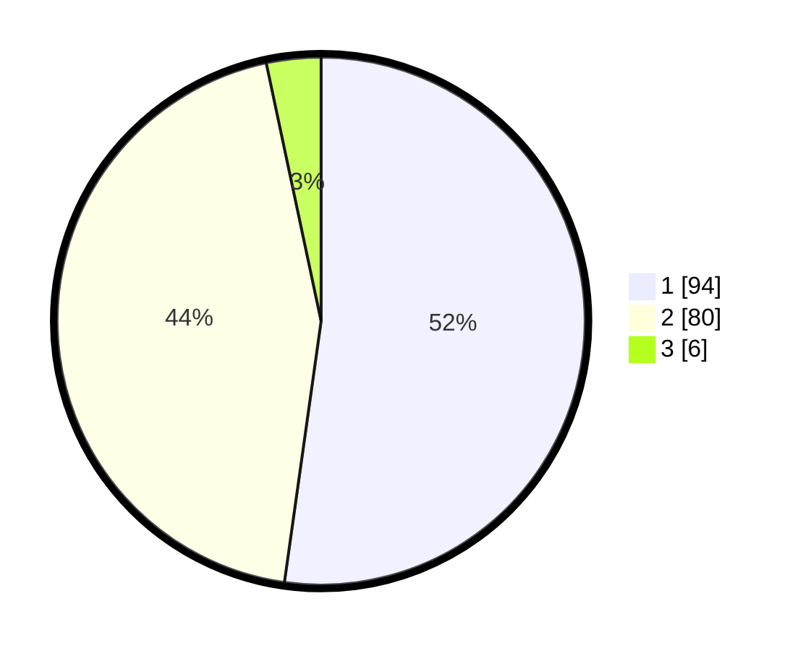

# Hasil

## Grafik

## Tabel

| No. | Nama Paslon    | Suara | Suara (raw) | Persentase |
|:--- |:-------------- | -----:| -----------:| ----------:|
| 1   | ANIES MUHAIMIN | 94    | [94][p-1]   | 52,22      |
| 2   | PRABOWO GIBRAN | 80    | [80][p-2]   | 44,44      |
| 3   | GANJAR MAHFUD  | 6     | [6][p-3]    | 3,33       |

[p-1]: https://github.com/gigit-pemilu/pemilu-2024/blob/main/pilpres/hitung-suara/sub/12-sumatera-utara/sub/71-kota-medan/sub/02-medan-sunggal/sub/1002-sei-sikambing-b/sub/009-tps/sub/paslon-1.txt
[p-2]: https://github.com/gigit-pemilu/pemilu-2024/blob/main/pilpres/hitung-suara/sub/12-sumatera-utara/sub/71-kota-medan/sub/02-medan-sunggal/sub/1002-sei-sikambing-b/sub/009-tps/sub/paslon-2.txt
[p-3]: https://github.com/gigit-pemilu/pemilu-2024/blob/main/pilpres/hitung-suara/sub/12-sumatera-utara/sub/71-kota-medan/sub/02-medan-sunggal/sub/1002-sei-sikambing-b/sub/009-tps/sub/paslon-3.txt

## Foto C Plano

https://sirekap-obj-formc.kpu.go.id/774c/pemilu/ppwp/12/71/02/10/02/1271021002009-20240214-232653--b369bbdd-2218-4e23-9fb0-078839c28e7c.jpg

https://sirekap-obj-formc.kpu.go.id/774c/pemilu/ppwp/12/71/02/10/02/1271021002009-20240214-233748--cd4fd96b-2bef-4906-9351-e5d945d599c5.jpg

https://sirekap-obj-formc.kpu.go.id/774c/pemilu/ppwp/12/71/02/10/02/1271021002009-20240214-233844--77a2f439-68f2-42c6-b361-c02f91f5f583.jpg

## Metadata

| Key        | Value               |
| ---------- | ------------------- |
| Time Stamp | 2024-02-25 11:00:00 |

