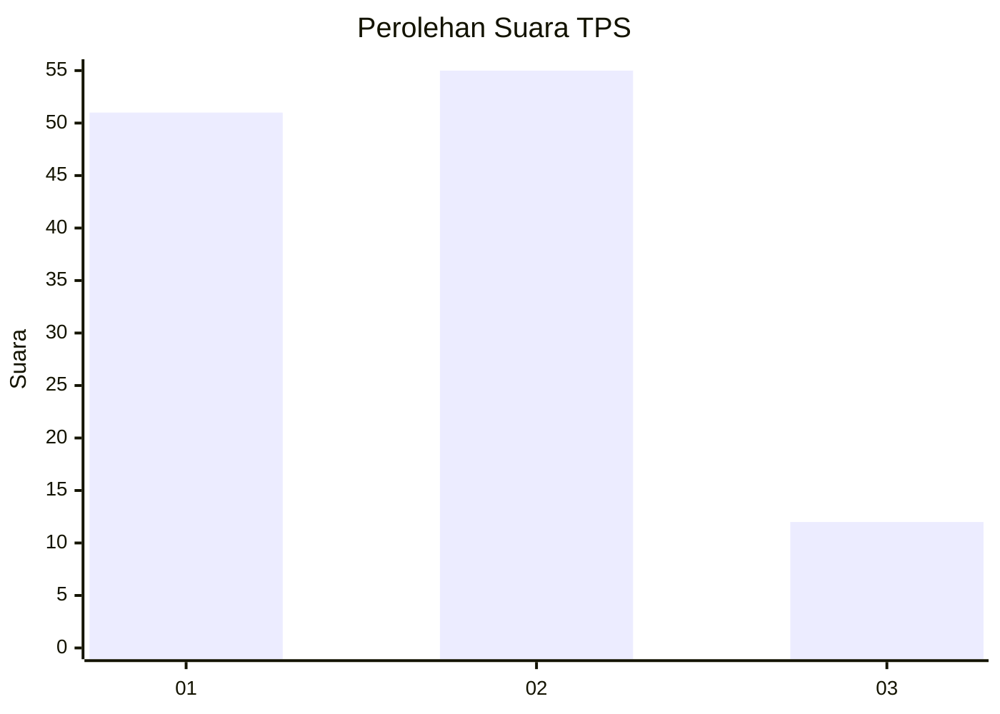
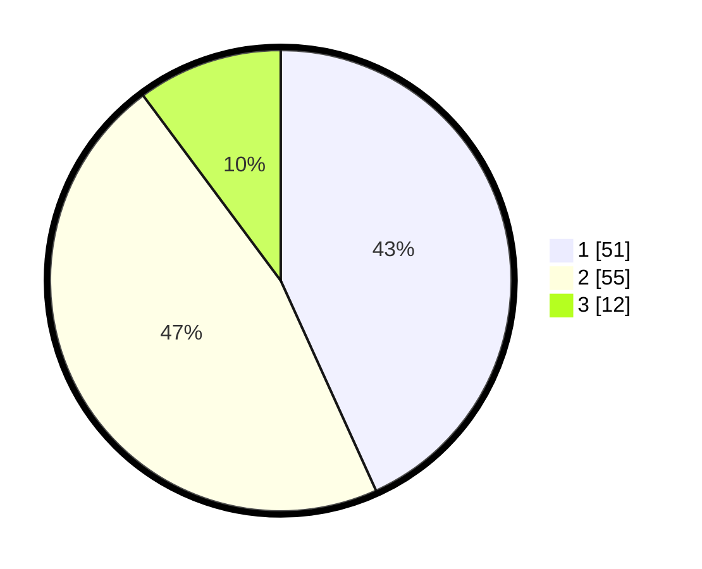

# Hasil

## Grafik

## Tabel

| No. | Nama Paslon    | Suara | Suara (raw) | Persentase |
|:--- |:-------------- | -----:| -----------:| ----------:|
| 1   | ANIES MUHAIMIN | 51    | [51][p-1]   | 43,22      |
| 2   | PRABOWO GIBRAN | 55    | [55][p-2]   | 46,61      |
| 3   | GANJAR MAHFUD  | 12    | [12][p-3]   | 10,17      |

[p-1]: https://github.com/gigit-pemilu/pemilu-2024-12-sumatera-utara/blob/main/pilpres/hitung-suara/sub/12-sumatera-utara/sub/71-kota-medan/sub/02-medan-sunggal/sub/1002-sei-sikambing-b/sub/051-tps/sub/paslon-1.txt
[p-2]: https://github.com/gigit-pemilu/pemilu-2024-12-sumatera-utara/blob/main/pilpres/hitung-suara/sub/12-sumatera-utara/sub/71-kota-medan/sub/02-medan-sunggal/sub/1002-sei-sikambing-b/sub/051-tps/sub/paslon-2.txt
[p-3]: https://github.com/gigit-pemilu/pemilu-2024-12-sumatera-utara/blob/main/pilpres/hitung-suara/sub/12-sumatera-utara/sub/71-kota-medan/sub/02-medan-sunggal/sub/1002-sei-sikambing-b/sub/051-tps/sub/paslon-3.txt

## Foto C Plano

https://sirekap-obj-formc.kpu.go.id/2e21/pemilu/ppwp/12/71/02/10/02/1271021002051-20240214-205655--19d559cd-64ed-44ce-966d-f620b40aca34.jpg

https://sirekap-obj-formc.kpu.go.id/2e21/pemilu/ppwp/12/71/02/10/02/1271021002051-20240214-211742--fff32ee1-9a55-459c-8a94-09bceb9f54a1.jpg

https://sirekap-obj-formc.kpu.go.id/2e21/pemilu/ppwp/12/71/02/10/02/1271021002051-20240214-205746--ed6c2e09-6833-4bc8-8062-f95a982bd714.jpg

## Metadata

| Key        | Value               |
| ---------- | ------------------- |
| Time Stamp | 2024-02-25 00:00:00 |

