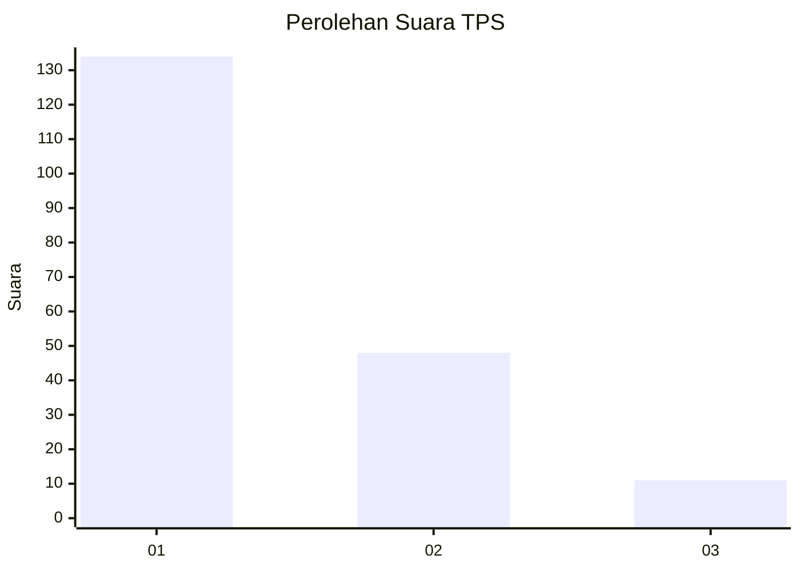
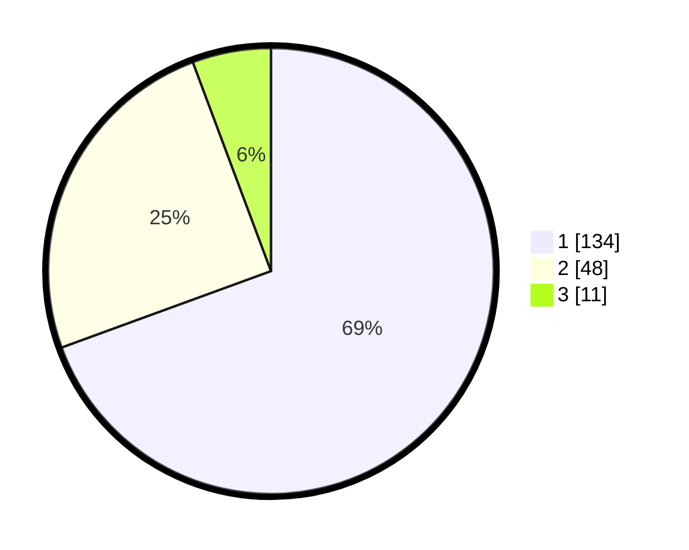

# Hasil

## Grafik

## Tabel

| No. | Nama Paslon    | Suara | Suara (raw) | Persentase |
|:--- |:-------------- | -----:| -----------:| ----------:|
| 1   | ANIES MUHAIMIN | 134   | [134][p-1]  | 69,43      |
| 2   | PRABOWO GIBRAN | 48    | [48][p-2]   | 24,87      |
| 3   | GANJAR MAHFUD  | 11    | [11][p-3]   | 5,70       |

[p-1]: https://github.com/gigit-pemilu/pemilu-2024-12-sumatera-utara/blob/main/pilpres/hitung-suara/sub/12-sumatera-utara/sub/71-kota-medan/sub/02-medan-sunggal/sub/1005-tanjung-rejo/sub/056-tps/sub/paslon-1.txt
[p-2]: https://github.com/gigit-pemilu/pemilu-2024-12-sumatera-utara/blob/main/pilpres/hitung-suara/sub/12-sumatera-utara/sub/71-kota-medan/sub/02-medan-sunggal/sub/1005-tanjung-rejo/sub/056-tps/sub/paslon-2.txt
[p-3]: https://github.com/gigit-pemilu/pemilu-2024-12-sumatera-utara/blob/main/pilpres/hitung-suara/sub/12-sumatera-utara/sub/71-kota-medan/sub/02-medan-sunggal/sub/1005-tanjung-rejo/sub/056-tps/sub/paslon-3.txt

## Foto C Plano

https://sirekap-obj-formc.kpu.go.id/bd80/pemilu/ppwp/12/71/02/10/05/1271021005056-20240215-020955--4487fef0-143c-45cb-b78b-9b7a966f92cc.jpg

https://sirekap-obj-formc.kpu.go.id/bd80/pemilu/ppwp/12/71/02/10/05/1271021005056-20240215-021016--9be07207-c64b-420b-9fa1-4f89ed94f174.jpg

https://sirekap-obj-formc.kpu.go.id/bd80/pemilu/ppwp/12/71/02/10/05/1271021005056-20240215-021034--f699c411-807a-48dc-8aa1-453525e60f8a.jpg

## Metadata

| Key        | Value               |
| ---------- | ------------------- |
| Time Stamp | 2024-02-25 12:00:00 |

