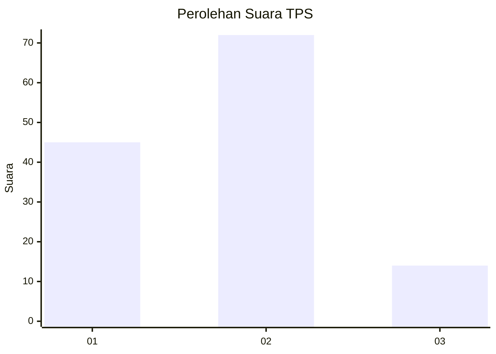
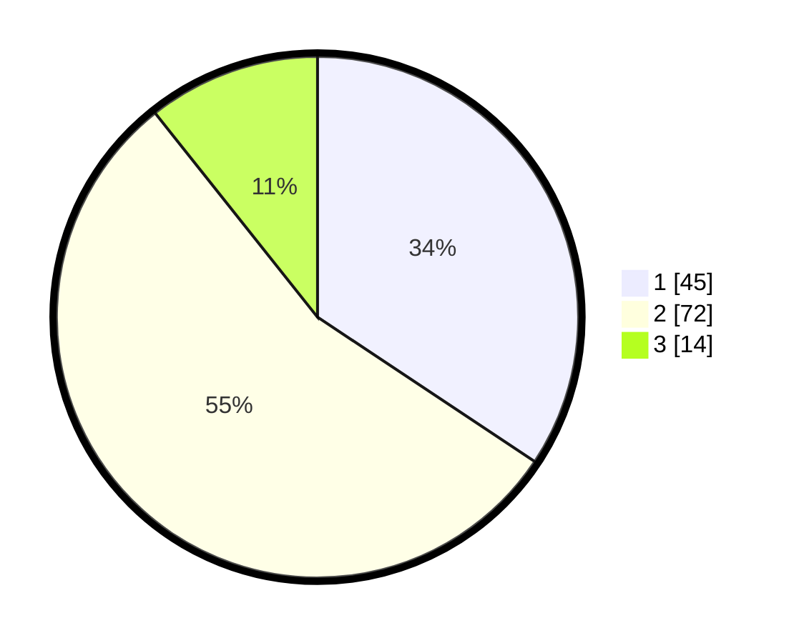

# Hasil

## Grafik

## Tabel

| No. | Nama Paslon    | Suara | Suara (raw) | Persentase |
|:--- |:-------------- | -----:| -----------:| ----------:|
| 1   | ANIES MUHAIMIN | 45    | [45][p-1]   | 34,35      |
| 2   | PRABOWO GIBRAN | 72    | [72][p-2]   | 54,96      |
| 3   | GANJAR MAHFUD  | 14    | [14][p-3]   | 10,69      |

[p-1]: https://github.com/gigit-pemilu/pemilu-2024/blob/main/pilpres/hitung-suara/sub/12-sumatera-utara/sub/71-kota-medan/sub/03-medan-helvetia/sub/1001-helvetia/sub/004-tps/sub/paslon-1.txt
[p-2]: https://github.com/gigit-pemilu/pemilu-2024/blob/main/pilpres/hitung-suara/sub/12-sumatera-utara/sub/71-kota-medan/sub/03-medan-helvetia/sub/1001-helvetia/sub/004-tps/sub/paslon-2.txt
[p-3]: https://github.com/gigit-pemilu/pemilu-2024/blob/main/pilpres/hitung-suara/sub/12-sumatera-utara/sub/71-kota-medan/sub/03-medan-helvetia/sub/1001-helvetia/sub/004-tps/sub/paslon-3.txt

## Foto C Plano

https://sirekap-obj-formc.kpu.go.id/8dca/pemilu/ppwp/12/71/03/10/01/1271031001004-20240214-224818--ecda861c-74e7-46ec-a3bd-8cdfca500ca5.jpg

https://sirekap-obj-formc.kpu.go.id/8dca/pemilu/ppwp/12/71/03/10/01/1271031001004-20240214-224828--ade27d51-2ae7-4c70-84c4-402861aa73ed.jpg

https://sirekap-obj-formc.kpu.go.id/8dca/pemilu/ppwp/12/71/03/10/01/1271031001004-20240214-224840--901e58d8-e90f-4d41-88f5-0f14e5fb1823.jpg

## Metadata

| Key        | Value               |
| ---------- | ------------------- |
| Time Stamp | 2024-02-16 23:30:00 |

