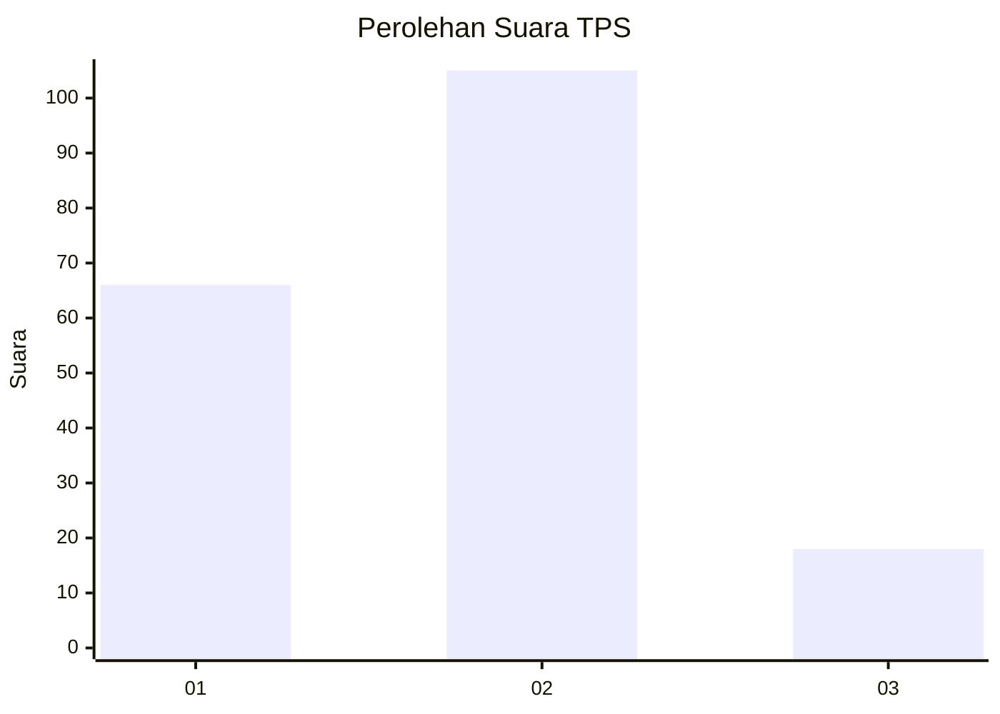
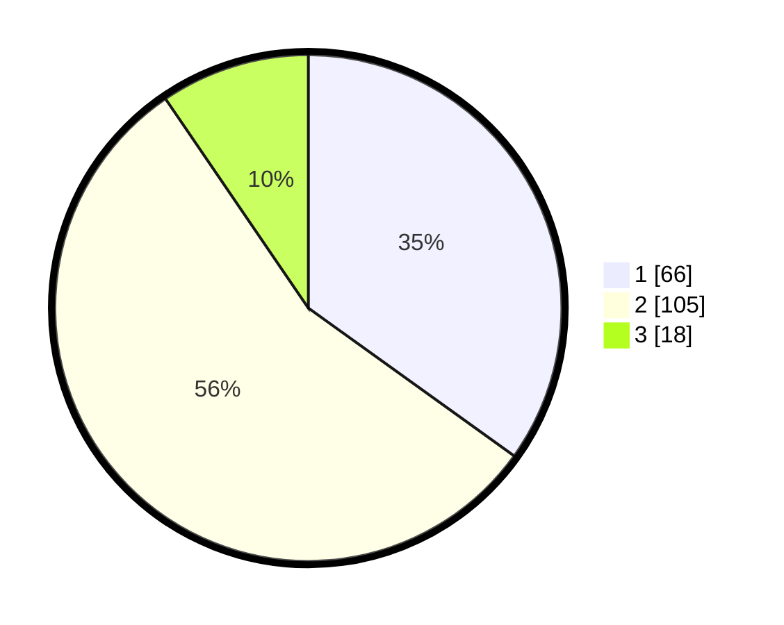

# Hasil

## Grafik

## Tabel

| No. | Nama Paslon    | Suara | Suara (raw) | Persentase |
|:--- |:-------------- | -----:| -----------:| ----------:|
| 1   | ANIES MUHAIMIN | 66    | [66][p-1]   | 34,92      |
| 2   | PRABOWO GIBRAN | 105   | [105][p-2]  | 55,56      |
| 3   | GANJAR MAHFUD  | 18    | [18][p-3]   | 9,52       |

[p-1]: https://github.com/gigit-pemilu/pemilu-2024-12-sumatera-utara/blob/main/pilpres/hitung-suara/sub/12-sumatera-utara/sub/71-kota-medan/sub/03-medan-helvetia/sub/1001-helvetia/sub/014-tps/sub/paslon-1.txt
[p-2]: https://github.com/gigit-pemilu/pemilu-2024-12-sumatera-utara/blob/main/pilpres/hitung-suara/sub/12-sumatera-utara/sub/71-kota-medan/sub/03-medan-helvetia/sub/1001-helvetia/sub/014-tps/sub/paslon-2.txt
[p-3]: https://github.com/gigit-pemilu/pemilu-2024-12-sumatera-utara/blob/main/pilpres/hitung-suara/sub/12-sumatera-utara/sub/71-kota-medan/sub/03-medan-helvetia/sub/1001-helvetia/sub/014-tps/sub/paslon-3.txt

## Foto C Plano

https://sirekap-obj-formc.kpu.go.id/c301/pemilu/ppwp/12/71/03/10/01/1271031001014-20240215-005705--eb194146-3785-434e-afe1-db5a97a0d501.jpg

https://sirekap-obj-formc.kpu.go.id/c301/pemilu/ppwp/12/71/03/10/01/1271031001014-20240214-160129--e6334b8b-4f72-4c79-babb-03ec2115dbd0.jpg

https://sirekap-obj-formc.kpu.go.id/c301/pemilu/ppwp/12/71/03/10/01/1271031001014-20240215-213519--a9a5d4b7-1b25-41da-b6ed-4d0ae7507f5e.jpg

## Metadata

| Key        | Value               |
| ---------- | ------------------- |
| Time Stamp | 2024-02-15 22:00:27 |

