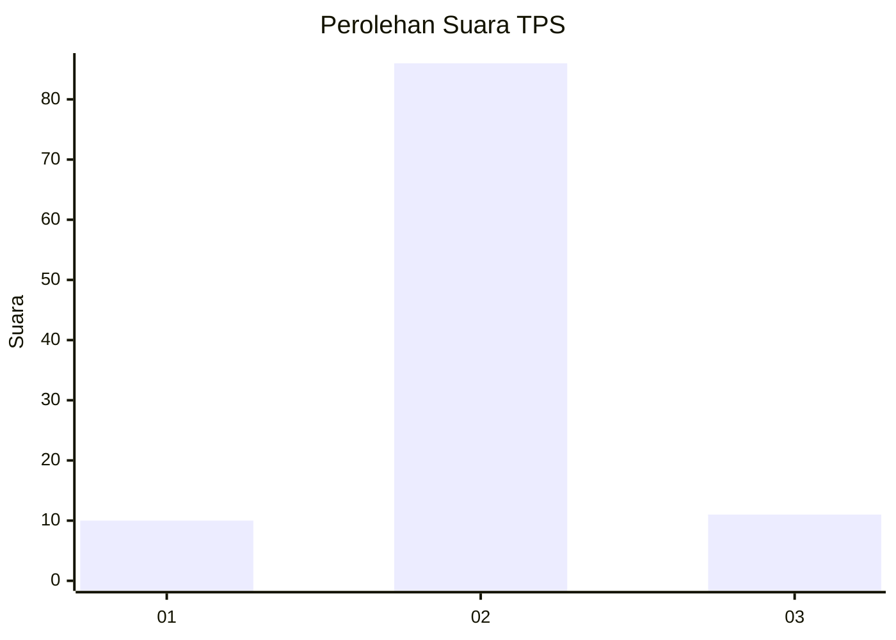
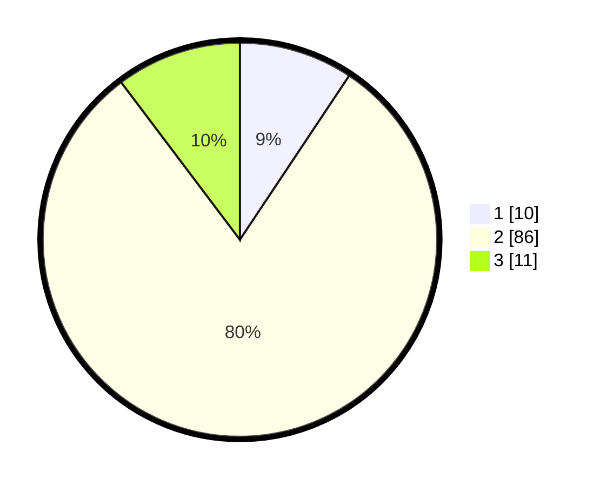

# Hasil

## Grafik

## Tabel

| No. | Nama Paslon    | Suara | Suara (raw) | Persentase |
|:--- |:-------------- | -----:| -----------:| ----------:|
| 1   | ANIES MUHAIMIN | 10    | [10][p-1]   | 9,35       |
| 2   | PRABOWO GIBRAN | 86    | [86][p-2]   | 80,37      |
| 3   | GANJAR MAHFUD  | 11    | [11][p-3]   | 10,28      |

[p-1]: https://github.com/gigit-pemilu/pemilu-2024/blob/main/pilpres/hitung-suara/sub/12-sumatera-utara/sub/71-kota-medan/sub/03-medan-helvetia/sub/1003-helvetia-timur/sub/019-tps/sub/paslon-1.txt
[p-2]: https://github.com/gigit-pemilu/pemilu-2024/blob/main/pilpres/hitung-suara/sub/12-sumatera-utara/sub/71-kota-medan/sub/03-medan-helvetia/sub/1003-helvetia-timur/sub/019-tps/sub/paslon-2.txt
[p-3]: https://github.com/gigit-pemilu/pemilu-2024/blob/main/pilpres/hitung-suara/sub/12-sumatera-utara/sub/71-kota-medan/sub/03-medan-helvetia/sub/1003-helvetia-timur/sub/019-tps/sub/paslon-3.txt

## Foto C Plano

https://sirekap-obj-formc.kpu.go.id/b9b5/pemilu/ppwp/12/71/03/10/03/1271031003019-20240215-033611--c61edc40-7bb7-490e-a279-53acce80eb53.jpg

https://sirekap-obj-formc.kpu.go.id/b9b5/pemilu/ppwp/12/71/03/10/03/1271031003019-20240215-033646--9d22992e-03b7-4fd8-a5f7-1d4cd999e466.jpg

https://sirekap-obj-formc.kpu.go.id/b9b5/pemilu/ppwp/12/71/03/10/03/1271031003019-20240215-033724--09c77a95-6f18-453f-b4a6-0ed481455fa9.jpg

## Metadata

| Key        | Value               |
| ---------- | ------------------- |
| Time Stamp | 2024-02-25 17:00:00 |

