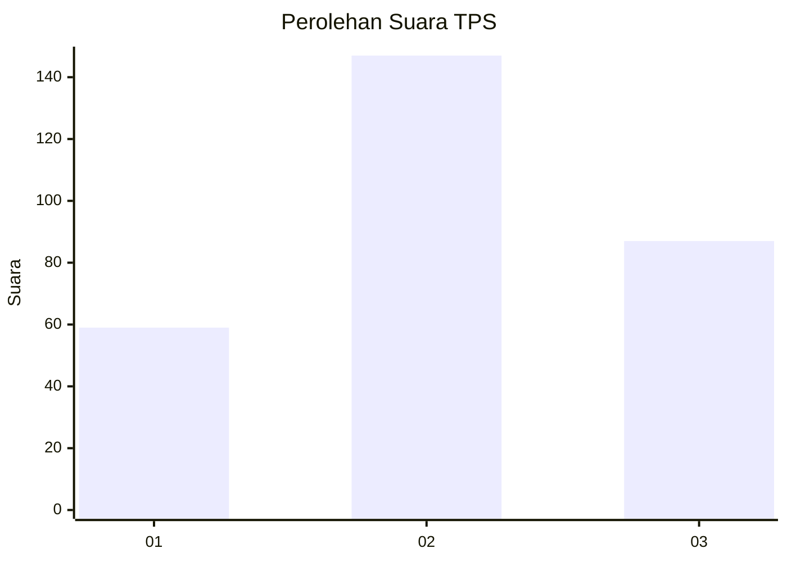
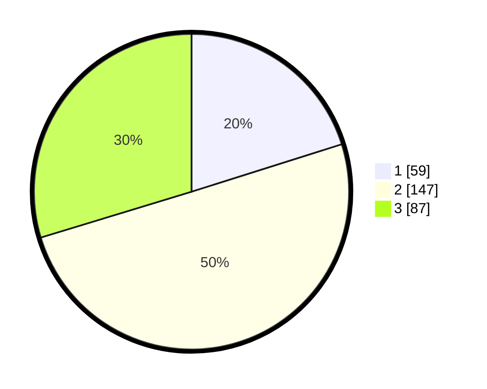

# Hasil

## Grafik

## Tabel

| No. | Nama Paslon    | Suara | Suara (raw) | Persentase |
|:--- |:-------------- | -----:| -----------:| ----------:|
| 1   | ANIES MUHAIMIN | 59    | [59][p-1]   | 20,14      |
| 2   | PRABOWO GIBRAN | 147   | [147][p-2]  | 50,17      |
| 3   | GANJAR MAHFUD  | 87    | [87][p-3]   | 29,69      |

[p-1]: https://github.com/gigit-pemilu/pemilu-2024-12-sumatera-utara/blob/main/pilpres/hitung-suara/sub/12-sumatera-utara/sub/71-kota-medan/sub/03-medan-helvetia/sub/1004-tanjung-gusta/sub/902-tps/sub/paslon-1.txt
[p-2]: https://github.com/gigit-pemilu/pemilu-2024-12-sumatera-utara/blob/main/pilpres/hitung-suara/sub/12-sumatera-utara/sub/71-kota-medan/sub/03-medan-helvetia/sub/1004-tanjung-gusta/sub/902-tps/sub/paslon-2.txt
[p-3]: https://github.com/gigit-pemilu/pemilu-2024-12-sumatera-utara/blob/main/pilpres/hitung-suara/sub/12-sumatera-utara/sub/71-kota-medan/sub/03-medan-helvetia/sub/1004-tanjung-gusta/sub/902-tps/sub/paslon-3.txt

## Foto C Plano

https://sirekap-obj-formc.kpu.go.id/b2f6/pemilu/ppwp/12/71/03/10/04/1271031004902-20240214-160129--ccea66e1-ccf2-47f4-b7cf-6d9c2c0f875c.jpg

https://sirekap-obj-formc.kpu.go.id/b2f6/pemilu/ppwp/12/71/03/10/04/1271031004902-20240214-160141--a01eb3ed-1034-4cbc-b2f3-d32b3cce7670.jpg

https://sirekap-obj-formc.kpu.go.id/b2f6/pemilu/ppwp/12/71/03/10/04/1271031004902-20240214-160118--b454f282-16b8-47e3-8869-70c29c511db7.jpg

## Metadata

| Key        | Value               |
| ---------- | ------------------- |
| Time Stamp | 2024-02-25 23:00:00 |

