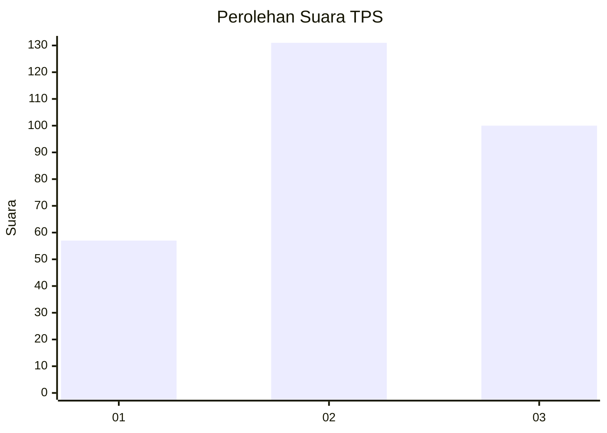
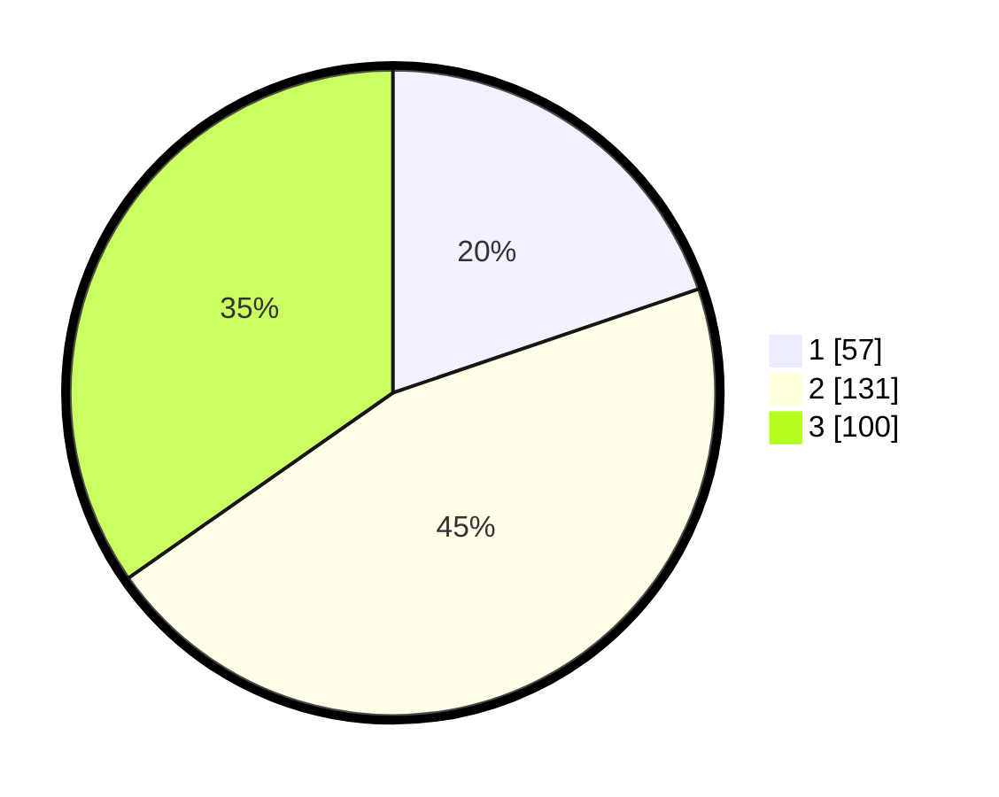

# Hasil

## Grafik

## Tabel

| No. | Nama Paslon    | Suara | Suara (raw) | Persentase |
|:--- |:-------------- | -----:| -----------:| ----------:|
| 1   | ANIES MUHAIMIN | 57    | [57][p-1]   | 19,79      |
| 2   | PRABOWO GIBRAN | 131   | [131][p-2]  | 45,49      |
| 3   | GANJAR MAHFUD  | 100   | [100][p-3]  | 34,72      |

[p-1]: https://github.com/gigit-pemilu/pemilu-2024/blob/main/pilpres/hitung-suara/sub/12-sumatera-utara/sub/71-kota-medan/sub/03-medan-helvetia/sub/1004-tanjung-gusta/sub/904-tps/sub/paslon-1.txt
[p-2]: https://github.com/gigit-pemilu/pemilu-2024/blob/main/pilpres/hitung-suara/sub/12-sumatera-utara/sub/71-kota-medan/sub/03-medan-helvetia/sub/1004-tanjung-gusta/sub/904-tps/sub/paslon-2.txt
[p-3]: https://github.com/gigit-pemilu/pemilu-2024/blob/main/pilpres/hitung-suara/sub/12-sumatera-utara/sub/71-kota-medan/sub/03-medan-helvetia/sub/1004-tanjung-gusta/sub/904-tps/sub/paslon-3.txt

## Foto C Plano

https://sirekap-obj-formc.kpu.go.id/f9b8/pemilu/ppwp/12/71/03/10/04/1271031004904-20240215-014201--778565c0-789d-4162-99fe-2faf496bfef0.jpg

https://sirekap-obj-formc.kpu.go.id/f9b8/pemilu/ppwp/12/71/03/10/04/1271031004904-20240215-014252--17c88ffb-2bbb-424c-bba4-a4c5c8d7f371.jpg

https://sirekap-obj-formc.kpu.go.id/f9b8/pemilu/ppwp/12/71/03/10/04/1271031004904-20240214-234824--aef13e74-3a36-4fa2-8815-d4cfee82c52d.jpg

## Metadata

| Key        | Value               |
| ---------- | ------------------- |
| Time Stamp | 2024-02-25 11:00:00 |

