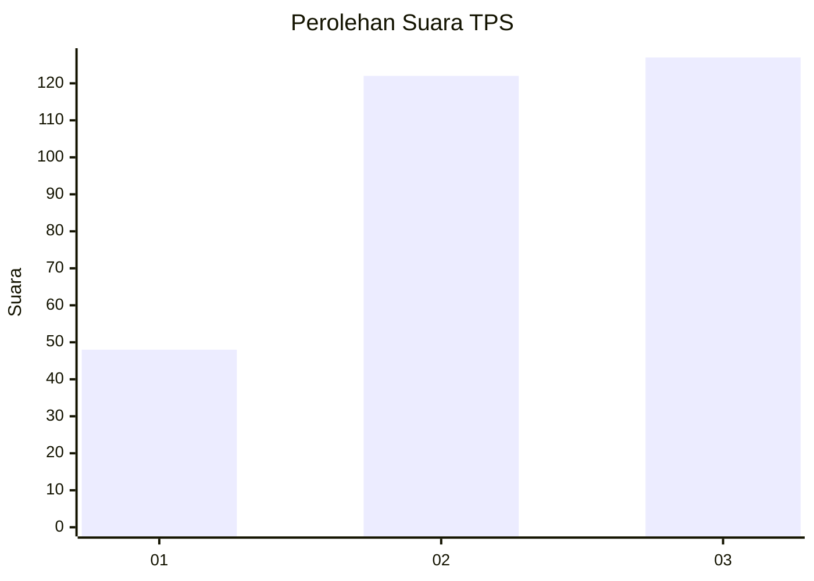
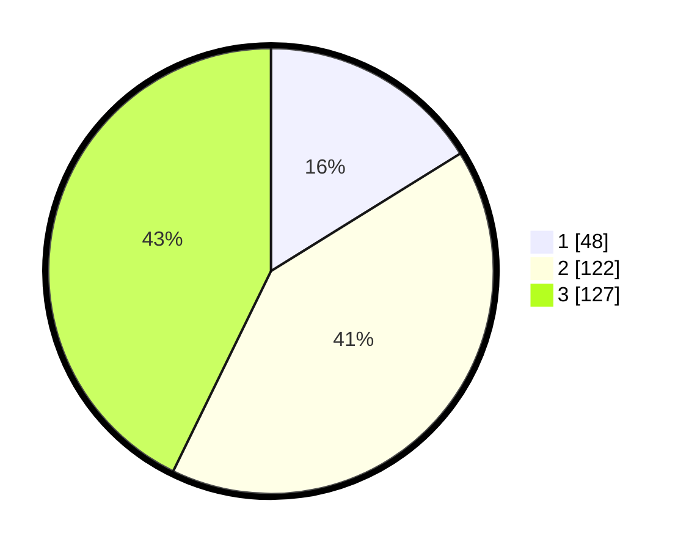

# Hasil

## Grafik

## Tabel

| No. | Nama Paslon    | Suara | Suara (raw) | Persentase |
|:--- |:-------------- | -----:| -----------:| ----------:|
| 1   | ANIES MUHAIMIN | 48    | [48][p-1]   | 16,16      |
| 2   | PRABOWO GIBRAN | 122   | [122][p-2]  | 41,08      |
| 3   | GANJAR MAHFUD  | 127   | [127][p-3]  | 42,76      |

[p-1]: https://github.com/gigit-pemilu/pemilu-2024-12-sumatera-utara/blob/main/pilpres/hitung-suara/sub/12-sumatera-utara/sub/71-kota-medan/sub/03-medan-helvetia/sub/1004-tanjung-gusta/sub/905-tps/sub/paslon-1.txt
[p-2]: https://github.com/gigit-pemilu/pemilu-2024-12-sumatera-utara/blob/main/pilpres/hitung-suara/sub/12-sumatera-utara/sub/71-kota-medan/sub/03-medan-helvetia/sub/1004-tanjung-gusta/sub/905-tps/sub/paslon-2.txt
[p-3]: https://github.com/gigit-pemilu/pemilu-2024-12-sumatera-utara/blob/main/pilpres/hitung-suara/sub/12-sumatera-utara/sub/71-kota-medan/sub/03-medan-helvetia/sub/1004-tanjung-gusta/sub/905-tps/sub/paslon-3.txt

## Foto C Plano

https://sirekap-obj-formc.kpu.go.id/549d/pemilu/ppwp/12/71/03/10/04/1271031004905-20240215-021611--fee67c0c-90b1-445b-bc72-16388f5dcc9b.jpg

https://sirekap-obj-formc.kpu.go.id/549d/pemilu/ppwp/12/71/03/10/04/1271031004905-20240215-020508--98aa36bb-b7ea-40a4-b898-480cbc0fe893.jpg

https://sirekap-obj-formc.kpu.go.id/549d/pemilu/ppwp/12/71/03/10/04/1271031004905-20240215-021922--5a188e11-3b12-4cba-802c-b25abc14c4c0.jpg

## Metadata

| Key        | Value               |
| ---------- | ------------------- |
| Time Stamp | 2024-02-25 12:00:00 |

