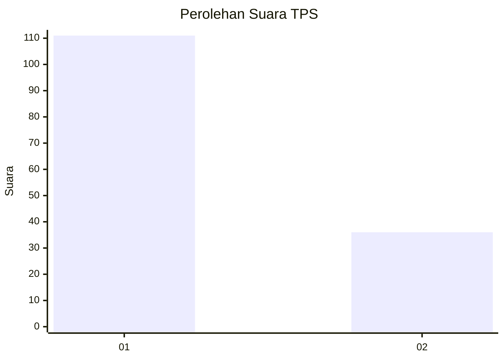
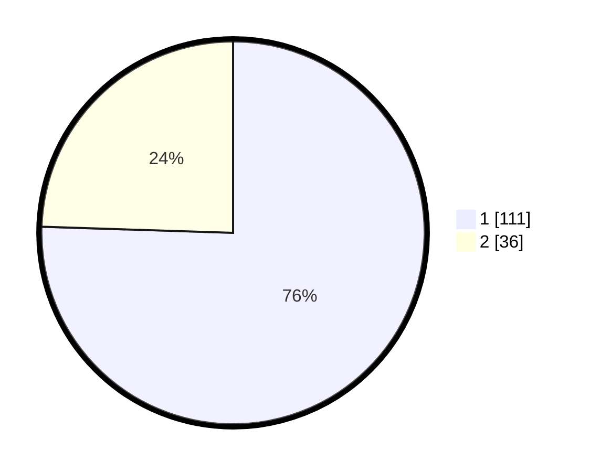

# Hasil

## Grafik

## Tabel

| No. | Nama Paslon    | Suara | Suara (raw) | Persentase |
|:--- |:-------------- | -----:| -----------:| ----------:|
| 1   | ANIES MUHAIMIN | 111   | [111][p-1]  | 75,51      |
| 2   | PRABOWO GIBRAN | 36    | [36][p-2]   | 24,49      |

[p-1]: https://github.com/gigit-pemilu/pemilu-2024/blob/main/pilpres/hitung-suara/sub/12-sumatera-utara/sub/71-kota-medan/sub/03-medan-helvetia/sub/1005-cinta-damai/sub/052-tps/sub/paslon-1.txt
[p-2]: https://github.com/gigit-pemilu/pemilu-2024/blob/main/pilpres/hitung-suara/sub/12-sumatera-utara/sub/71-kota-medan/sub/03-medan-helvetia/sub/1005-cinta-damai/sub/052-tps/sub/paslon-2.txt
[p-3]: https://github.com/gigit-pemilu/pemilu-2024/blob/main/pilpres/hitung-suara/sub/12-sumatera-utara/sub/71-kota-medan/sub/03-medan-helvetia/sub/1005-cinta-damai/sub/052-tps/sub/paslon-3.txt

## Foto C Plano

https://sirekap-obj-formc.kpu.go.id/48b0/pemilu/ppwp/12/71/03/10/05/1271031005052-20240214-212910--676ab71a-7e28-4355-995a-3ed0def29fdc.jpg

https://sirekap-obj-formc.kpu.go.id/48b0/pemilu/ppwp/12/71/03/10/05/1271031005052-20240214-204526--248f78dc-68ed-40d6-9aa2-4433ee4ffb41.jpg

https://sirekap-obj-formc.kpu.go.id/48b0/pemilu/ppwp/12/71/03/10/05/1271031005052-20240214-212715--e7e575c7-365b-4e9d-8509-4f025fb7c0be.jpg

## Metadata

| Key        | Value               |
| ---------- | ------------------- |
| Time Stamp | 2024-02-26 16:00:00 |

