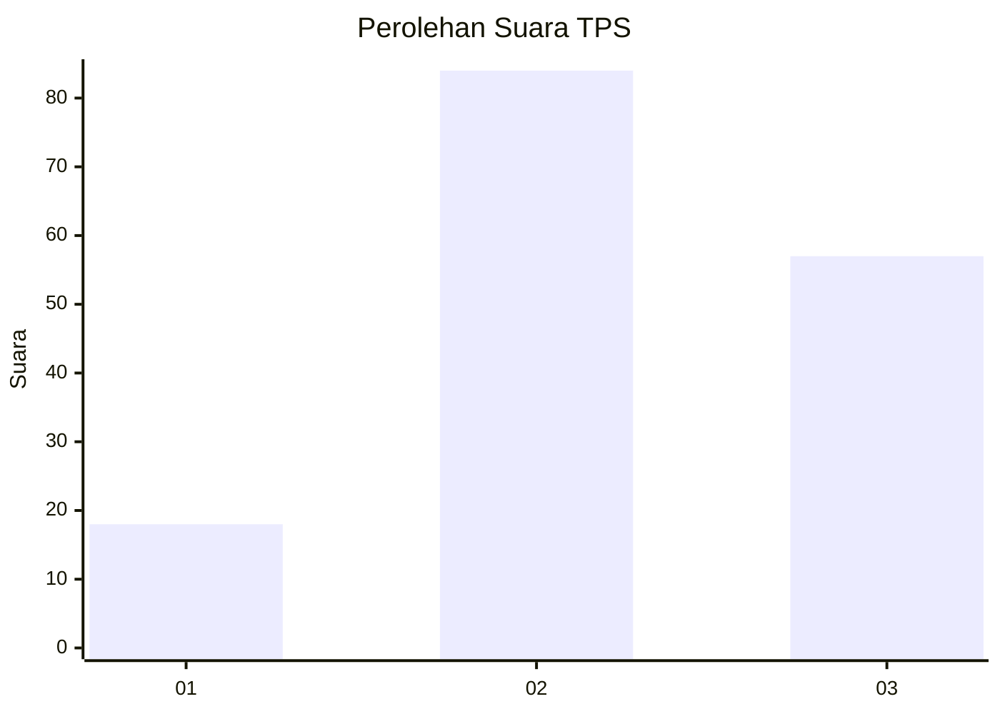
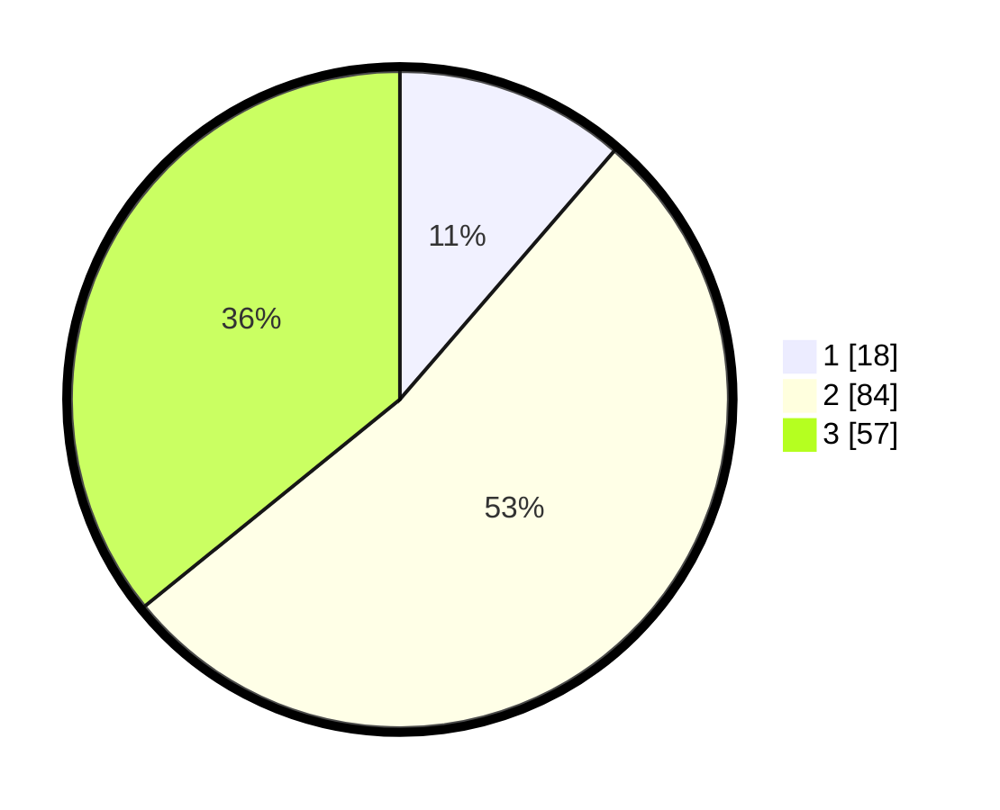

# Hasil

## Grafik

## Tabel

| No. | Nama Paslon    | Suara | Suara (raw) | Persentase |
|:--- |:-------------- | -----:| -----------:| ----------:|
| 1   | ANIES MUHAIMIN | 18    | [18][p-1]   | 11,32      |
| 2   | PRABOWO GIBRAN | 84    | [84][p-2]   | 52,83      |
| 3   | GANJAR MAHFUD  | 57    | [57][p-3]   | 35,85      |

[p-1]: https://github.com/gigit-pemilu/pemilu-2024-12-sumatera-utara/blob/main/pilpres/hitung-suara/sub/12-sumatera-utara/sub/71-kota-medan/sub/04-medan-denai/sub/1001-tegal-s-mandala-i/sub/011-tps/sub/paslon-1.txt
[p-2]: https://github.com/gigit-pemilu/pemilu-2024-12-sumatera-utara/blob/main/pilpres/hitung-suara/sub/12-sumatera-utara/sub/71-kota-medan/sub/04-medan-denai/sub/1001-tegal-s-mandala-i/sub/011-tps/sub/paslon-2.txt
[p-3]: https://github.com/gigit-pemilu/pemilu-2024-12-sumatera-utara/blob/main/pilpres/hitung-suara/sub/12-sumatera-utara/sub/71-kota-medan/sub/04-medan-denai/sub/1001-tegal-s-mandala-i/sub/011-tps/sub/paslon-3.txt

## Foto C Plano

https://sirekap-obj-formc.kpu.go.id/b1a5/pemilu/ppwp/12/71/04/10/01/1271041001011-20240214-224731--211e4992-4210-4396-86ca-89bd2f7c3086.jpg

https://sirekap-obj-formc.kpu.go.id/b1a5/pemilu/ppwp/12/71/04/10/01/1271041001011-20240214-224914--de4438de-8799-4c15-8e3e-9263d73040eb.jpg

https://sirekap-obj-formc.kpu.go.id/b1a5/pemilu/ppwp/12/71/04/10/01/1271041001011-20240214-225057--8c85e5b1-307a-4425-8388-54f9d5c5a851.jpg

## Metadata

| Key        | Value               |
| ---------- | ------------------- |
| Time Stamp | 2024-02-25 15:00:00 |

