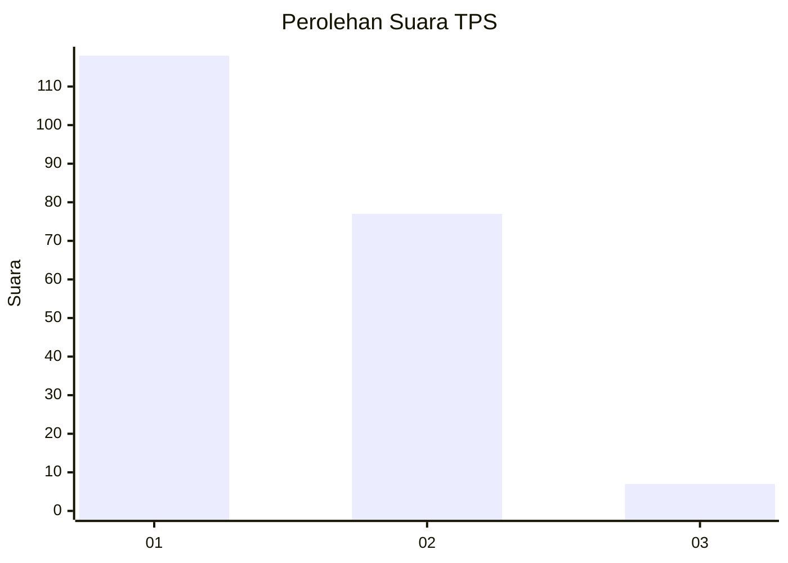
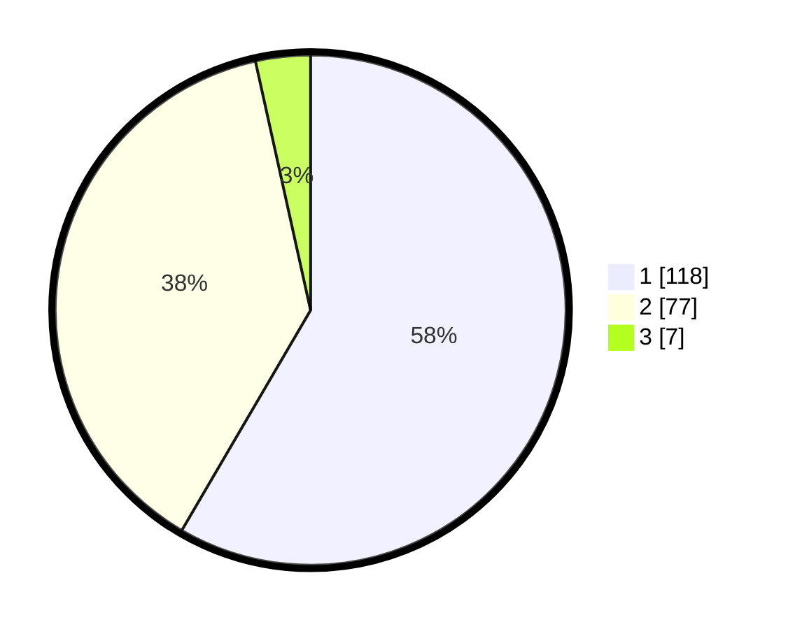

# Hasil

## Grafik

## Tabel

| No. | Nama Paslon    | Suara | Suara (raw) | Persentase |
|:--- |:-------------- | -----:| -----------:| ----------:|
| 1   | ANIES MUHAIMIN | 118   | [118][p-1]  | 58,42      |
| 2   | PRABOWO GIBRAN | 77    | [77][p-2]   | 38,12      |
| 3   | GANJAR MAHFUD  | 7     | [7][p-3]    | 3,47       |

[p-1]: https://github.com/gigit-pemilu/pemilu-2024/blob/main/pilpres/hitung-suara/sub/12-sumatera-utara/sub/71-kota-medan/sub/04-medan-denai/sub/1002-tegal-s-mandala-ii/sub/003-tps/sub/paslon-1.txt
[p-2]: https://github.com/gigit-pemilu/pemilu-2024/blob/main/pilpres/hitung-suara/sub/12-sumatera-utara/sub/71-kota-medan/sub/04-medan-denai/sub/1002-tegal-s-mandala-ii/sub/003-tps/sub/paslon-2.txt
[p-3]: https://github.com/gigit-pemilu/pemilu-2024/blob/main/pilpres/hitung-suara/sub/12-sumatera-utara/sub/71-kota-medan/sub/04-medan-denai/sub/1002-tegal-s-mandala-ii/sub/003-tps/sub/paslon-3.txt

## Foto C Plano

https://sirekap-obj-formc.kpu.go.id/051a/pemilu/ppwp/12/71/04/10/02/1271041002003-20240215-000549--50f1de44-c98e-4cd7-8a5d-11440cd60ad9.jpg

https://sirekap-obj-formc.kpu.go.id/051a/pemilu/ppwp/12/71/04/10/02/1271041002003-20240215-000908--46e9841a-32f9-415a-8077-67167cfff00f.jpg

https://sirekap-obj-formc.kpu.go.id/051a/pemilu/ppwp/12/71/04/10/02/1271041002003-20240215-001123--d98dee2d-d421-4347-aaf2-2262123cdfca.jpg

## Metadata

| Key        | Value               |
| ---------- | ------------------- |
| Time Stamp | 2024-02-25 22:00:00 |

