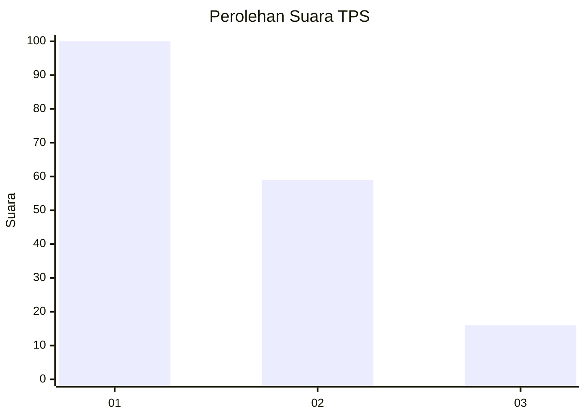
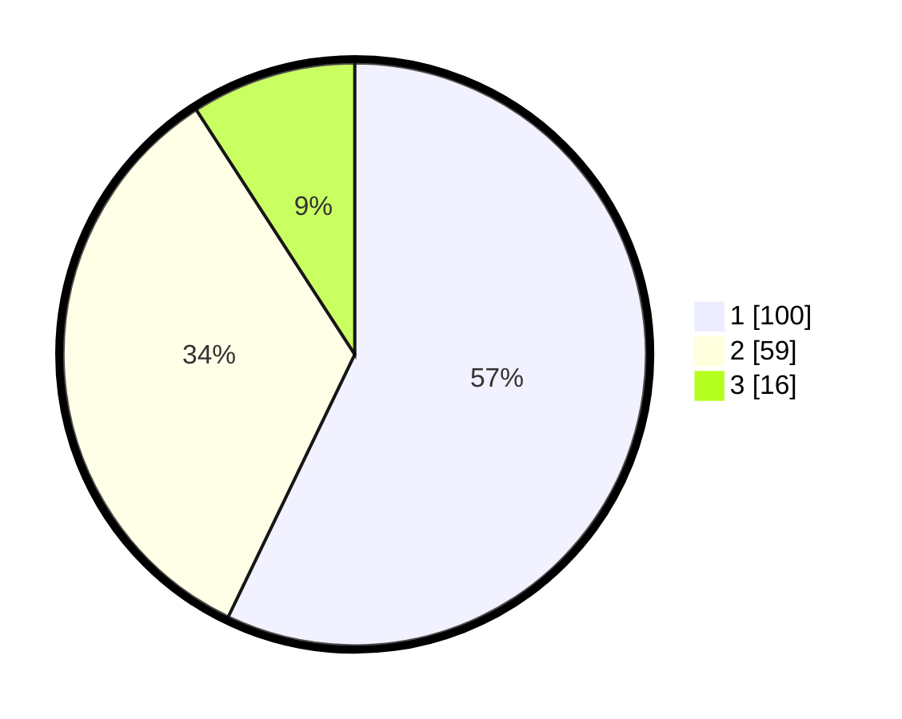

# Hasil

## Grafik

## Tabel

| No. | Nama Paslon    | Suara | Suara (raw) | Persentase |
|:--- |:-------------- | -----:| -----------:| ----------:|
| 1   | ANIES MUHAIMIN | 100   | [100][p-1]  | 57,14      |
| 2   | PRABOWO GIBRAN | 59    | [59][p-2]   | 33,71      |
| 3   | GANJAR MAHFUD  | 16    | [16][p-3]   | 9,14       |

[p-1]: https://github.com/gigit-pemilu/pemilu-2024/blob/main/pilpres/hitung-suara/sub/12-sumatera-utara/sub/71-kota-medan/sub/04-medan-denai/sub/1003-tegal-s-mandala-iii/sub/004-tps/sub/paslon-1.txt
[p-2]: https://github.com/gigit-pemilu/pemilu-2024/blob/main/pilpres/hitung-suara/sub/12-sumatera-utara/sub/71-kota-medan/sub/04-medan-denai/sub/1003-tegal-s-mandala-iii/sub/004-tps/sub/paslon-2.txt
[p-3]: https://github.com/gigit-pemilu/pemilu-2024/blob/main/pilpres/hitung-suara/sub/12-sumatera-utara/sub/71-kota-medan/sub/04-medan-denai/sub/1003-tegal-s-mandala-iii/sub/004-tps/sub/paslon-3.txt

## Foto C Plano

https://sirekap-obj-formc.kpu.go.id/30ef/pemilu/ppwp/12/71/04/10/03/1271041003004-20240215-013406--b49937a3-7f29-4323-8e11-a8a46a77b882.jpg

https://sirekap-obj-formc.kpu.go.id/30ef/pemilu/ppwp/12/71/04/10/03/1271041003004-20240215-013605--26f6f014-7d66-49fe-b3b7-6e96d52d6ba8.jpg

https://sirekap-obj-formc.kpu.go.id/30ef/pemilu/ppwp/12/71/04/10/03/1271041003004-20240215-013740--940396f2-c2a3-4e4a-b3e6-d2268cb32e8e.jpg

## Metadata

| Key        | Value               |
| ---------- | ------------------- |
| Time Stamp | 2024-02-25 16:00:00 |

