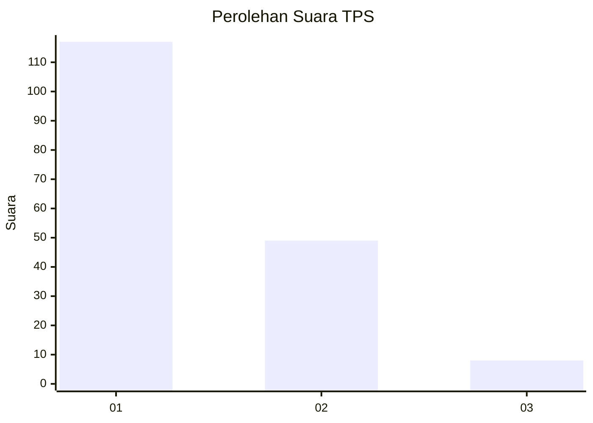
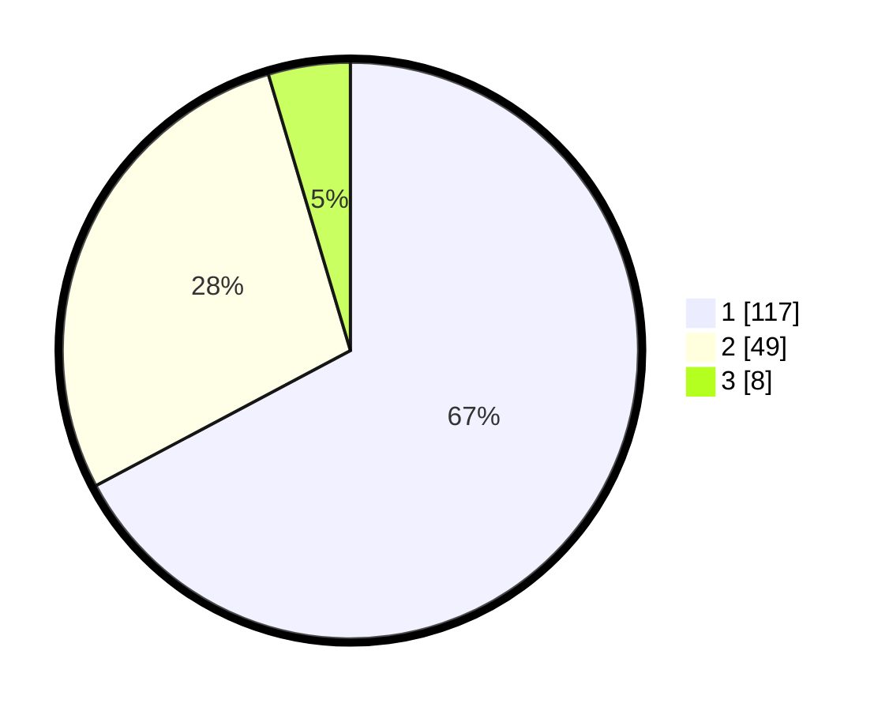

# Hasil

## Grafik

## Tabel

| No. | Nama Paslon    | Suara | Suara (raw) | Persentase |
|:--- |:-------------- | -----:| -----------:| ----------:|
| 1   | ANIES MUHAIMIN | 117   | [117][p-1]  | 67,24      |
| 2   | PRABOWO GIBRAN | 49    | [49][p-2]   | 28,16      |
| 3   | GANJAR MAHFUD  | 8     | [8][p-3]    | 4,60       |

[p-1]: https://github.com/gigit-pemilu/pemilu-2024-12-sumatera-utara/blob/main/pilpres/hitung-suara/sub/12-sumatera-utara/sub/71-kota-medan/sub/04-medan-denai/sub/1003-tegal-s-mandala-iii/sub/011-tps/sub/paslon-1.txt
[p-2]: https://github.com/gigit-pemilu/pemilu-2024-12-sumatera-utara/blob/main/pilpres/hitung-suara/sub/12-sumatera-utara/sub/71-kota-medan/sub/04-medan-denai/sub/1003-tegal-s-mandala-iii/sub/011-tps/sub/paslon-2.txt
[p-3]: https://github.com/gigit-pemilu/pemilu-2024-12-sumatera-utara/blob/main/pilpres/hitung-suara/sub/12-sumatera-utara/sub/71-kota-medan/sub/04-medan-denai/sub/1003-tegal-s-mandala-iii/sub/011-tps/sub/paslon-3.txt

## Foto C Plano

https://sirekap-obj-formc.kpu.go.id/d4ea/pemilu/ppwp/12/71/04/10/03/1271041003011-20240215-020600--8442df8e-6834-44ff-9232-a77ec19d834c.jpg

https://sirekap-obj-formc.kpu.go.id/d4ea/pemilu/ppwp/12/71/04/10/03/1271041003011-20240215-021029--d926ec8f-c56b-4572-9ac6-0e75a901d62c.jpg

https://sirekap-obj-formc.kpu.go.id/d4ea/pemilu/ppwp/12/71/04/10/03/1271041003011-20240215-021226--3b692902-b09b-45d6-87b7-2f130813538d.jpg

## Metadata

| Key        | Value               |
| ---------- | ------------------- |
| Time Stamp | 2024-02-25 22:00:00 |

