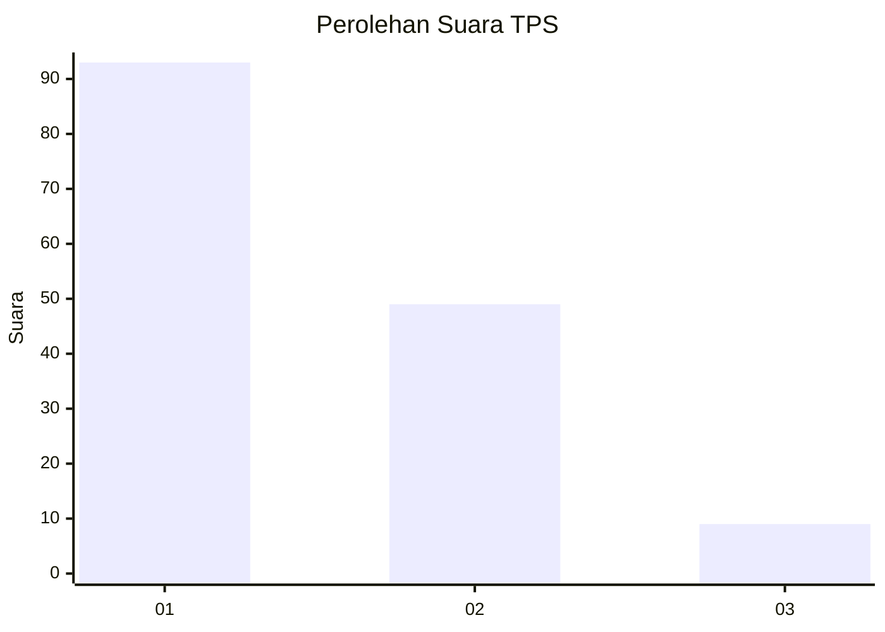
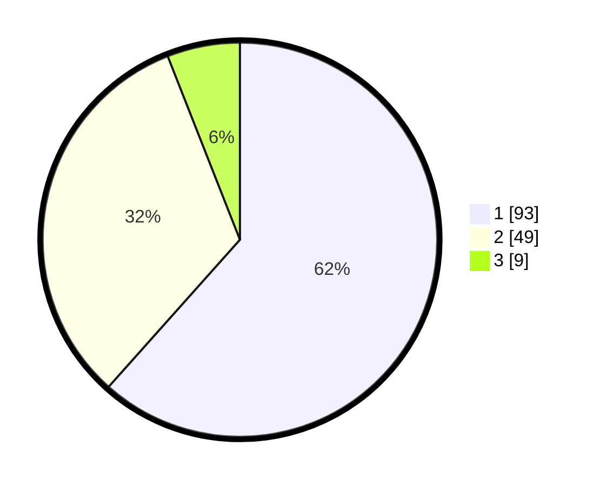

# Hasil

## Grafik

## Tabel

| No. | Nama Paslon    | Suara | Suara (raw) | Persentase |
|:--- |:-------------- | -----:| -----------:| ----------:|
| 1   | ANIES MUHAIMIN | 93    | [93][p-1]   | 61,59      |
| 2   | PRABOWO GIBRAN | 49    | [49][p-2]   | 32,45      |
| 3   | GANJAR MAHFUD  | 9     | [9][p-3]    | 5,96       |

[p-1]: https://github.com/gigit-pemilu/pemilu-2024/blob/main/pilpres/hitung-suara/sub/12-sumatera-utara/sub/71-kota-medan/sub/04-medan-denai/sub/1003-tegal-s-mandala-iii/sub/012-tps/sub/paslon-1.txt
[p-2]: https://github.com/gigit-pemilu/pemilu-2024/blob/main/pilpres/hitung-suara/sub/12-sumatera-utara/sub/71-kota-medan/sub/04-medan-denai/sub/1003-tegal-s-mandala-iii/sub/012-tps/sub/paslon-2.txt
[p-3]: https://github.com/gigit-pemilu/pemilu-2024/blob/main/pilpres/hitung-suara/sub/12-sumatera-utara/sub/71-kota-medan/sub/04-medan-denai/sub/1003-tegal-s-mandala-iii/sub/012-tps/sub/paslon-3.txt

## Foto C Plano

https://sirekap-obj-formc.kpu.go.id/c167/pemilu/ppwp/12/71/04/10/03/1271041003012-20240215-003840--21462c1f-4fb6-4cae-b290-95b6942f73ea.jpg

https://sirekap-obj-formc.kpu.go.id/c167/pemilu/ppwp/12/71/04/10/03/1271041003012-20240215-003934--08d84336-08a3-47fb-aea1-ade0d12034ab.jpg

https://sirekap-obj-formc.kpu.go.id/c167/pemilu/ppwp/12/71/04/10/03/1271041003012-20240215-004052--154753d7-0c74-4c31-911a-e5b0dd1ad60e.jpg

## Metadata

| Key        | Value               |
| ---------- | ------------------- |
| Time Stamp | 2024-02-25 02:00:00 |

