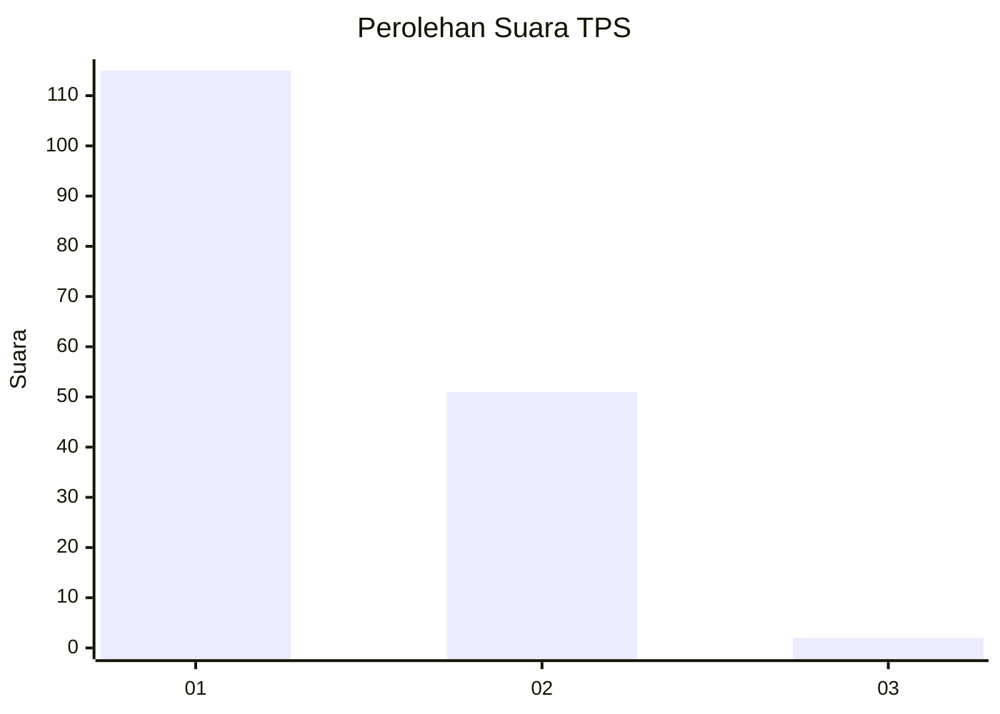
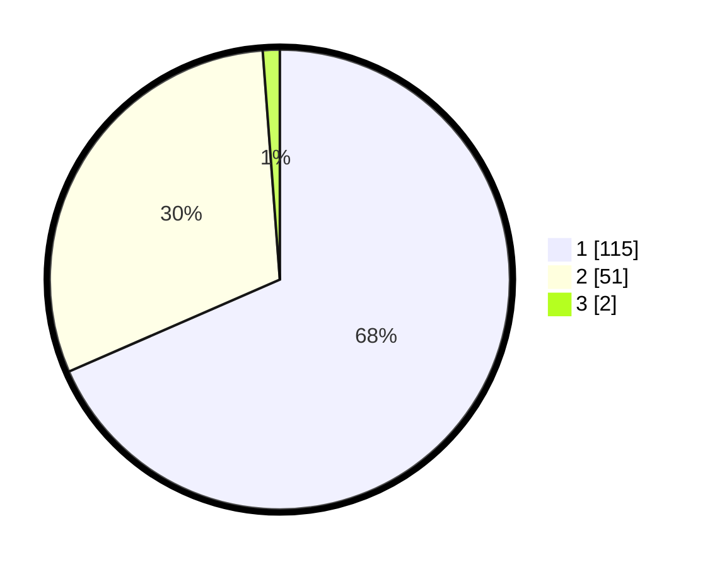

# Hasil

## Grafik

## Tabel

| No. | Nama Paslon    | Suara | Suara (raw) | Persentase |
|:--- |:-------------- | -----:| -----------:| ----------:|
| 1   | ANIES MUHAIMIN | 115   | [115][p-1]  | 68,45      |
| 2   | PRABOWO GIBRAN | 51    | [51][p-2]   | 30,36      |
| 3   | GANJAR MAHFUD  | 2     | [2][p-3]    | 1,19       |

[p-1]: https://github.com/gigit-pemilu/pemilu-2024-12-sumatera-utara/blob/main/pilpres/hitung-suara/sub/12-sumatera-utara/sub/71-kota-medan/sub/04-medan-denai/sub/1003-tegal-s-mandala-iii/sub/041-tps/sub/paslon-1.txt
[p-2]: https://github.com/gigit-pemilu/pemilu-2024-12-sumatera-utara/blob/main/pilpres/hitung-suara/sub/12-sumatera-utara/sub/71-kota-medan/sub/04-medan-denai/sub/1003-tegal-s-mandala-iii/sub/041-tps/sub/paslon-2.txt
[p-3]: https://github.com/gigit-pemilu/pemilu-2024-12-sumatera-utara/blob/main/pilpres/hitung-suara/sub/12-sumatera-utara/sub/71-kota-medan/sub/04-medan-denai/sub/1003-tegal-s-mandala-iii/sub/041-tps/sub/paslon-3.txt

## Foto C Plano

https://sirekap-obj-formc.kpu.go.id/3a9d/pemilu/ppwp/12/71/04/10/03/1271041003041-20240215-000340--25b1b95a-0534-4fb5-91a8-ebd6c4414a38.jpg

https://sirekap-obj-formc.kpu.go.id/3a9d/pemilu/ppwp/12/71/04/10/03/1271041003041-20240214-235926--b568079e-86cf-47fe-aac9-e61612100c28.jpg

https://sirekap-obj-formc.kpu.go.id/3a9d/pemilu/ppwp/12/71/04/10/03/1271041003041-20240215-000115--97068fe1-97f1-4d61-845d-f77340cb2dcc.jpg

## Metadata

| Key        | Value               |
| ---------- | ------------------- |
| Time Stamp | 2024-02-25 13:00:00 |

