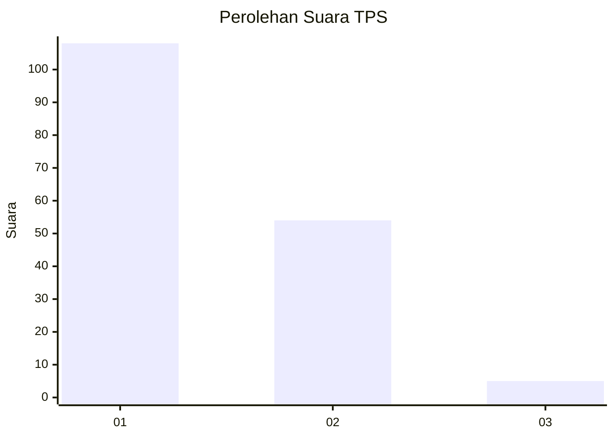
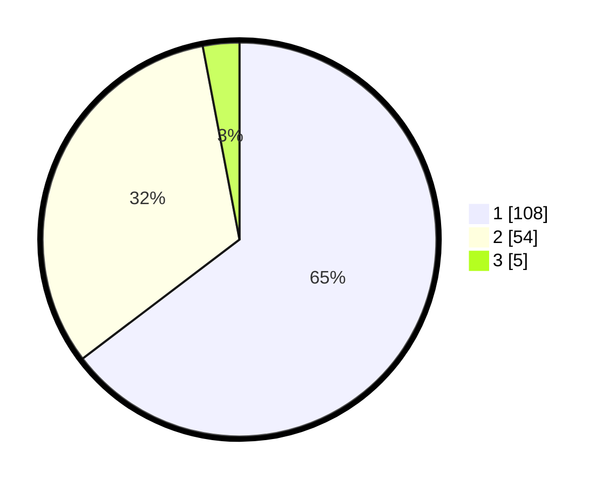

# Hasil

## Grafik

## Tabel

| No. | Nama Paslon    | Suara | Suara (raw) | Persentase |
|:--- |:-------------- | -----:| -----------:| ----------:|
| 1   | ANIES MUHAIMIN | 108   | [108][p-1]  | 64,67      |
| 2   | PRABOWO GIBRAN | 54    | [54][p-2]   | 32,34      |
| 3   | GANJAR MAHFUD  | 5     | [5][p-3]    | 2,99       |

[p-1]: https://github.com/gigit-pemilu/pemilu-2024-12-sumatera-utara/blob/main/pilpres/hitung-suara/sub/12-sumatera-utara/sub/71-kota-medan/sub/04-medan-denai/sub/1003-tegal-s-mandala-iii/sub/043-tps/sub/paslon-1.txt
[p-2]: https://github.com/gigit-pemilu/pemilu-2024-12-sumatera-utara/blob/main/pilpres/hitung-suara/sub/12-sumatera-utara/sub/71-kota-medan/sub/04-medan-denai/sub/1003-tegal-s-mandala-iii/sub/043-tps/sub/paslon-2.txt
[p-3]: https://github.com/gigit-pemilu/pemilu-2024-12-sumatera-utara/blob/main/pilpres/hitung-suara/sub/12-sumatera-utara/sub/71-kota-medan/sub/04-medan-denai/sub/1003-tegal-s-mandala-iii/sub/043-tps/sub/paslon-3.txt

## Foto C Plano

https://sirekap-obj-formc.kpu.go.id/8f3c/pemilu/ppwp/12/71/04/10/03/1271041003043-20240215-000503--288be98a-e489-4fde-aa91-3a5518db3e2b.jpg

https://sirekap-obj-formc.kpu.go.id/8f3c/pemilu/ppwp/12/71/04/10/03/1271041003043-20240214-235807--fcc9d51b-c924-4d86-9452-f5f6362ce958.jpg

https://sirekap-obj-formc.kpu.go.id/8f3c/pemilu/ppwp/12/71/04/10/03/1271041003043-20240215-000047--ab2a9583-2436-49af-aa03-85ab3371a398.jpg

## Metadata

| Key        | Value               |
| ---------- | ------------------- |
| Time Stamp | 2024-02-25 22:00:00 |

