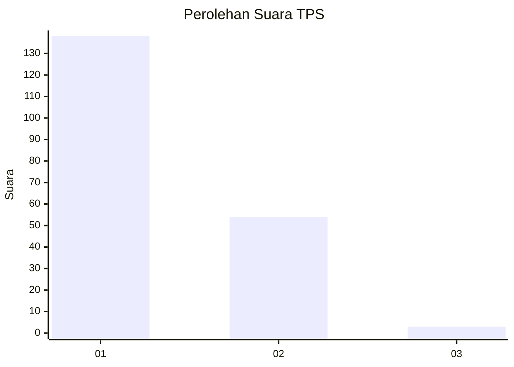
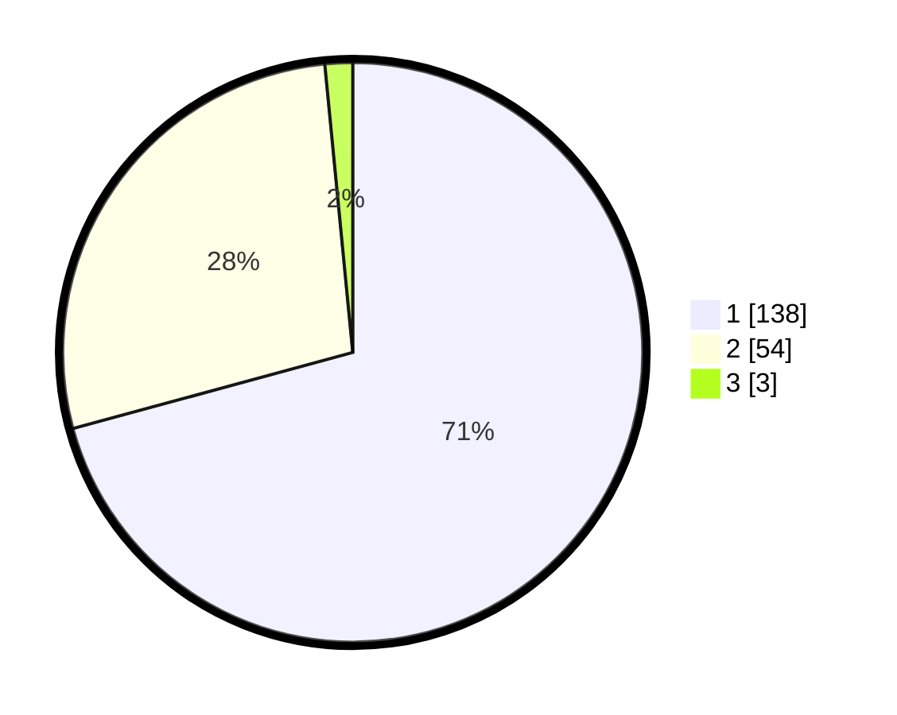

# Hasil

## Grafik

## Tabel

| No. | Nama Paslon    | Suara | Suara (raw) | Persentase |
|:--- |:-------------- | -----:| -----------:| ----------:|
| 1   | ANIES MUHAIMIN | 138   | [138][p-1]  | 70,77      |
| 2   | PRABOWO GIBRAN | 54    | [54][p-2]   | 27,69      |
| 3   | GANJAR MAHFUD  | 3     | [3][p-3]    | 1,54       |

[p-1]: https://github.com/gigit-pemilu/pemilu-2024-12-sumatera-utara/blob/main/pilpres/hitung-suara/sub/12-sumatera-utara/sub/71-kota-medan/sub/04-medan-denai/sub/1003-tegal-s-mandala-iii/sub/050-tps/sub/paslon-1.txt
[p-2]: https://github.com/gigit-pemilu/pemilu-2024-12-sumatera-utara/blob/main/pilpres/hitung-suara/sub/12-sumatera-utara/sub/71-kota-medan/sub/04-medan-denai/sub/1003-tegal-s-mandala-iii/sub/050-tps/sub/paslon-2.txt
[p-3]: https://github.com/gigit-pemilu/pemilu-2024-12-sumatera-utara/blob/main/pilpres/hitung-suara/sub/12-sumatera-utara/sub/71-kota-medan/sub/04-medan-denai/sub/1003-tegal-s-mandala-iii/sub/050-tps/sub/paslon-3.txt

## Foto C Plano

https://sirekap-obj-formc.kpu.go.id/9ef9/pemilu/ppwp/12/71/04/10/03/1271041003050-20240215-082215--05ced06d-4dd2-44a4-a748-9ad65375b71d.jpg

https://sirekap-obj-formc.kpu.go.id/9ef9/pemilu/ppwp/12/71/04/10/03/1271041003050-20240215-033534--3540da94-665e-414f-b9fa-bef02df81e8c.jpg

https://sirekap-obj-formc.kpu.go.id/9ef9/pemilu/ppwp/12/71/04/10/03/1271041003050-20240215-082404--531ebcf0-ef91-4351-8c6d-23a37a34f7b8.jpg

## Metadata

| Key        | Value               |
| ---------- | ------------------- |
| Time Stamp | 2024-02-25 12:00:00 |

