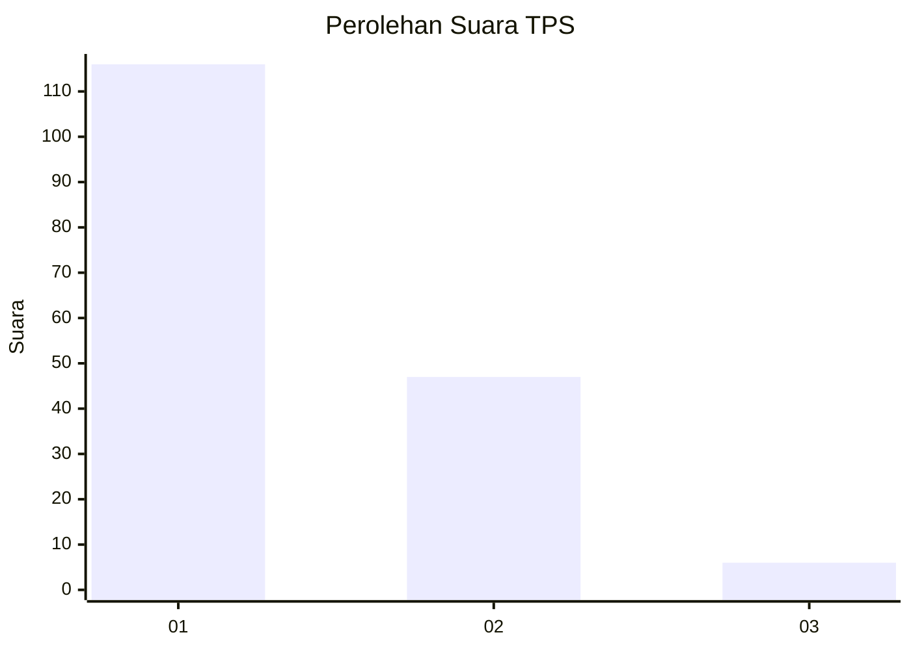
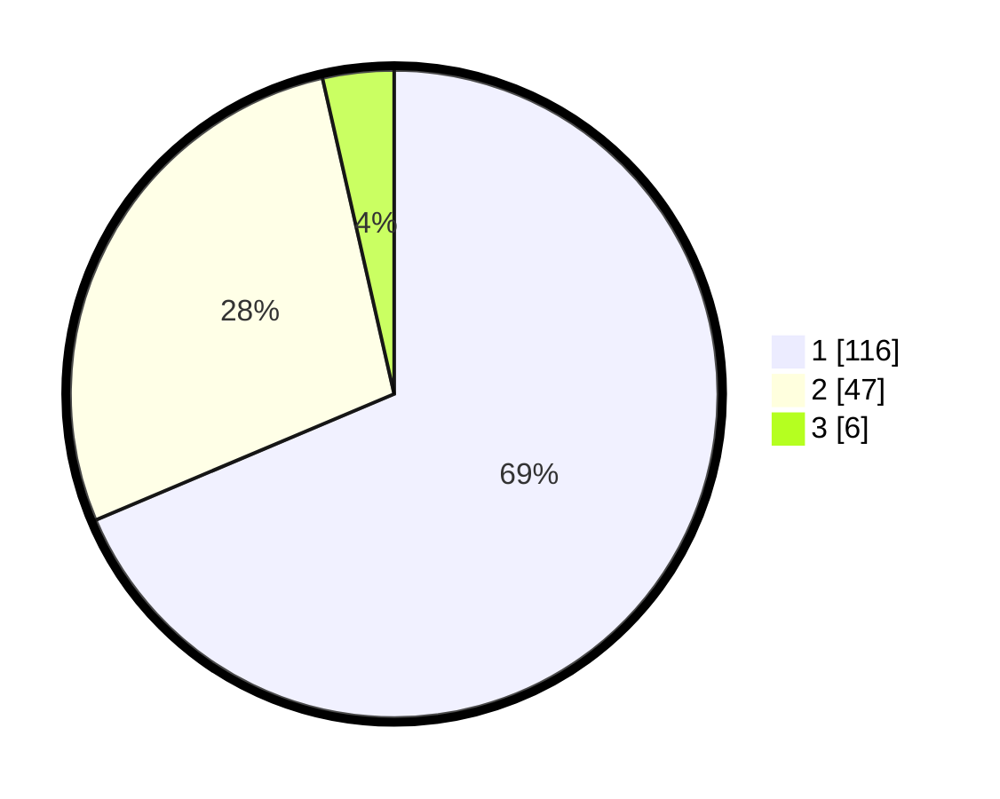

# Hasil

## Grafik

## Tabel

| No. | Nama Paslon    | Suara | Suara (raw) | Persentase |
|:--- |:-------------- | -----:| -----------:| ----------:|
| 1   | ANIES MUHAIMIN | 116   | [116][p-1]  | 68,64      |
| 2   | PRABOWO GIBRAN | 47    | [47][p-2]   | 27,81      |
| 3   | GANJAR MAHFUD  | 6     | [6][p-3]    | 3,55       |

[p-1]: https://github.com/gigit-pemilu/pemilu-2024-12-sumatera-utara/blob/main/pilpres/hitung-suara/sub/12-sumatera-utara/sub/71-kota-medan/sub/04-medan-denai/sub/1003-tegal-s-mandala-iii/sub/077-tps/sub/paslon-1.txt
[p-2]: https://github.com/gigit-pemilu/pemilu-2024-12-sumatera-utara/blob/main/pilpres/hitung-suara/sub/12-sumatera-utara/sub/71-kota-medan/sub/04-medan-denai/sub/1003-tegal-s-mandala-iii/sub/077-tps/sub/paslon-2.txt
[p-3]: https://github.com/gigit-pemilu/pemilu-2024-12-sumatera-utara/blob/main/pilpres/hitung-suara/sub/12-sumatera-utara/sub/71-kota-medan/sub/04-medan-denai/sub/1003-tegal-s-mandala-iii/sub/077-tps/sub/paslon-3.txt

## Foto C Plano

https://sirekap-obj-formc.kpu.go.id/1a9e/pemilu/ppwp/12/71/04/10/03/1271041003077-20240215-024452--b51407bb-9f21-4e90-8a02-76fd46d94527.jpg

https://sirekap-obj-formc.kpu.go.id/1a9e/pemilu/ppwp/12/71/04/10/03/1271041003077-20240215-024343--59143e22-ab40-45a6-97db-9be63e2228b9.jpg

https://sirekap-obj-formc.kpu.go.id/1a9e/pemilu/ppwp/12/71/04/10/03/1271041003077-20240215-024637--f87e124a-92f0-43c7-8251-1d0c6195591b.jpg

## Metadata

| Key        | Value               |
| ---------- | ------------------- |
| Time Stamp | 2024-02-25 21:00:00 |

