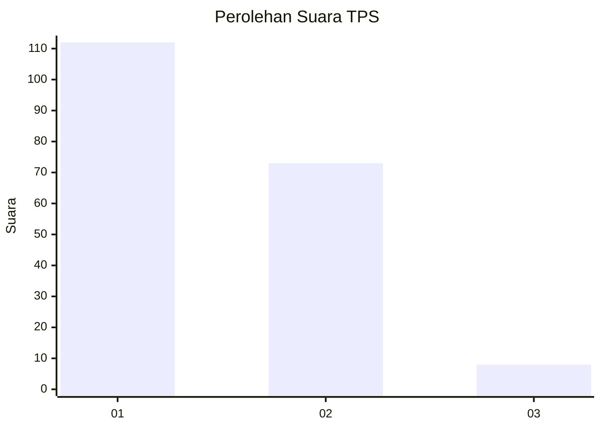
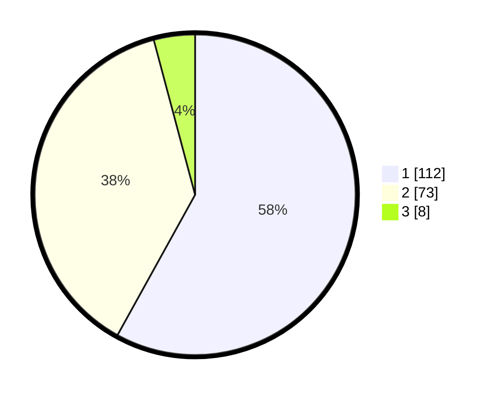

# Hasil

## Grafik

## Tabel

| No. | Nama Paslon    | Suara | Suara (raw) | Persentase |
|:--- |:-------------- | -----:| -----------:| ----------:|
| 1   | ANIES MUHAIMIN | 112   | [112][p-1]  | 58,03      |
| 2   | PRABOWO GIBRAN | 73    | [73][p-2]   | 37,82      |
| 3   | GANJAR MAHFUD  | 8     | [8][p-3]    | 4,15       |

[p-1]: https://github.com/gigit-pemilu/pemilu-2024-12-sumatera-utara/blob/main/pilpres/hitung-suara/sub/12-sumatera-utara/sub/71-kota-medan/sub/04-medan-denai/sub/1004-denai/sub/019-tps/sub/paslon-1.txt
[p-2]: https://github.com/gigit-pemilu/pemilu-2024-12-sumatera-utara/blob/main/pilpres/hitung-suara/sub/12-sumatera-utara/sub/71-kota-medan/sub/04-medan-denai/sub/1004-denai/sub/019-tps/sub/paslon-2.txt
[p-3]: https://github.com/gigit-pemilu/pemilu-2024-12-sumatera-utara/blob/main/pilpres/hitung-suara/sub/12-sumatera-utara/sub/71-kota-medan/sub/04-medan-denai/sub/1004-denai/sub/019-tps/sub/paslon-3.txt

## Foto C Plano

https://sirekap-obj-formc.kpu.go.id/ad0b/pemilu/ppwp/12/71/04/10/04/1271041004019-20240215-014354--c644ef35-0ceb-4d71-aea7-aeabb6e3a73e.jpg

https://sirekap-obj-formc.kpu.go.id/ad0b/pemilu/ppwp/12/71/04/10/04/1271041004019-20240215-014544--16898492-d316-4b57-9854-2de7e75c0611.jpg

https://sirekap-obj-formc.kpu.go.id/ad0b/pemilu/ppwp/12/71/04/10/04/1271041004019-20240214-205301--2e8cb4f8-268b-4ec4-af51-7068baf089ca.jpg

## Metadata

| Key        | Value               |
| ---------- | ------------------- |
| Time Stamp | 2024-02-25 17:00:00 |

