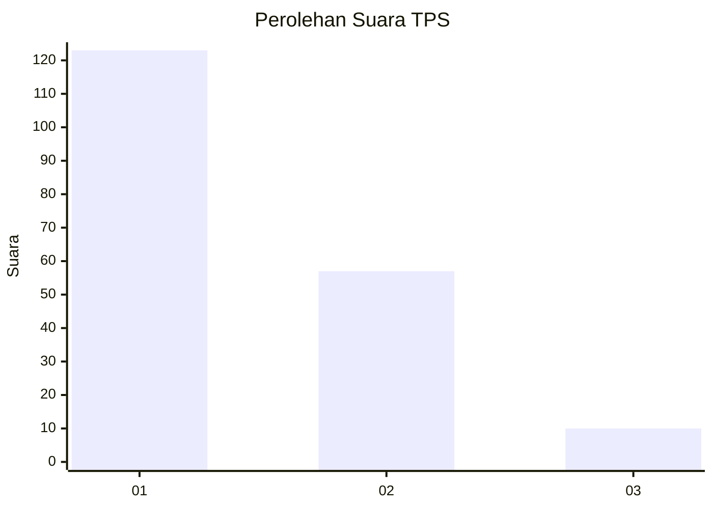
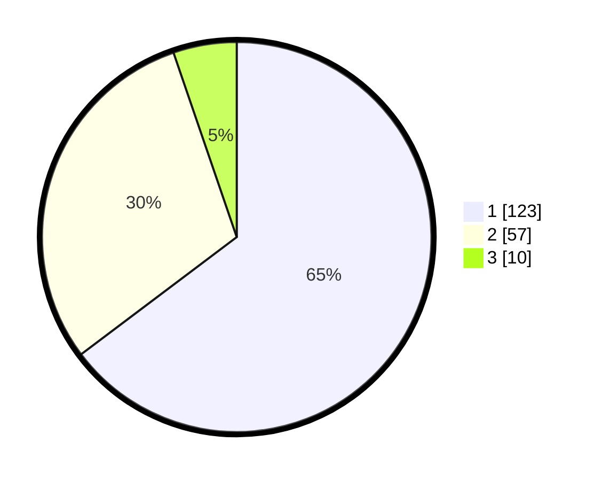

# Hasil

## Grafik

## Tabel

| No. | Nama Paslon    | Suara | Suara (raw) | Persentase |
|:--- |:-------------- | -----:| -----------:| ----------:|
| 1   | ANIES MUHAIMIN | 123   | [123][p-1]  | 64,74      |
| 2   | PRABOWO GIBRAN | 57    | [57][p-2]   | 30,00      |
| 3   | GANJAR MAHFUD  | 10    | [10][p-3]   | 5,26       |

[p-1]: https://github.com/gigit-pemilu/pemilu-2024-12-sumatera-utara/blob/main/pilpres/hitung-suara/sub/12-sumatera-utara/sub/71-kota-medan/sub/04-medan-denai/sub/1004-denai/sub/020-tps/sub/paslon-1.txt
[p-2]: https://github.com/gigit-pemilu/pemilu-2024-12-sumatera-utara/blob/main/pilpres/hitung-suara/sub/12-sumatera-utara/sub/71-kota-medan/sub/04-medan-denai/sub/1004-denai/sub/020-tps/sub/paslon-2.txt
[p-3]: https://github.com/gigit-pemilu/pemilu-2024-12-sumatera-utara/blob/main/pilpres/hitung-suara/sub/12-sumatera-utara/sub/71-kota-medan/sub/04-medan-denai/sub/1004-denai/sub/020-tps/sub/paslon-3.txt

## Foto C Plano

https://sirekap-obj-formc.kpu.go.id/6576/pemilu/ppwp/12/71/04/10/04/1271041004020-20240214-235716--fcadbbd2-96a3-43a5-800c-cd369eec7245.jpg

https://sirekap-obj-formc.kpu.go.id/6576/pemilu/ppwp/12/71/04/10/04/1271041004020-20240214-235730--af2419ea-575e-439e-97b1-b0dec27ee7eb.jpg

https://sirekap-obj-formc.kpu.go.id/6576/pemilu/ppwp/12/71/04/10/04/1271041004020-20240214-235904--f0375753-b1ce-495e-a394-13bae842973e.jpg

## Metadata

| Key        | Value               |
| ---------- | ------------------- |
| Time Stamp | 2024-02-25 15:00:00 |

