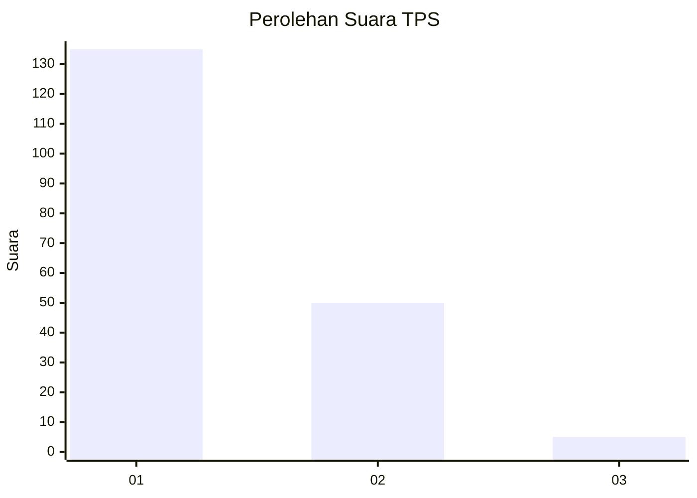
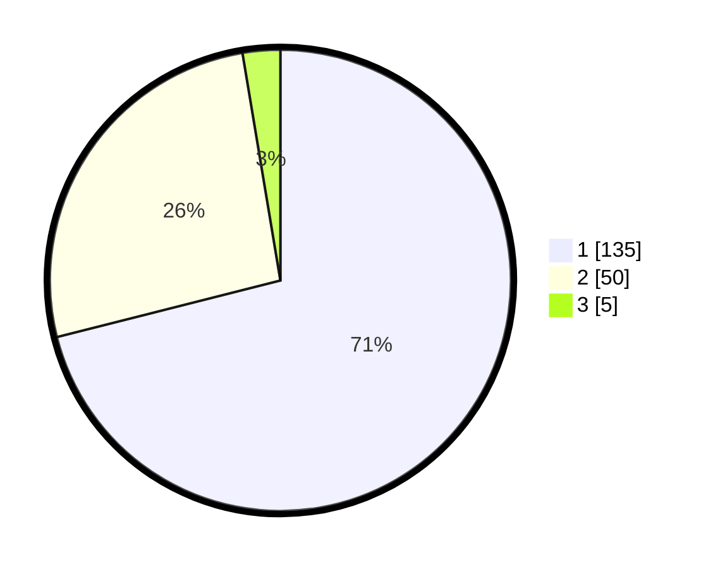

# Hasil

## Grafik

## Tabel

| No. | Nama Paslon    | Suara | Suara (raw) | Persentase |
|:--- |:-------------- | -----:| -----------:| ----------:|
| 1   | ANIES MUHAIMIN | 135   | [135][p-1]  | 71,05      |
| 2   | PRABOWO GIBRAN | 50    | [50][p-2]   | 26,32      |
| 3   | GANJAR MAHFUD  | 5     | [5][p-3]    | 2,63       |

[p-1]: https://github.com/gigit-pemilu/pemilu-2024-12-sumatera-utara/blob/main/pilpres/hitung-suara/sub/12-sumatera-utara/sub/71-kota-medan/sub/04-medan-denai/sub/1005-binjai/sub/134-tps/sub/paslon-1.txt
[p-2]: https://github.com/gigit-pemilu/pemilu-2024-12-sumatera-utara/blob/main/pilpres/hitung-suara/sub/12-sumatera-utara/sub/71-kota-medan/sub/04-medan-denai/sub/1005-binjai/sub/134-tps/sub/paslon-2.txt
[p-3]: https://github.com/gigit-pemilu/pemilu-2024-12-sumatera-utara/blob/main/pilpres/hitung-suara/sub/12-sumatera-utara/sub/71-kota-medan/sub/04-medan-denai/sub/1005-binjai/sub/134-tps/sub/paslon-3.txt

## Foto C Plano

https://sirekap-obj-formc.kpu.go.id/f5a7/pemilu/ppwp/12/71/04/10/05/1271041005134-20240214-214743--53dd35e1-8d8b-420d-b8ab-2dc9ec5d489c.jpg

https://sirekap-obj-formc.kpu.go.id/f5a7/pemilu/ppwp/12/71/04/10/05/1271041005134-20240214-214824--28a27335-de63-437a-bc0e-2ed4e248e399.jpg

https://sirekap-obj-formc.kpu.go.id/f5a7/pemilu/ppwp/12/71/04/10/05/1271041005134-20240214-214945--12c13479-551b-4dd9-8ab8-1b3751d751af.jpg

## Metadata

| Key        | Value               |
| ---------- | ------------------- |
| Time Stamp | 2024-02-24 22:31:28 |

