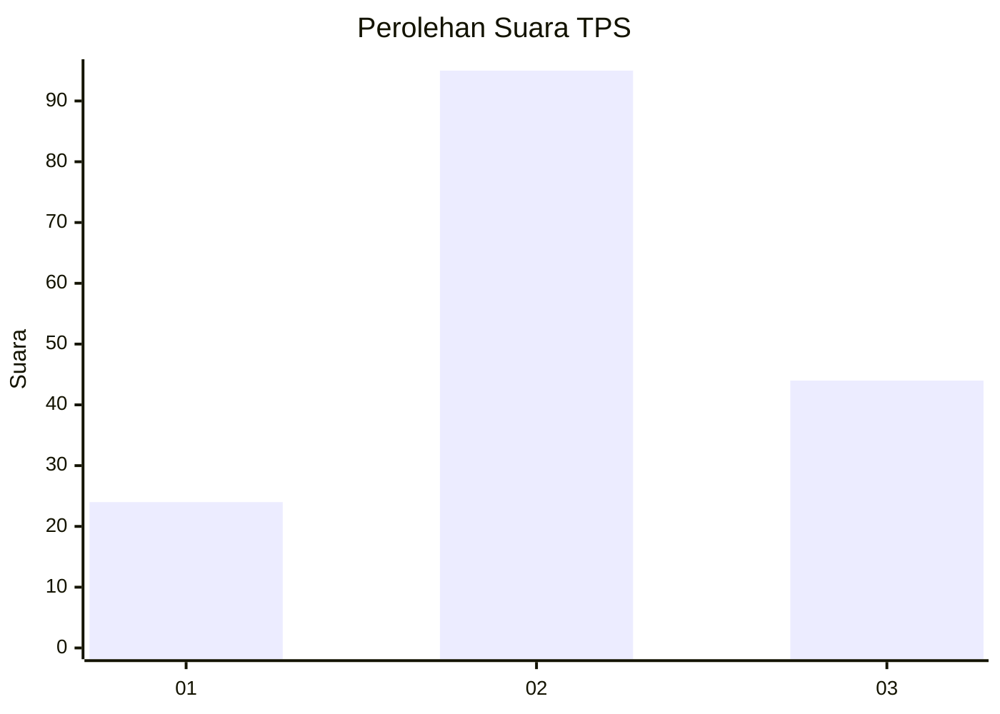
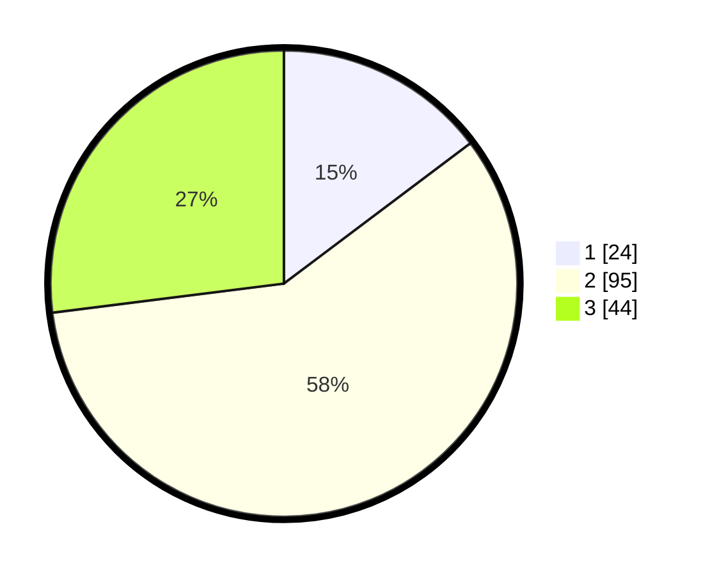

# Hasil

## Grafik

## Tabel

| No. | Nama Paslon    | Suara | Suara (raw) | Persentase |
|:--- |:-------------- | -----:| -----------:| ----------:|
| 1   | ANIES MUHAIMIN | 24    | [24][p-1]   | 14,72      |
| 2   | PRABOWO GIBRAN | 95    | [95][p-2]   | 58,28      |
| 3   | GANJAR MAHFUD  | 44    | [44][p-3]   | 26,99      |

[p-1]: https://github.com/gigit-pemilu/pemilu-2024/blob/main/pilpres/hitung-suara/sub/12-sumatera-utara/sub/71-kota-medan/sub/05-medan-barat/sub/1002-silalas/sub/003-tps/sub/paslon-1.txt
[p-2]: https://github.com/gigit-pemilu/pemilu-2024/blob/main/pilpres/hitung-suara/sub/12-sumatera-utara/sub/71-kota-medan/sub/05-medan-barat/sub/1002-silalas/sub/003-tps/sub/paslon-2.txt
[p-3]: https://github.com/gigit-pemilu/pemilu-2024/blob/main/pilpres/hitung-suara/sub/12-sumatera-utara/sub/71-kota-medan/sub/05-medan-barat/sub/1002-silalas/sub/003-tps/sub/paslon-3.txt

## Foto C Plano

https://sirekap-obj-formc.kpu.go.id/ebc6/pemilu/ppwp/12/71/05/10/02/1271051002003-20240214-221022--7422ee26-3466-4bc0-bc74-06f431380fa7.jpg

https://sirekap-obj-formc.kpu.go.id/ebc6/pemilu/ppwp/12/71/05/10/02/1271051002003-20240214-221135--d7faadba-f0eb-4619-9392-f9c50a8493af.jpg

https://sirekap-obj-formc.kpu.go.id/ebc6/pemilu/ppwp/12/71/05/10/02/1271051002003-20240214-221227--2d099e25-9024-4f70-a6ca-607305ed34e1.jpg

## Metadata

| Key        | Value               |
| ---------- | ------------------- |
| Time Stamp | 2024-02-16 23:30:00 |

