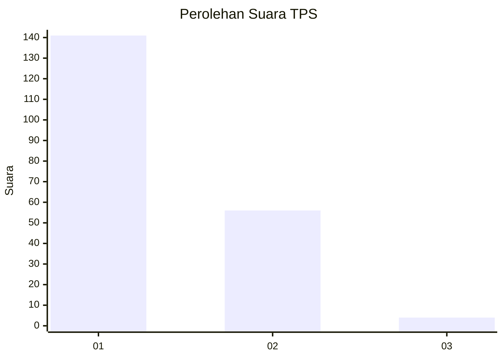
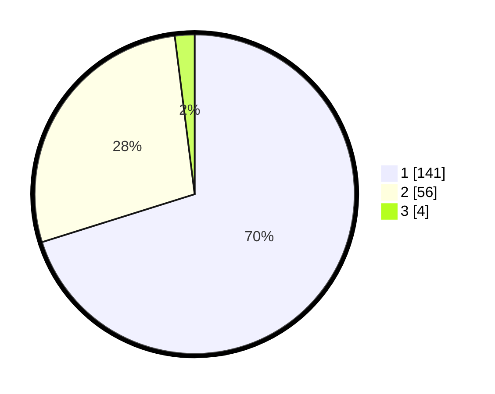

# Hasil

## Grafik

## Tabel

| No. | Nama Paslon    | Suara | Suara (raw) | Persentase |
|:--- |:-------------- | -----:| -----------:| ----------:|
| 1   | ANIES MUHAIMIN | 141   | [141][p-1]  | 70,15      |
| 2   | PRABOWO GIBRAN | 56    | [56][p-2]   | 27,86      |
| 3   | GANJAR MAHFUD  | 4     | [4][p-3]    | 1,99       |

[p-1]: https://github.com/gigit-pemilu/pemilu-2024-12-sumatera-utara/blob/main/pilpres/hitung-suara/sub/12-sumatera-utara/sub/71-kota-medan/sub/05-medan-barat/sub/1005-sei-agul/sub/048-tps/sub/paslon-1.txt
[p-2]: https://github.com/gigit-pemilu/pemilu-2024-12-sumatera-utara/blob/main/pilpres/hitung-suara/sub/12-sumatera-utara/sub/71-kota-medan/sub/05-medan-barat/sub/1005-sei-agul/sub/048-tps/sub/paslon-2.txt
[p-3]: https://github.com/gigit-pemilu/pemilu-2024-12-sumatera-utara/blob/main/pilpres/hitung-suara/sub/12-sumatera-utara/sub/71-kota-medan/sub/05-medan-barat/sub/1005-sei-agul/sub/048-tps/sub/paslon-3.txt

## Foto C Plano

https://sirekap-obj-formc.kpu.go.id/4138/pemilu/ppwp/12/71/05/10/05/1271051005048-20240214-222647--9ec1639a-08d3-4bb3-8ddb-5832c6b9b2d9.jpg

https://sirekap-obj-formc.kpu.go.id/4138/pemilu/ppwp/12/71/05/10/05/1271051005048-20240214-223046--c1eaa808-f35b-4d01-bc28-579b1fbaf7b5.jpg

https://sirekap-obj-formc.kpu.go.id/4138/pemilu/ppwp/12/71/05/10/05/1271051005048-20240214-223218--f19c891b-e48a-4b43-a39b-4fc58a3581a8.jpg

## Metadata

| Key        | Value               |
| ---------- | ------------------- |
| Time Stamp | 2024-02-24 22:31:28 |

