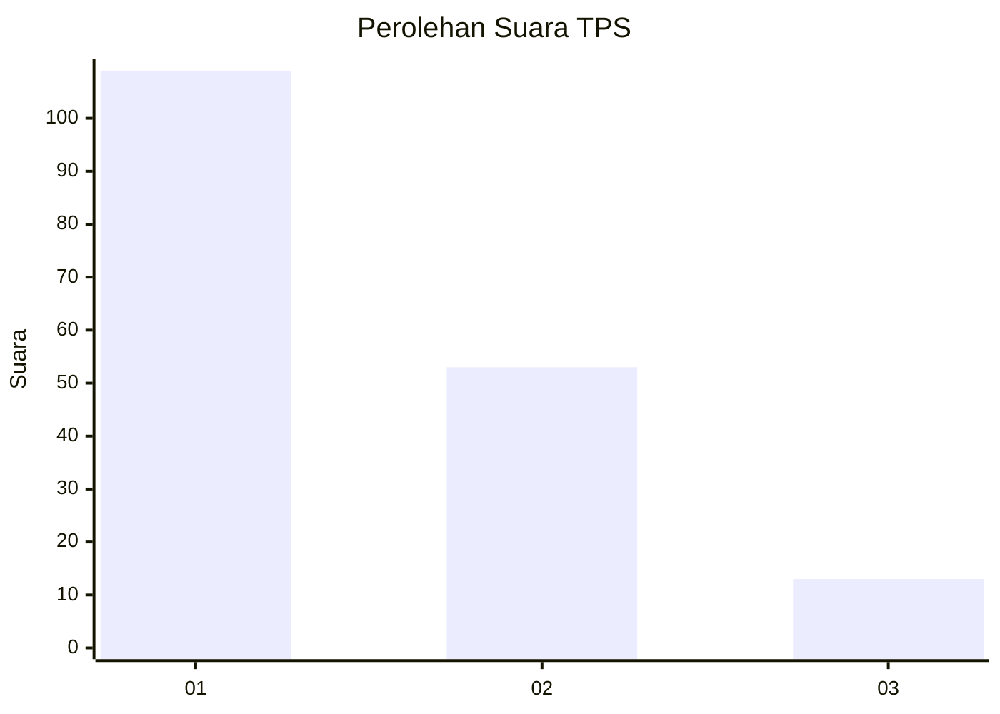
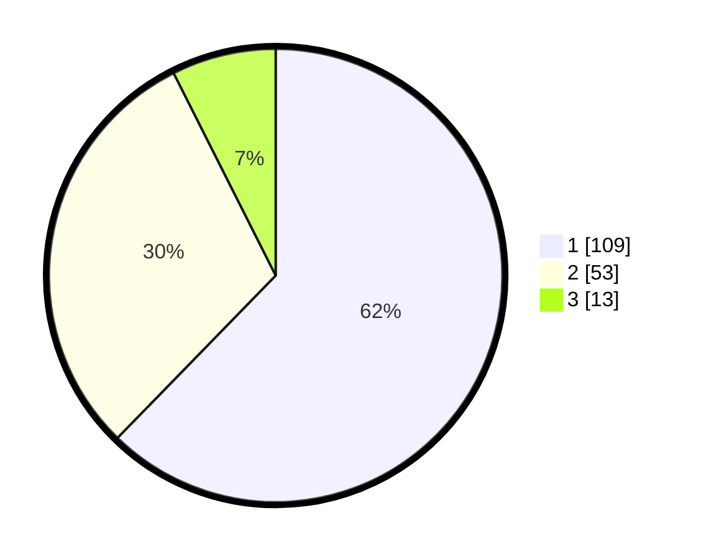

# Hasil

## Grafik

## Tabel

| No. | Nama Paslon    | Suara | Suara (raw) | Persentase |
|:--- |:-------------- | -----:| -----------:| ----------:|
| 1   | ANIES MUHAIMIN | 109   | [109][p-1]  | 62,29      |
| 2   | PRABOWO GIBRAN | 53    | [53][p-2]   | 30,29      |
| 3   | GANJAR MAHFUD  | 13    | [13][p-3]   | 7,43       |

[p-1]: https://github.com/gigit-pemilu/pemilu-2024/blob/main/pilpres/hitung-suara/sub/12-sumatera-utara/sub/71-kota-medan/sub/06-medan-deli/sub/1001-titipapan/sub/002-tps/sub/paslon-1.txt
[p-2]: https://github.com/gigit-pemilu/pemilu-2024/blob/main/pilpres/hitung-suara/sub/12-sumatera-utara/sub/71-kota-medan/sub/06-medan-deli/sub/1001-titipapan/sub/002-tps/sub/paslon-2.txt
[p-3]: https://github.com/gigit-pemilu/pemilu-2024/blob/main/pilpres/hitung-suara/sub/12-sumatera-utara/sub/71-kota-medan/sub/06-medan-deli/sub/1001-titipapan/sub/002-tps/sub/paslon-3.txt

## Foto C Plano

https://sirekap-obj-formc.kpu.go.id/c255/pemilu/ppwp/12/71/06/10/01/1271061001002-20240214-192620--6c568698-4998-4eac-8c83-837fae75b086.jpg

https://sirekap-obj-formc.kpu.go.id/c255/pemilu/ppwp/12/71/06/10/01/1271061001002-20240214-192104--aa480863-2c0e-44cb-86b7-b2483443b48c.jpg

https://sirekap-obj-formc.kpu.go.id/c255/pemilu/ppwp/12/71/06/10/01/1271061001002-20240214-192839--ca65d9dc-dbca-46b7-a191-c031757f551a.jpg

## Metadata

| Key        | Value               |
| ---------- | ------------------- |
| Time Stamp | 2024-02-25 10:00:00 |

