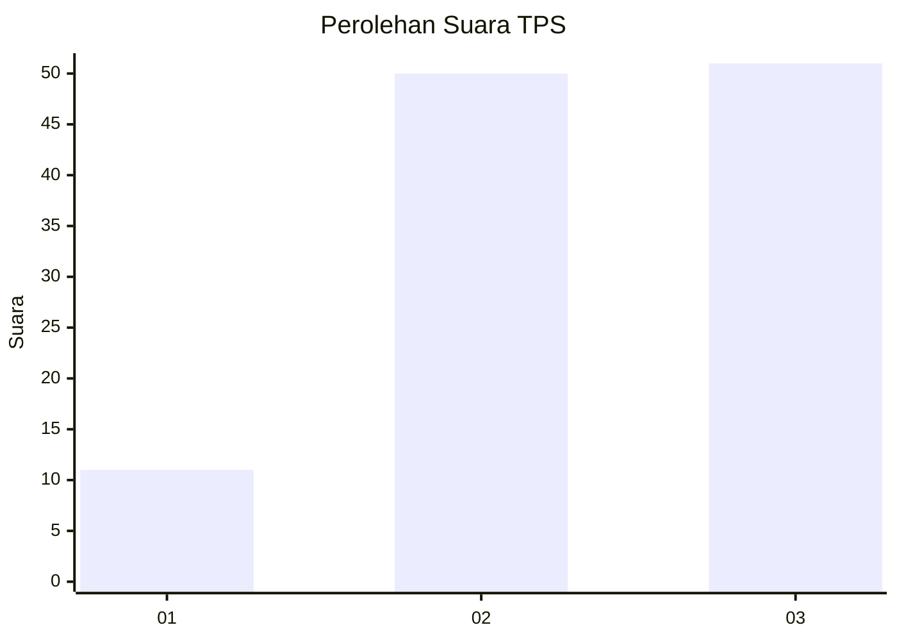
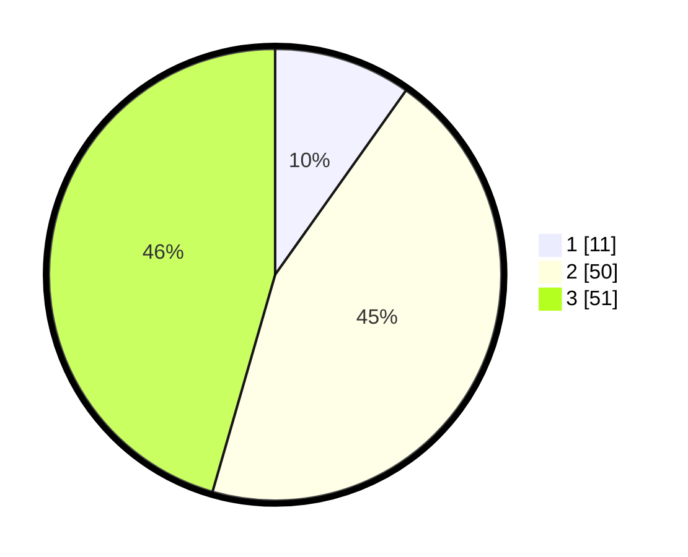

# Hasil

## Grafik

## Tabel

| No. | Nama Paslon    | Suara | Suara (raw) | Persentase |
|:--- |:-------------- | -----:| -----------:| ----------:|
| 1   | ANIES MUHAIMIN | 11    | [11][p-1]   | 9,82       |
| 2   | PRABOWO GIBRAN | 50    | [50][p-2]   | 44,64      |
| 3   | GANJAR MAHFUD  | 51    | [51][p-3]   | 45,54      |

[p-1]: https://github.com/gigit-pemilu/pemilu-2024/blob/main/pilpres/hitung-suara/sub/12-sumatera-utara/sub/71-kota-medan/sub/06-medan-deli/sub/1001-titipapan/sub/017-tps/sub/paslon-1.txt
[p-2]: https://github.com/gigit-pemilu/pemilu-2024/blob/main/pilpres/hitung-suara/sub/12-sumatera-utara/sub/71-kota-medan/sub/06-medan-deli/sub/1001-titipapan/sub/017-tps/sub/paslon-2.txt
[p-3]: https://github.com/gigit-pemilu/pemilu-2024/blob/main/pilpres/hitung-suara/sub/12-sumatera-utara/sub/71-kota-medan/sub/06-medan-deli/sub/1001-titipapan/sub/017-tps/sub/paslon-3.txt

## Foto C Plano

https://sirekap-obj-formc.kpu.go.id/f2b0/pemilu/ppwp/12/71/06/10/01/1271061001017-20240214-205928--607216cf-5947-4417-bac9-91d623a319ed.jpg

https://sirekap-obj-formc.kpu.go.id/f2b0/pemilu/ppwp/12/71/06/10/01/1271061001017-20240214-205948--06387efc-dbca-4dba-b436-82985ebe9feb.jpg

https://sirekap-obj-formc.kpu.go.id/f2b0/pemilu/ppwp/12/71/06/10/01/1271061001017-20240214-210006--c6c6cf2d-3197-4aa4-816f-ea68689ab595.jpg

## Metadata

| Key        | Value               |
| ---------- | ------------------- |
| Time Stamp | 2024-02-24 22:31:28 |

