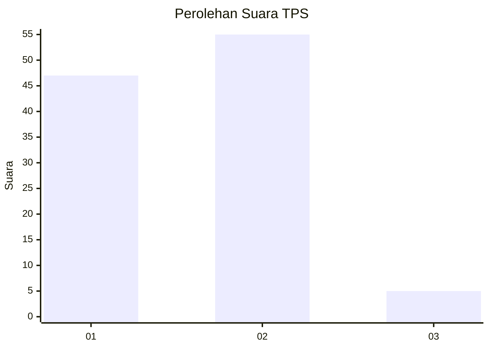
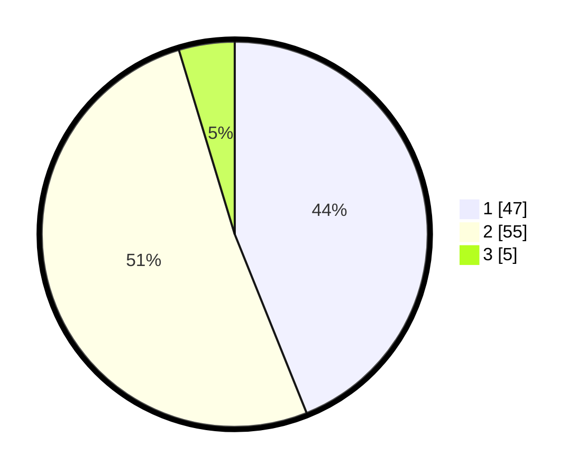

# Hasil

## Grafik

## Tabel

| No. | Nama Paslon    | Suara | Suara (raw) | Persentase |
|:--- |:-------------- | -----:| -----------:| ----------:|
| 1   | ANIES MUHAIMIN | 47    | [47][p-1]   | 43,93      |
| 2   | PRABOWO GIBRAN | 55    | [55][p-2]   | 51,40      |
| 3   | GANJAR MAHFUD  | 5     | [5][p-3]    | 4,67       |

[p-1]: https://github.com/gigit-pemilu/pemilu-2024/blob/main/pilpres/hitung-suara/sub/12-sumatera-utara/sub/71-kota-medan/sub/06-medan-deli/sub/1003-tanjung-mulya/sub/073-tps/sub/paslon-1.txt
[p-2]: https://github.com/gigit-pemilu/pemilu-2024/blob/main/pilpres/hitung-suara/sub/12-sumatera-utara/sub/71-kota-medan/sub/06-medan-deli/sub/1003-tanjung-mulya/sub/073-tps/sub/paslon-2.txt
[p-3]: https://github.com/gigit-pemilu/pemilu-2024/blob/main/pilpres/hitung-suara/sub/12-sumatera-utara/sub/71-kota-medan/sub/06-medan-deli/sub/1003-tanjung-mulya/sub/073-tps/sub/paslon-3.txt

## Foto C Plano

https://sirekap-obj-formc.kpu.go.id/dc4d/pemilu/ppwp/12/71/06/10/03/1271061003073-20240214-230531--8bb90004-4425-4008-8887-16ef07367ae3.jpg

https://sirekap-obj-formc.kpu.go.id/dc4d/pemilu/ppwp/12/71/06/10/03/1271061003073-20240214-230604--c22d9371-31ef-4d22-a541-145030150369.jpg

https://sirekap-obj-formc.kpu.go.id/dc4d/pemilu/ppwp/12/71/06/10/03/1271061003073-20240214-230705--04b54310-c10a-4133-bfff-1f8681e1eeff.jpg

## Metadata

| Key        | Value               |
| ---------- | ------------------- |
| Time Stamp | 2024-02-25 19:00:00 |

