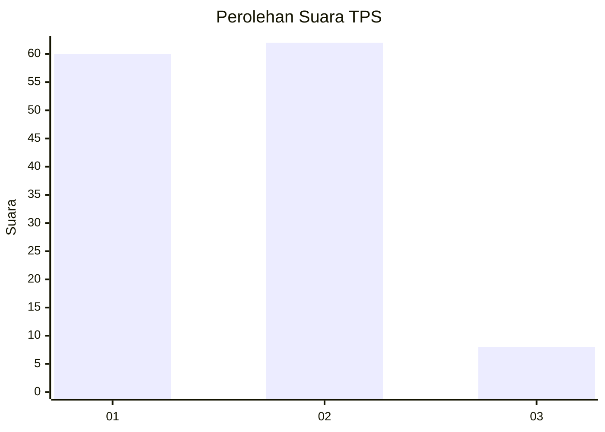
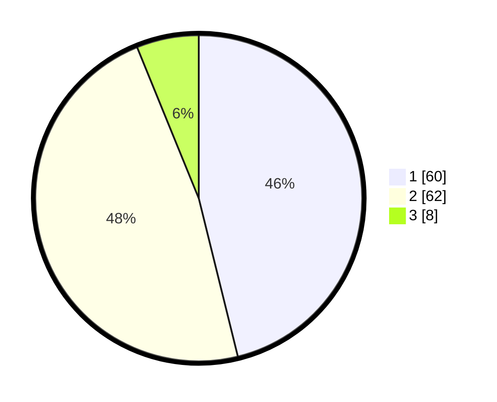

# Hasil

## Grafik

## Tabel

| No. | Nama Paslon    | Suara | Suara (raw) | Persentase |
|:--- |:-------------- | -----:| -----------:| ----------:|
| 1   | ANIES MUHAIMIN | 60    | [60][p-1]   | 46,15      |
| 2   | PRABOWO GIBRAN | 62    | [62][p-2]   | 47,69      |
| 3   | GANJAR MAHFUD  | 8     | [8][p-3]    | 6,15       |

[p-1]: https://github.com/gigit-pemilu/pemilu-2024/blob/main/pilpres/hitung-suara/sub/12-sumatera-utara/sub/71-kota-medan/sub/06-medan-deli/sub/1003-tanjung-mulya/sub/074-tps/sub/paslon-1.txt
[p-2]: https://github.com/gigit-pemilu/pemilu-2024/blob/main/pilpres/hitung-suara/sub/12-sumatera-utara/sub/71-kota-medan/sub/06-medan-deli/sub/1003-tanjung-mulya/sub/074-tps/sub/paslon-2.txt
[p-3]: https://github.com/gigit-pemilu/pemilu-2024/blob/main/pilpres/hitung-suara/sub/12-sumatera-utara/sub/71-kota-medan/sub/06-medan-deli/sub/1003-tanjung-mulya/sub/074-tps/sub/paslon-3.txt

## Foto C Plano

https://sirekap-obj-formc.kpu.go.id/5abe/pemilu/ppwp/12/71/06/10/03/1271061003074-20240215-012100--e3124f31-f897-4112-8709-bfdf749f22df.jpg

https://sirekap-obj-formc.kpu.go.id/5abe/pemilu/ppwp/12/71/06/10/03/1271061003074-20240215-012301--7d1a3501-a940-4396-b307-ec5f08119560.jpg

https://sirekap-obj-formc.kpu.go.id/5abe/pemilu/ppwp/12/71/06/10/03/1271061003074-20240215-012441--da33198e-f5b2-42e6-a782-a9f447ba5d14.jpg

## Metadata

| Key        | Value               |
| ---------- | ------------------- |
| Time Stamp | 2024-02-25 17:00:00 |

