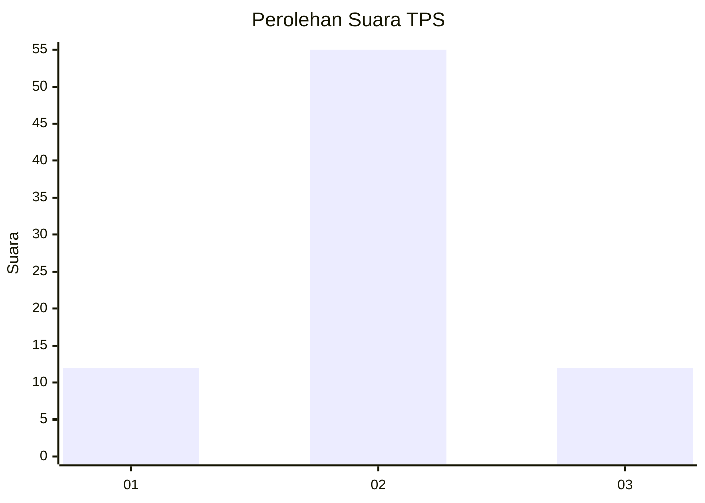
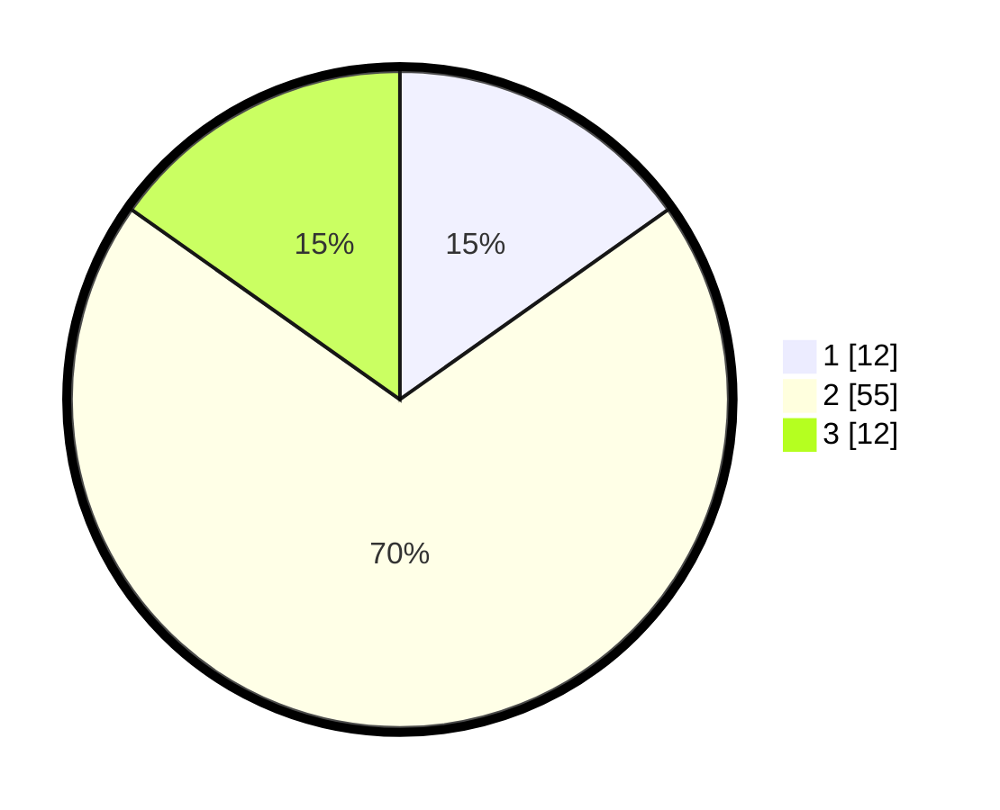

# Hasil

## Grafik

## Tabel

| No. | Nama Paslon    | Suara | Suara (raw) | Persentase |
|:--- |:-------------- | -----:| -----------:| ----------:|
| 1   | ANIES MUHAIMIN | 12    | [12][p-1]   | 15,19      |
| 2   | PRABOWO GIBRAN | 55    | [55][p-2]   | 69,62      |
| 3   | GANJAR MAHFUD  | 12    | [12][p-3]   | 15,19      |

[p-1]: https://github.com/gigit-pemilu/pemilu-2024-12-sumatera-utara/blob/main/pilpres/hitung-suara/sub/12-sumatera-utara/sub/71-kota-medan/sub/06-medan-deli/sub/1004-kota-bangun/sub/016-tps/sub/paslon-1.txt
[p-2]: https://github.com/gigit-pemilu/pemilu-2024-12-sumatera-utara/blob/main/pilpres/hitung-suara/sub/12-sumatera-utara/sub/71-kota-medan/sub/06-medan-deli/sub/1004-kota-bangun/sub/016-tps/sub/paslon-2.txt
[p-3]: https://github.com/gigit-pemilu/pemilu-2024-12-sumatera-utara/blob/main/pilpres/hitung-suara/sub/12-sumatera-utara/sub/71-kota-medan/sub/06-medan-deli/sub/1004-kota-bangun/sub/016-tps/sub/paslon-3.txt

## Foto C Plano

https://sirekap-obj-formc.kpu.go.id/0ea1/pemilu/ppwp/12/71/06/10/04/1271061004016-20240215-005258--e67c4277-b594-4f6d-8bca-54f144b6d9f3.jpg

https://sirekap-obj-formc.kpu.go.id/0ea1/pemilu/ppwp/12/71/06/10/04/1271061004016-20240215-030511--14f3ce49-21f5-4a6d-8be4-68acb71cc70e.jpg

https://sirekap-obj-formc.kpu.go.id/0ea1/pemilu/ppwp/12/71/06/10/04/1271061004016-20240215-035648--2b3724b3-978e-4198-bfd5-4c01ad859386.jpg

## Metadata

| Key        | Value               |
| ---------- | ------------------- |
| Time Stamp | 2024-02-24 22:31:28 |

