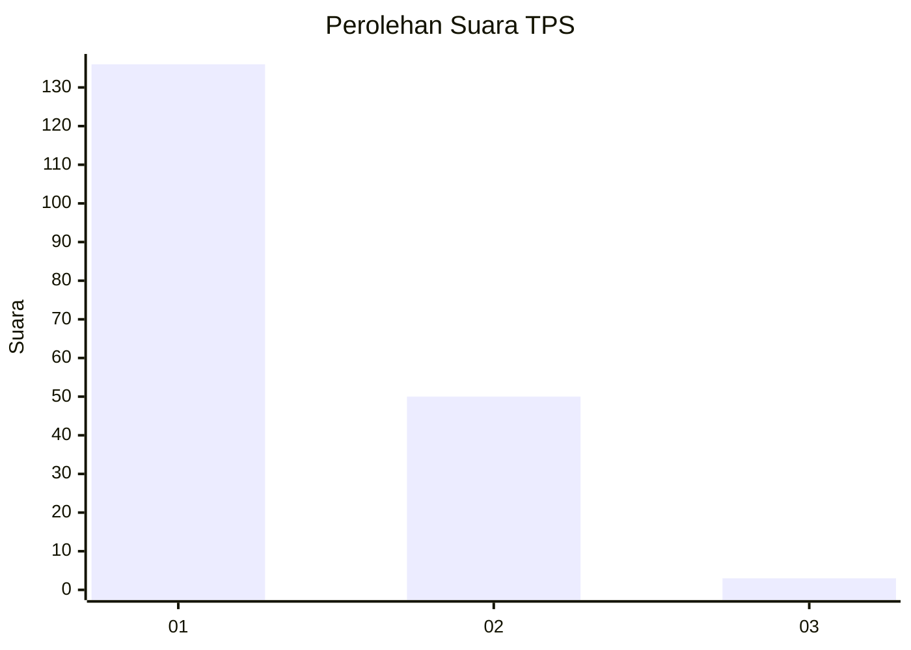
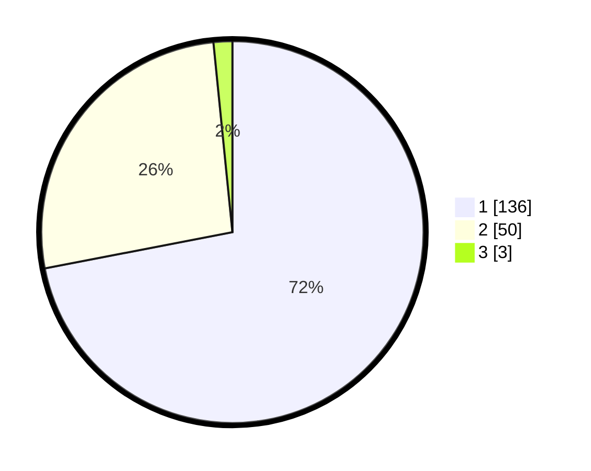

# Hasil

## Grafik

## Tabel

| No. | Nama Paslon    | Suara | Suara (raw) | Persentase |
|:--- |:-------------- | -----:| -----------:| ----------:|
| 1   | ANIES MUHAIMIN | 136   | [136][p-1]  | 71,96      |
| 2   | PRABOWO GIBRAN | 50    | [50][p-2]   | 26,46      |
| 3   | GANJAR MAHFUD  | 3     | [3][p-3]    | 1,59       |

[p-1]: https://github.com/gigit-pemilu/pemilu-2024/blob/main/pilpres/hitung-suara/sub/12-sumatera-utara/sub/71-kota-medan/sub/06-medan-deli/sub/1005-mabar/sub/004-tps/sub/paslon-1.txt
[p-2]: https://github.com/gigit-pemilu/pemilu-2024/blob/main/pilpres/hitung-suara/sub/12-sumatera-utara/sub/71-kota-medan/sub/06-medan-deli/sub/1005-mabar/sub/004-tps/sub/paslon-2.txt
[p-3]: https://github.com/gigit-pemilu/pemilu-2024/blob/main/pilpres/hitung-suara/sub/12-sumatera-utara/sub/71-kota-medan/sub/06-medan-deli/sub/1005-mabar/sub/004-tps/sub/paslon-3.txt

## Foto C Plano

https://sirekap-obj-formc.kpu.go.id/1201/pemilu/ppwp/12/71/06/10/05/1271061005004-20240214-232245--21033b77-d79e-4f9b-bec7-21be42394d79.jpg

https://sirekap-obj-formc.kpu.go.id/1201/pemilu/ppwp/12/71/06/10/05/1271061005004-20240214-232423--125e38af-1f5b-4e58-8fa2-6a67ceb6d5c3.jpg

https://sirekap-obj-formc.kpu.go.id/1201/pemilu/ppwp/12/71/06/10/05/1271061005004-20240214-232525--ef7e66a1-538e-4d9b-9030-80290051fd7e.jpg

## Metadata

| Key        | Value               |
| ---------- | ------------------- |
| Time Stamp | 2024-02-25 11:00:00 |

