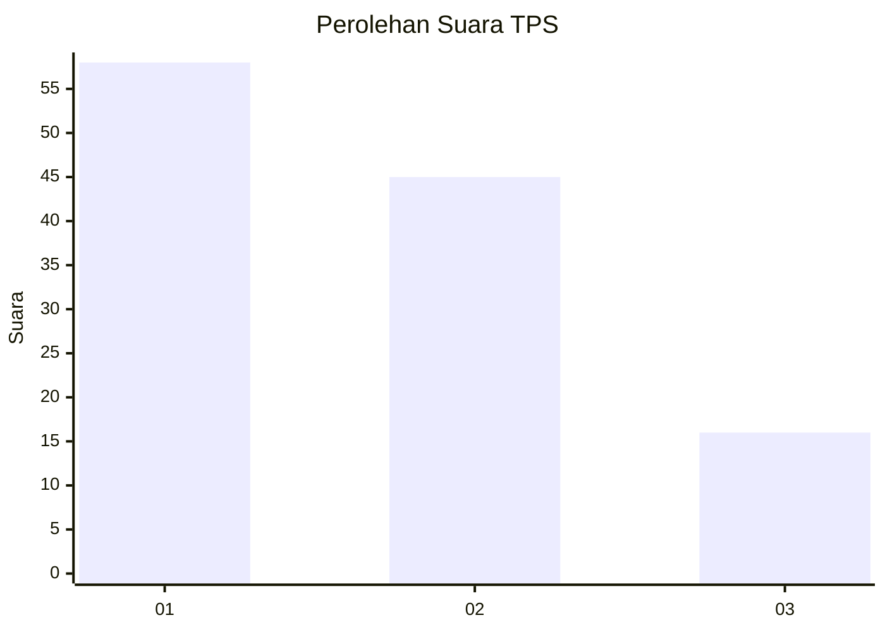
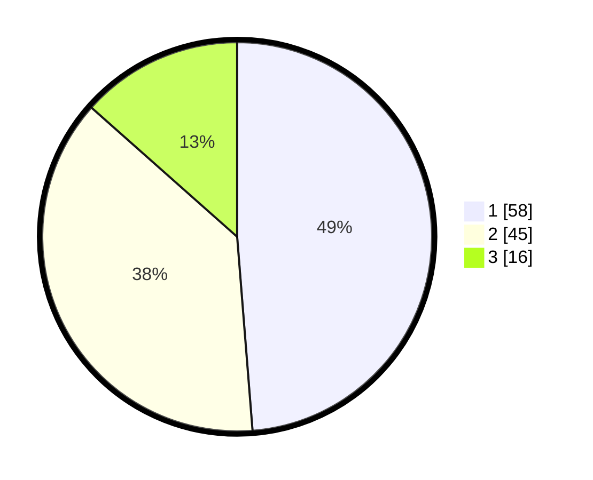

# Hasil

## Grafik

## Tabel

| No. | Nama Paslon    | Suara | Suara (raw) | Persentase |
|:--- |:-------------- | -----:| -----------:| ----------:|
| 1   | ANIES MUHAIMIN | 58    | [58][p-1]   | 48,74      |
| 2   | PRABOWO GIBRAN | 45    | [45][p-2]   | 37,82      |
| 3   | GANJAR MAHFUD  | 16    | [16][p-3]   | 13,45      |

[p-1]: https://github.com/gigit-pemilu/pemilu-2024-12-sumatera-utara/blob/main/pilpres/hitung-suara/sub/12-sumatera-utara/sub/71-kota-medan/sub/06-medan-deli/sub/1005-mabar/sub/038-tps/sub/paslon-1.txt
[p-2]: https://github.com/gigit-pemilu/pemilu-2024-12-sumatera-utara/blob/main/pilpres/hitung-suara/sub/12-sumatera-utara/sub/71-kota-medan/sub/06-medan-deli/sub/1005-mabar/sub/038-tps/sub/paslon-2.txt
[p-3]: https://github.com/gigit-pemilu/pemilu-2024-12-sumatera-utara/blob/main/pilpres/hitung-suara/sub/12-sumatera-utara/sub/71-kota-medan/sub/06-medan-deli/sub/1005-mabar/sub/038-tps/sub/paslon-3.txt

## Foto C Plano

https://sirekap-obj-formc.kpu.go.id/bb3d/pemilu/ppwp/12/71/06/10/05/1271061005038-20240214-191131--69ce189e-f865-44b2-b6b8-cd97135beb1e.jpg

https://sirekap-obj-formc.kpu.go.id/bb3d/pemilu/ppwp/12/71/06/10/05/1271061005038-20240214-191135--420f9c2a-0ae9-4f83-84ce-4f48766beb62.jpg

https://sirekap-obj-formc.kpu.go.id/bb3d/pemilu/ppwp/12/71/06/10/05/1271061005038-20240214-191113--1351abfc-7d76-43b7-9971-d5155917c67a.jpg

## Metadata

| Key        | Value               |
| ---------- | ------------------- |
| Time Stamp | 2024-02-14 21:46:01 |

