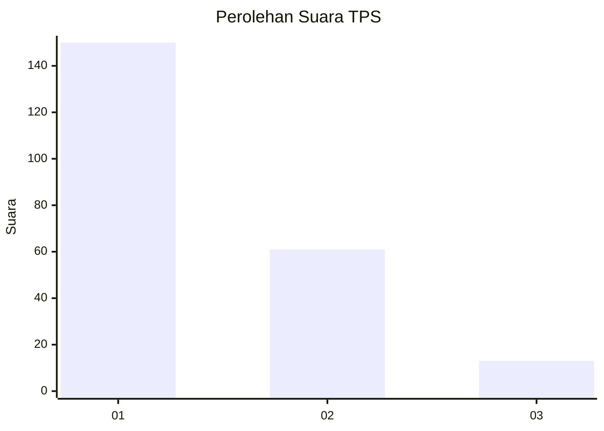
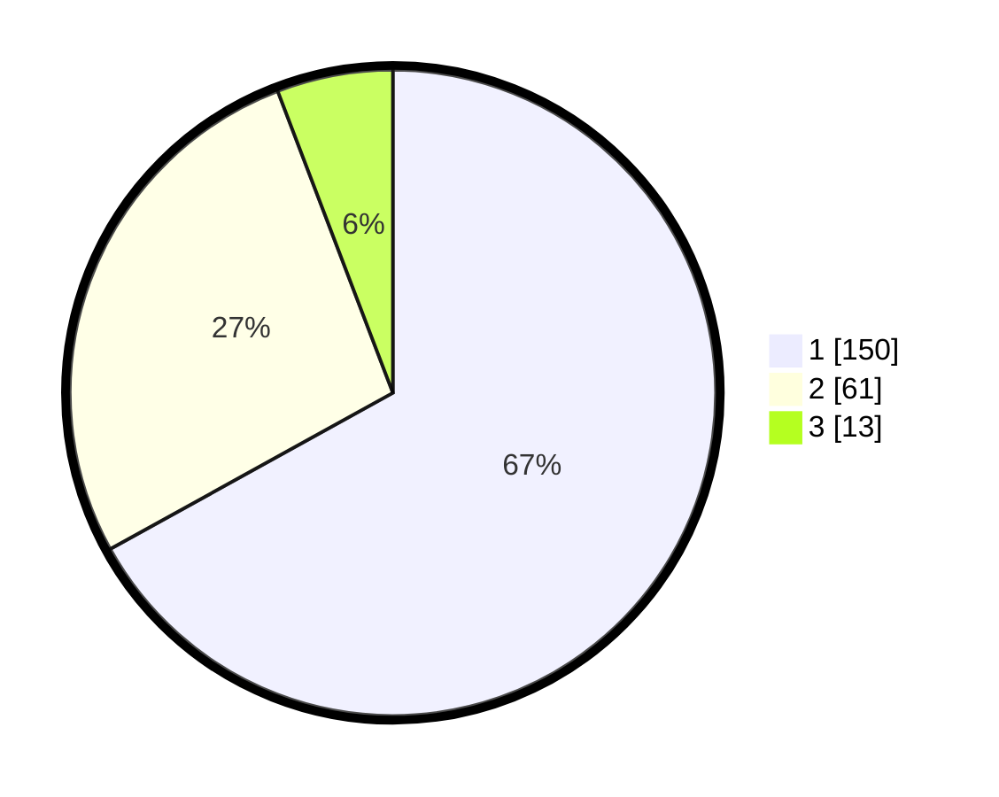

# Hasil

## Grafik

## Tabel

| No. | Nama Paslon    | Suara | Suara (raw) | Persentase |
|:--- |:-------------- | -----:| -----------:| ----------:|
| 1   | ANIES MUHAIMIN | 150   | [150][p-1]  | 66,96      |
| 2   | PRABOWO GIBRAN | 61    | [61][p-2]   | 27,23      |
| 3   | GANJAR MAHFUD  | 13    | [13][p-3]   | 5,80       |

[p-1]: https://github.com/gigit-pemilu/pemilu-2024-12-sumatera-utara/blob/main/pilpres/hitung-suara/sub/12-sumatera-utara/sub/71-kota-medan/sub/07-medan-tuntungan/sub/1002-simpang-selayang/sub/053-tps/sub/paslon-1.txt
[p-2]: https://github.com/gigit-pemilu/pemilu-2024-12-sumatera-utara/blob/main/pilpres/hitung-suara/sub/12-sumatera-utara/sub/71-kota-medan/sub/07-medan-tuntungan/sub/1002-simpang-selayang/sub/053-tps/sub/paslon-2.txt
[p-3]: https://github.com/gigit-pemilu/pemilu-2024-12-sumatera-utara/blob/main/pilpres/hitung-suara/sub/12-sumatera-utara/sub/71-kota-medan/sub/07-medan-tuntungan/sub/1002-simpang-selayang/sub/053-tps/sub/paslon-3.txt

## Foto C Plano

https://sirekap-obj-formc.kpu.go.id/4663/pemilu/ppwp/12/71/07/10/02/1271071002053-20240215-010049--58e3ebf6-fa20-4bf1-8acd-2511484bd82d.jpg

https://sirekap-obj-formc.kpu.go.id/4663/pemilu/ppwp/12/71/07/10/02/1271071002053-20240215-010229--3f14ea63-bc8c-4a89-bf4e-e74b51693c6d.jpg

https://sirekap-obj-formc.kpu.go.id/4663/pemilu/ppwp/12/71/07/10/02/1271071002053-20240215-010508--d9e56ac7-17a9-4fa5-b235-b22c877facec.jpg

## Metadata

| Key        | Value               |
| ---------- | ------------------- |
| Time Stamp | 2024-02-21 21:00:04 |

