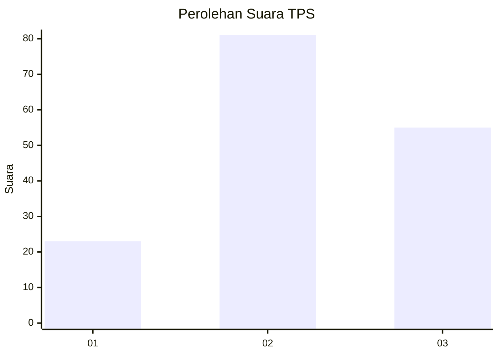
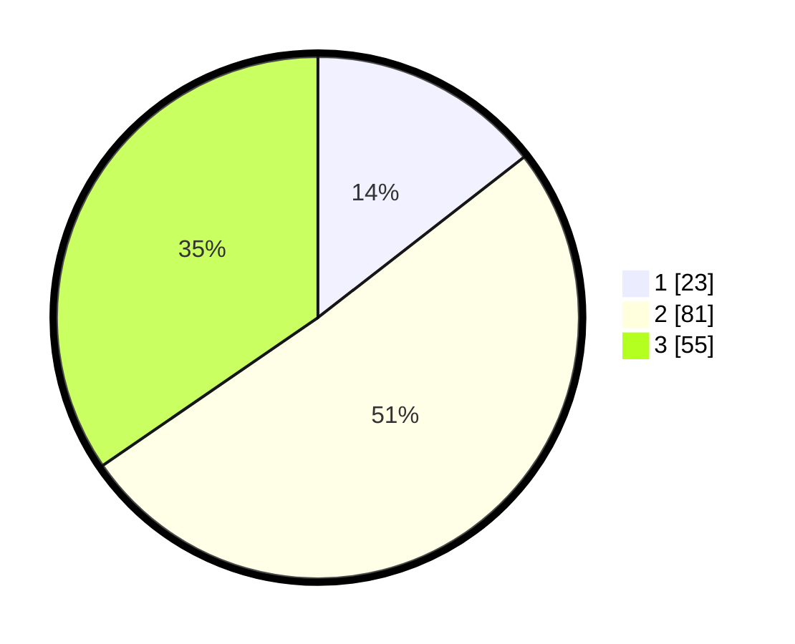

# Hasil

## Grafik

## Tabel

| No. | Nama Paslon    | Suara | Suara (raw) | Persentase |
|:--- |:-------------- | -----:| -----------:| ----------:|
| 1   | ANIES MUHAIMIN | 23    | [23][p-1]   | 14,47      |
| 2   | PRABOWO GIBRAN | 81    | [81][p-2]   | 50,94      |
| 3   | GANJAR MAHFUD  | 55    | [55][p-3]   | 34,59      |

[p-1]: https://github.com/gigit-pemilu/pemilu-2024-12-sumatera-utara/blob/main/pilpres/hitung-suara/sub/12-sumatera-utara/sub/71-kota-medan/sub/08-medan-belawan/sub/1001-belawan-i/sub/001-tps/sub/paslon-1.txt
[p-2]: https://github.com/gigit-pemilu/pemilu-2024-12-sumatera-utara/blob/main/pilpres/hitung-suara/sub/12-sumatera-utara/sub/71-kota-medan/sub/08-medan-belawan/sub/1001-belawan-i/sub/001-tps/sub/paslon-2.txt
[p-3]: https://github.com/gigit-pemilu/pemilu-2024-12-sumatera-utara/blob/main/pilpres/hitung-suara/sub/12-sumatera-utara/sub/71-kota-medan/sub/08-medan-belawan/sub/1001-belawan-i/sub/001-tps/sub/paslon-3.txt

## Foto C Plano

https://sirekap-obj-formc.kpu.go.id/c7bd/pemilu/ppwp/12/71/08/10/01/1271081001001-20240215-014204--35986cd0-cd92-4fe1-9a57-5788d309aac0.jpg

https://sirekap-obj-formc.kpu.go.id/c7bd/pemilu/ppwp/12/71/08/10/01/1271081001001-20240215-014312--c240c05b-518a-4d2a-a8a0-56f30da37808.jpg

https://sirekap-obj-formc.kpu.go.id/c7bd/pemilu/ppwp/12/71/08/10/01/1271081001001-20240215-014405--8d5cc906-ba25-4a69-9ec0-018c1c681533.jpg

## Metadata

| Key        | Value               |
| ---------- | ------------------- |
| Time Stamp | 2024-02-25 16:00:00 |

