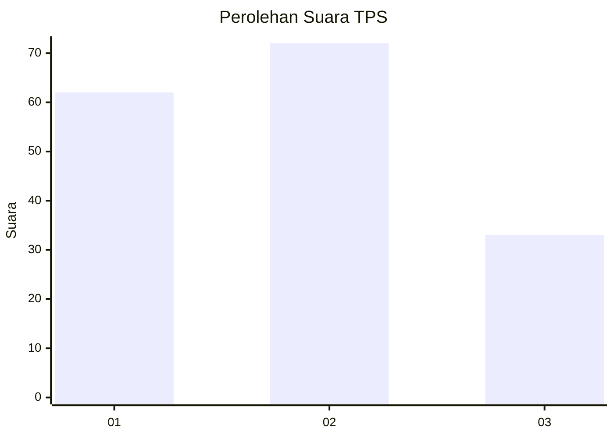
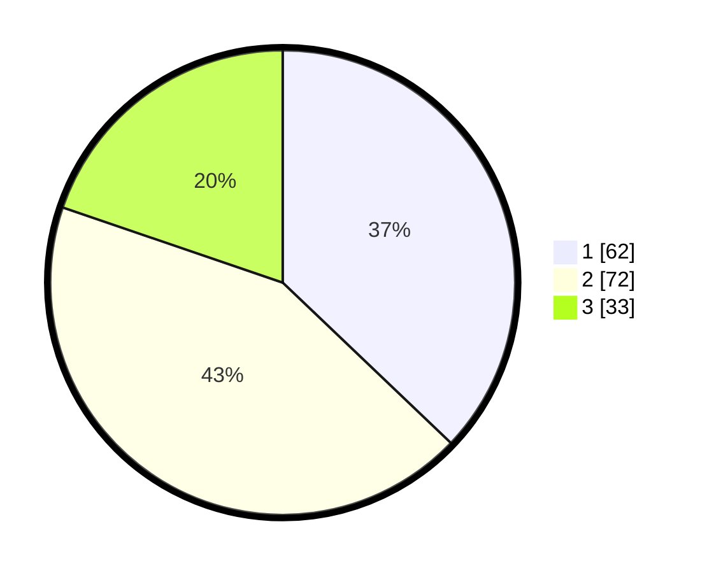

# Hasil

## Grafik

## Tabel

| No. | Nama Paslon    | Suara | Suara (raw) | Persentase |
|:--- |:-------------- | -----:| -----------:| ----------:|
| 1   | ANIES MUHAIMIN | 62    | [62][p-1]   | 37,13      |
| 2   | PRABOWO GIBRAN | 72    | [72][p-2]   | 43,11      |
| 3   | GANJAR MAHFUD  | 33    | [33][p-3]   | 19,76      |

[p-1]: https://github.com/gigit-pemilu/pemilu-2024/blob/main/pilpres/hitung-suara/sub/12-sumatera-utara/sub/71-kota-medan/sub/08-medan-belawan/sub/1001-belawan-i/sub/002-tps/sub/paslon-1.txt
[p-2]: https://github.com/gigit-pemilu/pemilu-2024/blob/main/pilpres/hitung-suara/sub/12-sumatera-utara/sub/71-kota-medan/sub/08-medan-belawan/sub/1001-belawan-i/sub/002-tps/sub/paslon-2.txt
[p-3]: https://github.com/gigit-pemilu/pemilu-2024/blob/main/pilpres/hitung-suara/sub/12-sumatera-utara/sub/71-kota-medan/sub/08-medan-belawan/sub/1001-belawan-i/sub/002-tps/sub/paslon-3.txt

## Foto C Plano

https://sirekap-obj-formc.kpu.go.id/d661/pemilu/ppwp/12/71/08/10/01/1271081001002-20240215-003812--3c502ea4-7ebb-418e-a857-63d77efd0940.jpg

https://sirekap-obj-formc.kpu.go.id/d661/pemilu/ppwp/12/71/08/10/01/1271081001002-20240215-003947--d31873e9-d2c0-4681-a3c9-20a25b12fc04.jpg

https://sirekap-obj-formc.kpu.go.id/d661/pemilu/ppwp/12/71/08/10/01/1271081001002-20240215-004031--d379ca60-fe8c-4613-95a0-de77de9dc205.jpg

## Metadata

| Key        | Value               |
| ---------- | ------------------- |
| Time Stamp | 2024-02-25 16:00:00 |

