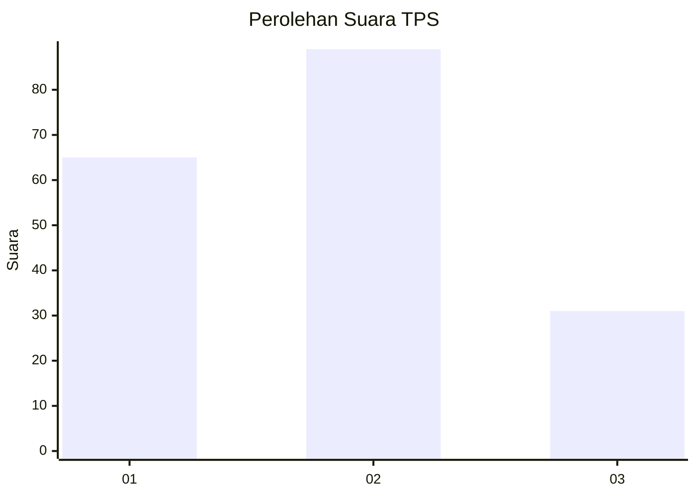
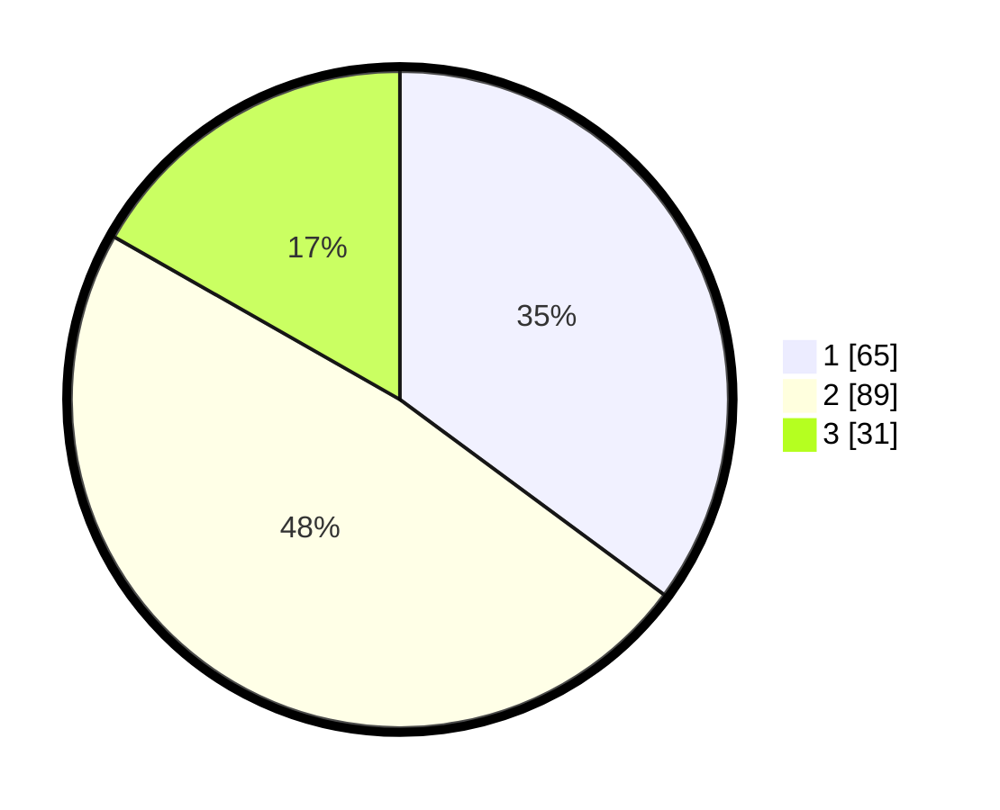

# Hasil

## Grafik

## Tabel

| No. | Nama Paslon    | Suara | Suara (raw) | Persentase |
|:--- |:-------------- | -----:| -----------:| ----------:|
| 1   | ANIES MUHAIMIN | 65    | [65][p-1]   | 35,14      |
| 2   | PRABOWO GIBRAN | 89    | [89][p-2]   | 48,11      |
| 3   | GANJAR MAHFUD  | 31    | [31][p-3]   | 16,76      |

[p-1]: https://github.com/gigit-pemilu/pemilu-2024/blob/main/pilpres/hitung-suara/sub/12-sumatera-utara/sub/71-kota-medan/sub/08-medan-belawan/sub/1001-belawan-i/sub/003-tps/sub/paslon-1.txt
[p-2]: https://github.com/gigit-pemilu/pemilu-2024/blob/main/pilpres/hitung-suara/sub/12-sumatera-utara/sub/71-kota-medan/sub/08-medan-belawan/sub/1001-belawan-i/sub/003-tps/sub/paslon-2.txt
[p-3]: https://github.com/gigit-pemilu/pemilu-2024/blob/main/pilpres/hitung-suara/sub/12-sumatera-utara/sub/71-kota-medan/sub/08-medan-belawan/sub/1001-belawan-i/sub/003-tps/sub/paslon-3.txt

## Foto C Plano

https://sirekap-obj-formc.kpu.go.id/d52c/pemilu/ppwp/12/71/08/10/01/1271081001003-20240214-200120--898f1ca1-a057-4bdc-8393-fa08d98edd11.jpg

https://sirekap-obj-formc.kpu.go.id/d52c/pemilu/ppwp/12/71/08/10/01/1271081001003-20240214-200223--4f4242b6-1bc0-4bf3-9f0a-e74dd33d0584.jpg

https://sirekap-obj-formc.kpu.go.id/d52c/pemilu/ppwp/12/71/08/10/01/1271081001003-20240214-200553--7a4b6439-b741-4a02-acfb-5301ca4b4eb4.jpg

## Metadata

| Key        | Value               |
| ---------- | ------------------- |
| Time Stamp | 2024-02-16 23:30:00 |

