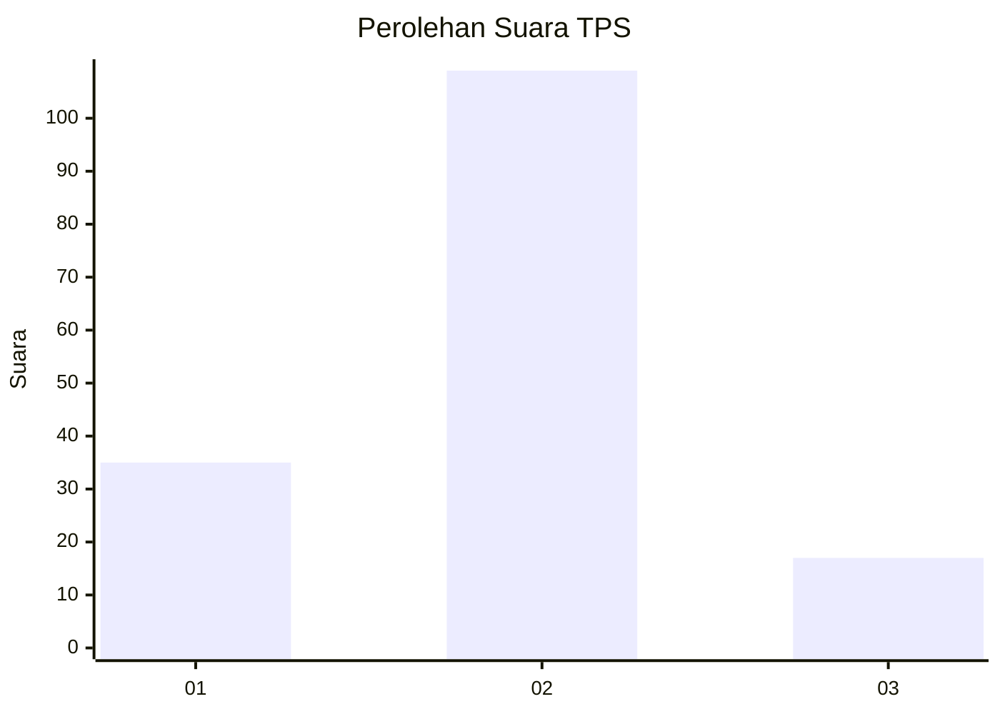

# Hasil

## Grafik

## Tabel

| No. | Nama Paslon    | Suara | Suara (raw) | Persentase |
|:--- |:-------------- | -----:| -----------:| ----------:|
| 1   | ANIES MUHAIMIN | 35    | [35][p-1]   | 21,74      |
| 2   | PRABOWO GIBRAN | 109   | [109][p-2]  | 67,70      |
| 3   | GANJAR MAHFUD  | 17    | [17][p-3]   | 10,56      |

[p-1]: https://github.com/gigit-pemilu/pemilu-2024/blob/main/pilpres/hitung-suara/sub/12-sumatera-utara/sub/71-kota-medan/sub/08-medan-belawan/sub/1001-belawan-i/sub/006-tps/sub/paslon-1.txt
[p-2]: https://github.com/gigit-pemilu/pemilu-2024/blob/main/pilpres/hitung-suara/sub/12-sumatera-utara/sub/71-kota-medan/sub/08-medan-belawan/sub/1001-belawan-i/sub/006-tps/sub/paslon-2.txt
[p-3]: https://github.com/gigit-pemilu/pemilu-2024/blob/main/pilpres/hitung-suara/sub/12-sumatera-utara/sub/71-kota-medan/sub/08-medan-belawan/sub/1001-belawan-i/sub/006-tps/sub/paslon-3.txt

## Foto C Plano

https://sirekap-obj-formc.kpu.go.id/776d/pemilu/ppwp/12/71/08/10/01/1271081001006-20240215-010307--a97df0d6-7d91-450c-bd42-38b466337662.jpg

https://sirekap-obj-formc.kpu.go.id/776d/pemilu/ppwp/12/71/08/10/01/1271081001006-20240215-010420--96533655-0a7f-4997-8c7c-bfc34d5f8362.jpg

https://sirekap-obj-formc.kpu.go.id/776d/pemilu/ppwp/12/71/08/10/01/1271081001006-20240215-010703--24d47981-00fa-4d28-9673-6836556880e6.jpg

## Metadata

| Key        | Value               |
| ---------- | ------------------- |
| Time Stamp | 2024-02-24 22:31:28 |

