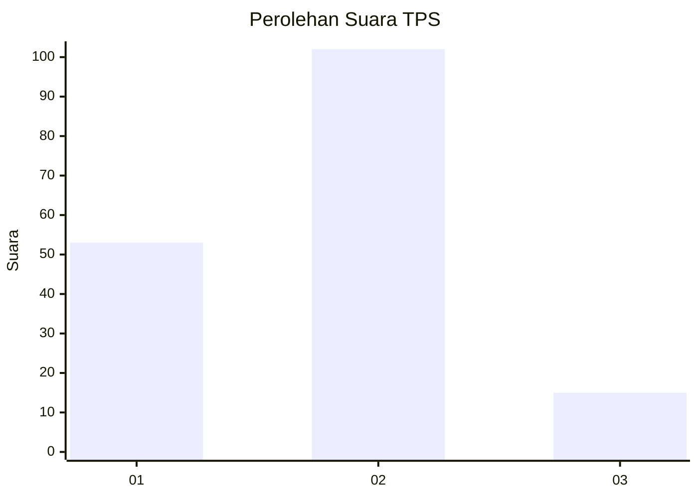
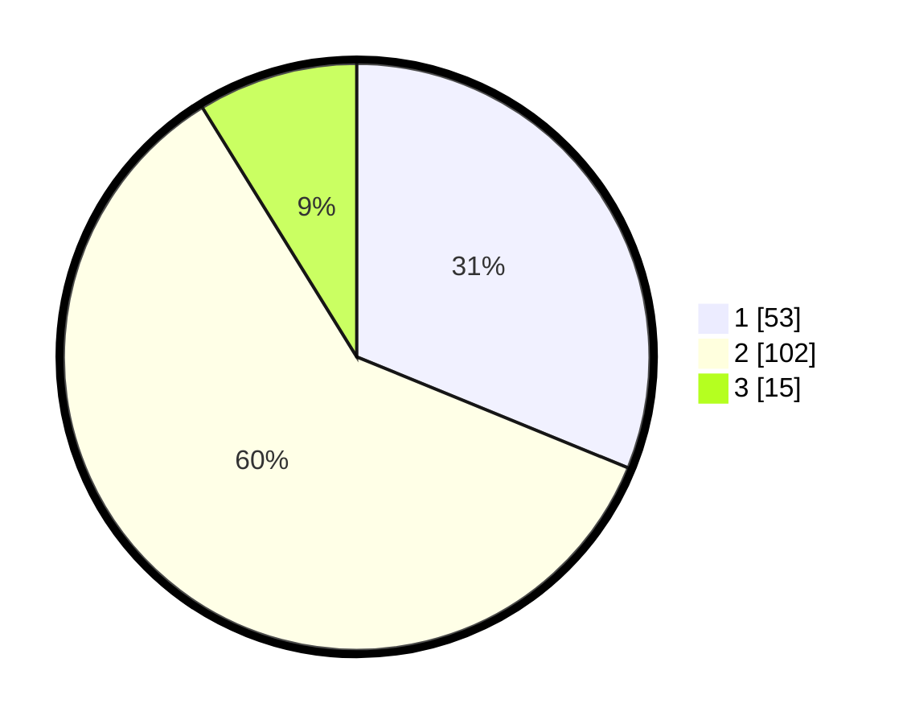

# Hasil

## Grafik

## Tabel

| No. | Nama Paslon    | Suara | Suara (raw) | Persentase |
|:--- |:-------------- | -----:| -----------:| ----------:|
| 1   | ANIES MUHAIMIN | 53    | [53][p-1]   | 31,18      |
| 2   | PRABOWO GIBRAN | 102   | [102][p-2]  | 60,00      |
| 3   | GANJAR MAHFUD  | 15    | [15][p-3]   | 8,82       |

[p-1]: https://github.com/gigit-pemilu/pemilu-2024-12-sumatera-utara/blob/main/pilpres/hitung-suara/sub/12-sumatera-utara/sub/71-kota-medan/sub/08-medan-belawan/sub/1001-belawan-i/sub/007-tps/sub/paslon-1.txt
[p-2]: https://github.com/gigit-pemilu/pemilu-2024-12-sumatera-utara/blob/main/pilpres/hitung-suara/sub/12-sumatera-utara/sub/71-kota-medan/sub/08-medan-belawan/sub/1001-belawan-i/sub/007-tps/sub/paslon-2.txt
[p-3]: https://github.com/gigit-pemilu/pemilu-2024-12-sumatera-utara/blob/main/pilpres/hitung-suara/sub/12-sumatera-utara/sub/71-kota-medan/sub/08-medan-belawan/sub/1001-belawan-i/sub/007-tps/sub/paslon-3.txt

## Foto C Plano

https://sirekap-obj-formc.kpu.go.id/9106/pemilu/ppwp/12/71/08/10/01/1271081001007-20240214-192728--aed93cff-a3bf-451a-9a3e-bd9201954483.jpg

https://sirekap-obj-formc.kpu.go.id/9106/pemilu/ppwp/12/71/08/10/01/1271081001007-20240214-192419--d7d12c7b-61b9-4316-9b5a-ef3ff035363a.jpg

https://sirekap-obj-formc.kpu.go.id/9106/pemilu/ppwp/12/71/08/10/01/1271081001007-20240214-192530--450987cc-d329-4995-bc98-68af53395f64.jpg

## Metadata

| Key        | Value               |
| ---------- | ------------------- |
| Time Stamp | 2024-02-24 22:31:28 |

