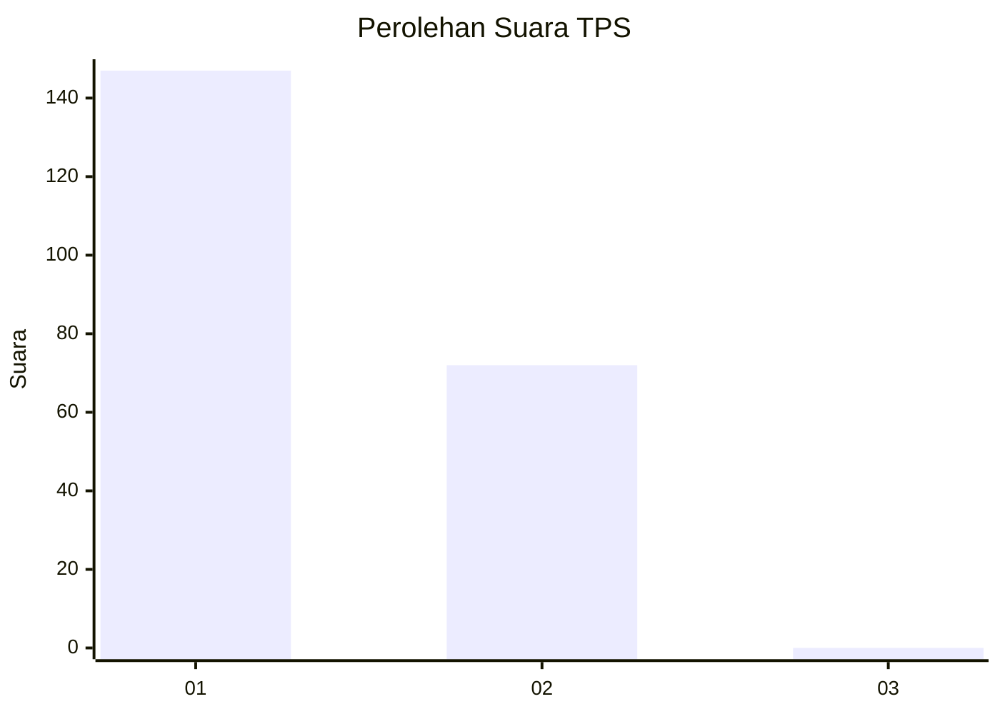
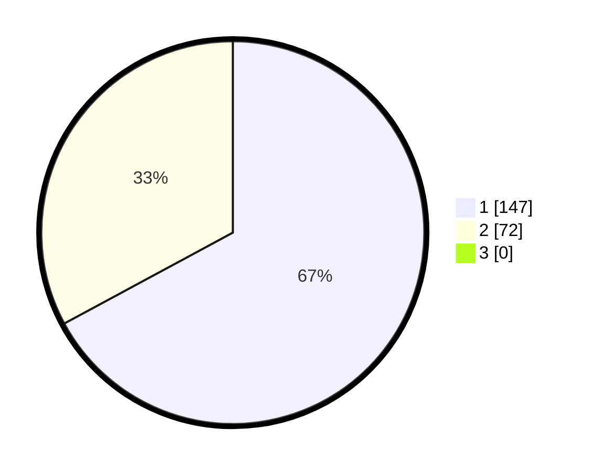

# Hasil

## Grafik

## Tabel

| No. | Nama Paslon    | Suara | Suara (raw) | Persentase |
|:--- |:-------------- | -----:| -----------:| ----------:|
| 1   | ANIES MUHAIMIN | 147   | [147][p-1]  | 67,12      |
| 2   | PRABOWO GIBRAN | 72    | [72][p-2]   | 32,88      |
| 3   | GANJAR MAHFUD  | 0     | [0][p-3]    | 0,00       |

[p-1]: https://github.com/gigit-pemilu/pemilu-2024-12-sumatera-utara/blob/main/pilpres/hitung-suara/sub/12-sumatera-utara/sub/71-kota-medan/sub/08-medan-belawan/sub/1001-belawan-i/sub/038-tps/sub/paslon-1.txt
[p-2]: https://github.com/gigit-pemilu/pemilu-2024-12-sumatera-utara/blob/main/pilpres/hitung-suara/sub/12-sumatera-utara/sub/71-kota-medan/sub/08-medan-belawan/sub/1001-belawan-i/sub/038-tps/sub/paslon-2.txt
[p-3]: https://github.com/gigit-pemilu/pemilu-2024-12-sumatera-utara/blob/main/pilpres/hitung-suara/sub/12-sumatera-utara/sub/71-kota-medan/sub/08-medan-belawan/sub/1001-belawan-i/sub/038-tps/sub/paslon-3.txt

## Foto C Plano

https://sirekap-obj-formc.kpu.go.id/91b3/pemilu/ppwp/12/71/08/10/01/1271081001038-20240214-232132--979fc466-f4a3-4127-8f03-2ef5340a24b3.jpg

https://sirekap-obj-formc.kpu.go.id/91b3/pemilu/ppwp/12/71/08/10/01/1271081001038-20240214-232429--5777304b-82b1-4ddc-bdba-cb8639fcf545.jpg

https://sirekap-obj-formc.kpu.go.id/91b3/pemilu/ppwp/12/71/08/10/01/1271081001038-20240214-232543--ed7554ee-e19b-4f99-a524-e224cddc009a.jpg

## Metadata

| Key        | Value               |
| ---------- | ------------------- |
| Time Stamp | 2024-02-24 22:31:28 |

