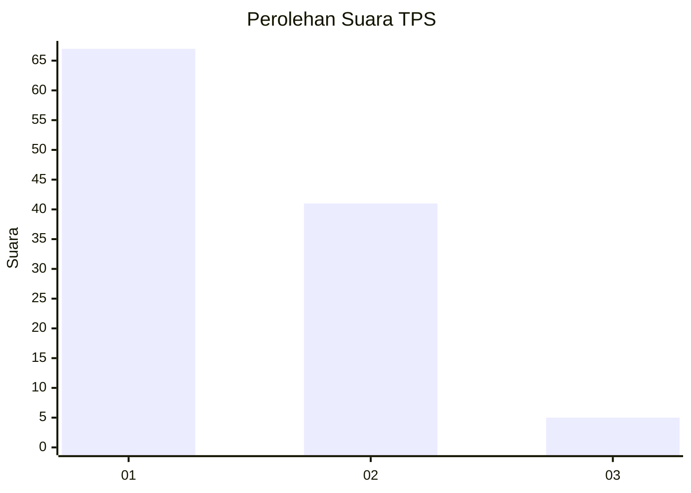
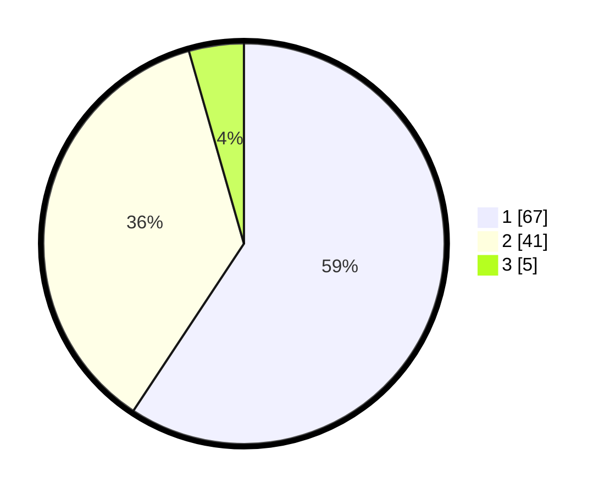

# Hasil

## Grafik

## Tabel

| No. | Nama Paslon    | Suara | Suara (raw) | Persentase |
|:--- |:-------------- | -----:| -----------:| ----------:|
| 1   | ANIES MUHAIMIN | 67    | [67][p-1]   | 59,29      |
| 2   | PRABOWO GIBRAN | 41    | [41][p-2]   | 36,28      |
| 3   | GANJAR MAHFUD  | 5     | [5][p-3]    | 4,42       |

[p-1]: https://github.com/gigit-pemilu/pemilu-2024/blob/main/pilpres/hitung-suara/sub/12-sumatera-utara/sub/71-kota-medan/sub/08-medan-belawan/sub/1001-belawan-i/sub/052-tps/sub/paslon-1.txt
[p-2]: https://github.com/gigit-pemilu/pemilu-2024/blob/main/pilpres/hitung-suara/sub/12-sumatera-utara/sub/71-kota-medan/sub/08-medan-belawan/sub/1001-belawan-i/sub/052-tps/sub/paslon-2.txt
[p-3]: https://github.com/gigit-pemilu/pemilu-2024/blob/main/pilpres/hitung-suara/sub/12-sumatera-utara/sub/71-kota-medan/sub/08-medan-belawan/sub/1001-belawan-i/sub/052-tps/sub/paslon-3.txt

## Foto C Plano

https://sirekap-obj-formc.kpu.go.id/e178/pemilu/ppwp/12/71/08/10/01/1271081001052-20240214-222939--7826e024-7839-429f-bd6c-62427bb225f4.jpg

https://sirekap-obj-formc.kpu.go.id/e178/pemilu/ppwp/12/71/08/10/01/1271081001052-20240214-211419--bb96f996-1857-4a77-8459-0fa11b36c189.jpg

https://sirekap-obj-formc.kpu.go.id/e178/pemilu/ppwp/12/71/08/10/01/1271081001052-20240214-223049--d32828ee-71da-40d8-98a5-fff389379aa8.jpg

## Metadata

| Key        | Value               |
| ---------- | ------------------- |
| Time Stamp | 2024-02-15 09:00:24 |

