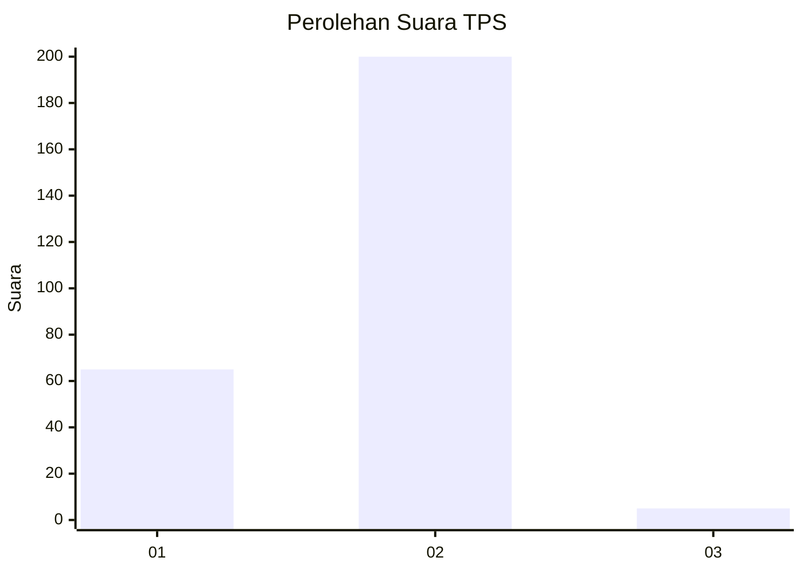
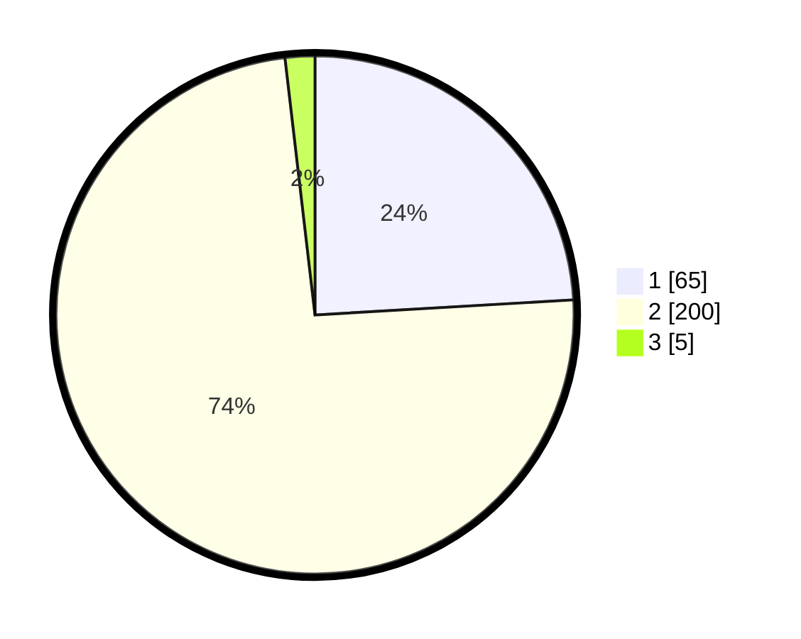

# Hasil

## Grafik

## Tabel

| No. | Nama Paslon    | Suara | Suara (raw) | Persentase |
|:--- |:-------------- | -----:| -----------:| ----------:|
| 1   | ANIES MUHAIMIN | 65    | [65][p-1]   | 24,07      |
| 2   | PRABOWO GIBRAN | 200   | [200][p-2]  | 74,07      |
| 3   | GANJAR MAHFUD  | 5     | [5][p-3]    | 1,85       |

[p-1]: https://github.com/gigit-pemilu/pemilu-2024-12-sumatera-utara/blob/main/pilpres/hitung-suara/sub/12-sumatera-utara/sub/71-kota-medan/sub/08-medan-belawan/sub/1002-belawan-ii/sub/007-tps/sub/paslon-1.txt
[p-2]: https://github.com/gigit-pemilu/pemilu-2024-12-sumatera-utara/blob/main/pilpres/hitung-suara/sub/12-sumatera-utara/sub/71-kota-medan/sub/08-medan-belawan/sub/1002-belawan-ii/sub/007-tps/sub/paslon-2.txt
[p-3]: https://github.com/gigit-pemilu/pemilu-2024-12-sumatera-utara/blob/main/pilpres/hitung-suara/sub/12-sumatera-utara/sub/71-kota-medan/sub/08-medan-belawan/sub/1002-belawan-ii/sub/007-tps/sub/paslon-3.txt

## Foto C Plano

https://sirekap-obj-formc.kpu.go.id/7af7/pemilu/ppwp/12/71/08/10/02/1271081002007-20240214-212105--6ba1b868-7d01-48d4-8474-e33636906ab3.jpg

https://sirekap-obj-formc.kpu.go.id/7af7/pemilu/ppwp/12/71/08/10/02/1271081002007-20240215-011100--90b79b92-1977-4f97-89c9-79614784924c.jpg

https://sirekap-obj-formc.kpu.go.id/7af7/pemilu/ppwp/12/71/08/10/02/1271081002007-20240214-212630--194c585b-5683-497e-8ded-2e184cf9ba56.jpg

## Metadata

| Key        | Value               |
| ---------- | ------------------- |
| Time Stamp | 2024-02-25 00:00:00 |

