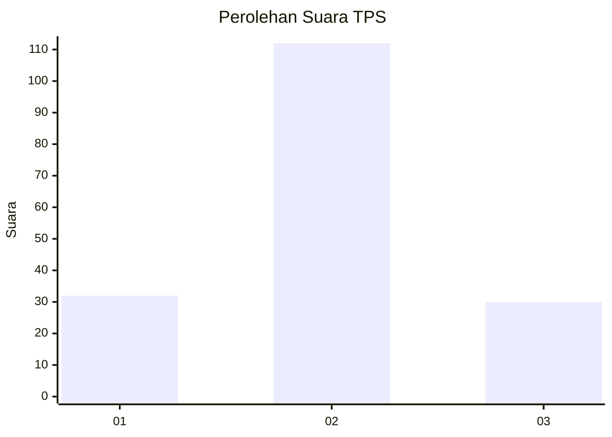
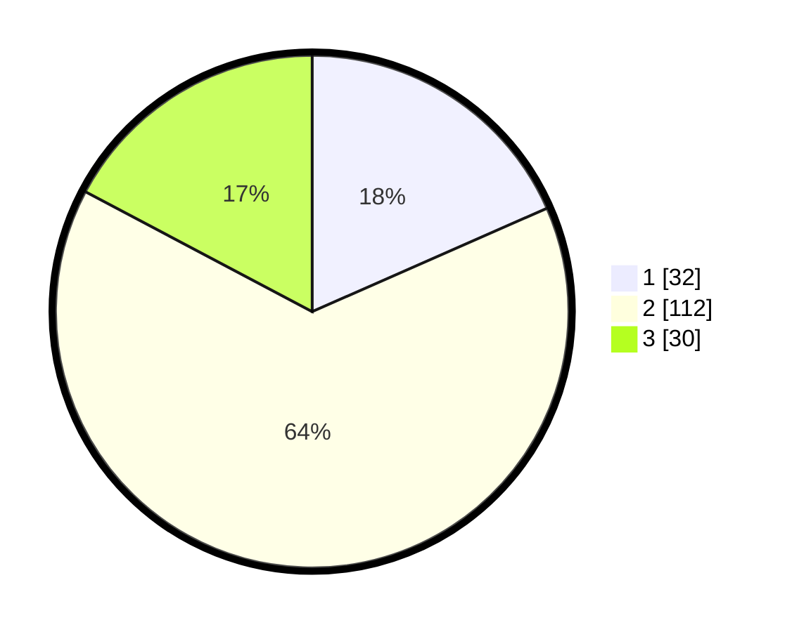

# Hasil

## Grafik

## Tabel

| No. | Nama Paslon    | Suara | Suara (raw) | Persentase |
|:--- |:-------------- | -----:| -----------:| ----------:|
| 1   | ANIES MUHAIMIN | 32    | [32][p-1]   | 18,39      |
| 2   | PRABOWO GIBRAN | 112   | [112][p-2]  | 64,37      |
| 3   | GANJAR MAHFUD  | 30    | [30][p-3]   | 17,24      |

[p-1]: https://github.com/gigit-pemilu/pemilu-2024/blob/main/pilpres/hitung-suara/sub/12-sumatera-utara/sub/71-kota-medan/sub/08-medan-belawan/sub/1003-belawan-bahagia/sub/004-tps/sub/paslon-1.txt
[p-2]: https://github.com/gigit-pemilu/pemilu-2024/blob/main/pilpres/hitung-suara/sub/12-sumatera-utara/sub/71-kota-medan/sub/08-medan-belawan/sub/1003-belawan-bahagia/sub/004-tps/sub/paslon-2.txt
[p-3]: https://github.com/gigit-pemilu/pemilu-2024/blob/main/pilpres/hitung-suara/sub/12-sumatera-utara/sub/71-kota-medan/sub/08-medan-belawan/sub/1003-belawan-bahagia/sub/004-tps/sub/paslon-3.txt

## Foto C Plano

https://sirekap-obj-formc.kpu.go.id/ae2b/pemilu/ppwp/12/71/08/10/03/1271081003004-20240214-214510--0b6ad145-6637-4a43-8124-b357b5adfb48.jpg

https://sirekap-obj-formc.kpu.go.id/ae2b/pemilu/ppwp/12/71/08/10/03/1271081003004-20240214-211609--a02d5a0e-9d53-446c-9f56-cf3bdc0be664.jpg

https://sirekap-obj-formc.kpu.go.id/ae2b/pemilu/ppwp/12/71/08/10/03/1271081003004-20240214-215120--3170267e-42cb-49be-a3dd-b186284fcd0d.jpg

## Metadata

| Key        | Value               |
| ---------- | ------------------- |
| Time Stamp | 2024-02-25 00:00:00 |

