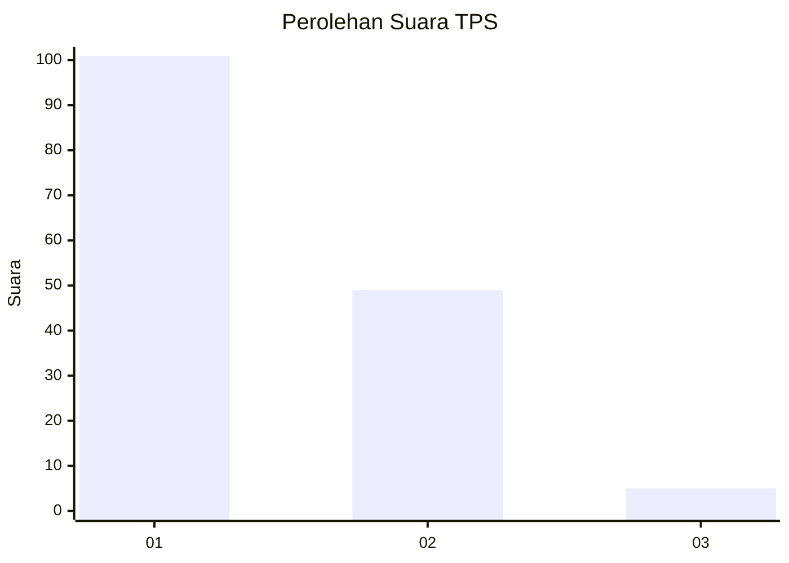
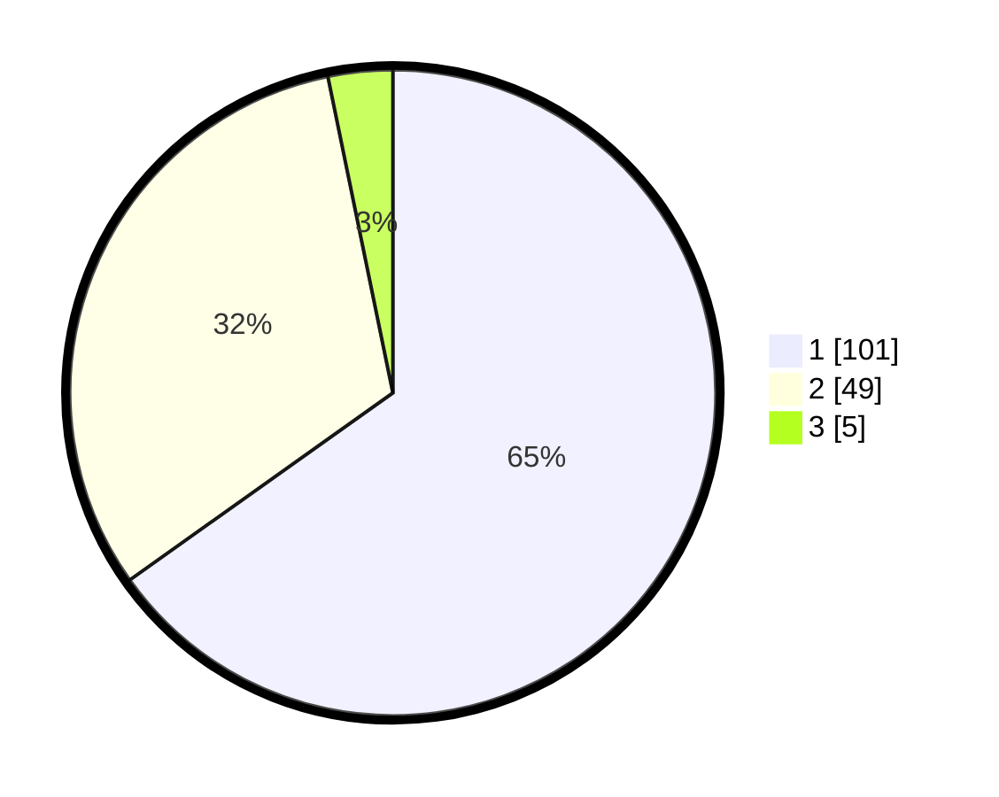

# Hasil

## Grafik

## Tabel

| No. | Nama Paslon    | Suara | Suara (raw) | Persentase |
|:--- |:-------------- | -----:| -----------:| ----------:|
| 1   | ANIES MUHAIMIN | 101   | [101][p-1]  | 65,16      |
| 2   | PRABOWO GIBRAN | 49    | [49][p-2]   | 31,61      |
| 3   | GANJAR MAHFUD  | 5     | [5][p-3]    | 3,23       |

[p-1]: https://github.com/gigit-pemilu/pemilu-2024/blob/main/pilpres/hitung-suara/sub/12-sumatera-utara/sub/71-kota-medan/sub/08-medan-belawan/sub/1003-belawan-bahagia/sub/023-tps/sub/paslon-1.txt
[p-2]: https://github.com/gigit-pemilu/pemilu-2024/blob/main/pilpres/hitung-suara/sub/12-sumatera-utara/sub/71-kota-medan/sub/08-medan-belawan/sub/1003-belawan-bahagia/sub/023-tps/sub/paslon-2.txt
[p-3]: https://github.com/gigit-pemilu/pemilu-2024/blob/main/pilpres/hitung-suara/sub/12-sumatera-utara/sub/71-kota-medan/sub/08-medan-belawan/sub/1003-belawan-bahagia/sub/023-tps/sub/paslon-3.txt

## Foto C Plano

https://sirekap-obj-formc.kpu.go.id/d046/pemilu/ppwp/12/71/08/10/03/1271081003023-20240215-060043--d925edf7-468d-4b84-9efe-a7f0631b5c43.jpg

https://sirekap-obj-formc.kpu.go.id/d046/pemilu/ppwp/12/71/08/10/03/1271081003023-20240215-060228--34a89fed-e667-4a9f-a5fa-08267d8a0d77.jpg

https://sirekap-obj-formc.kpu.go.id/d046/pemilu/ppwp/12/71/08/10/03/1271081003023-20240214-212137--bd16827f-b650-4949-9e87-ed29211a6cb1.jpg

## Metadata

| Key        | Value               |
| ---------- | ------------------- |
| Time Stamp | 2024-02-15 18:30:25 |

