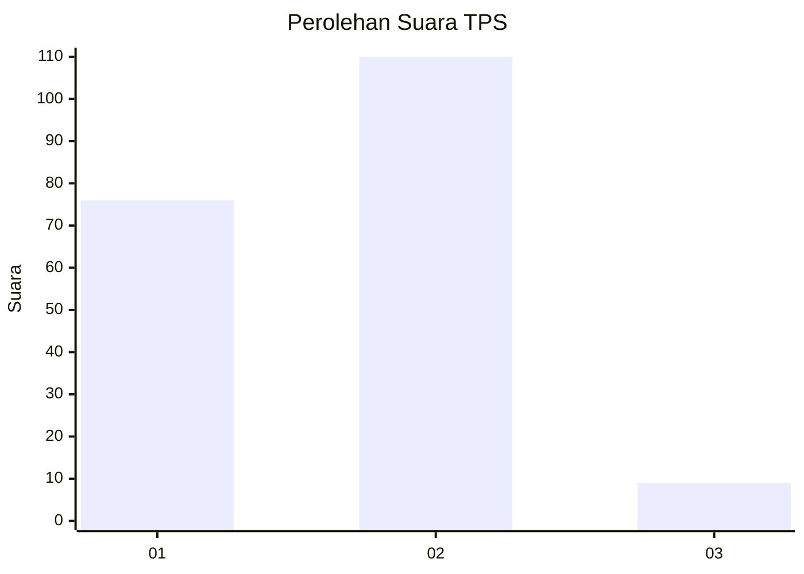
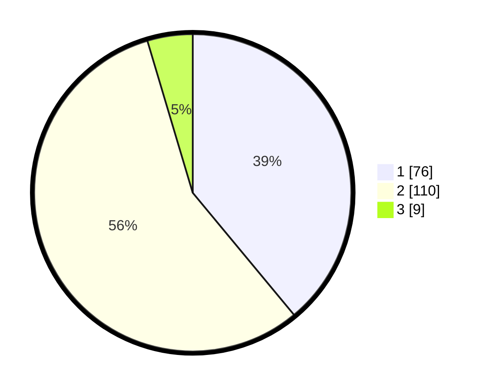

# Hasil

## Grafik

## Tabel

| No. | Nama Paslon    | Suara | Suara (raw) | Persentase |
|:--- |:-------------- | -----:| -----------:| ----------:|
| 1   | ANIES MUHAIMIN | 76    | [76][p-1]   | 38,97      |
| 2   | PRABOWO GIBRAN | 110   | [110][p-2]  | 56,41      |
| 3   | GANJAR MAHFUD  | 9     | [9][p-3]    | 4,62       |

[p-1]: https://github.com/gigit-pemilu/pemilu-2024/blob/main/pilpres/hitung-suara/sub/12-sumatera-utara/sub/71-kota-medan/sub/09-medan-amplas/sub/1001-amplas/sub/004-tps/sub/paslon-1.txt
[p-2]: https://github.com/gigit-pemilu/pemilu-2024/blob/main/pilpres/hitung-suara/sub/12-sumatera-utara/sub/71-kota-medan/sub/09-medan-amplas/sub/1001-amplas/sub/004-tps/sub/paslon-2.txt
[p-3]: https://github.com/gigit-pemilu/pemilu-2024/blob/main/pilpres/hitung-suara/sub/12-sumatera-utara/sub/71-kota-medan/sub/09-medan-amplas/sub/1001-amplas/sub/004-tps/sub/paslon-3.txt

## Foto C Plano

https://sirekap-obj-formc.kpu.go.id/dd0c/pemilu/ppwp/12/71/09/10/01/1271091001004-20240214-155452--e0600d11-815c-4619-a528-f86a4dc9a49d.jpg

https://sirekap-obj-formc.kpu.go.id/dd0c/pemilu/ppwp/12/71/09/10/01/1271091001004-20240214-155214--2f70634a-a607-4e5f-9a2b-3959fa9a40d2.jpg

https://sirekap-obj-formc.kpu.go.id/dd0c/pemilu/ppwp/12/71/09/10/01/1271091001004-20240214-155720--233edf12-1e9d-4e8c-badf-e4ac1bc38215.jpg

## Metadata

| Key        | Value               |
| ---------- | ------------------- |
| Time Stamp | 2024-02-16 00:00:26 |

