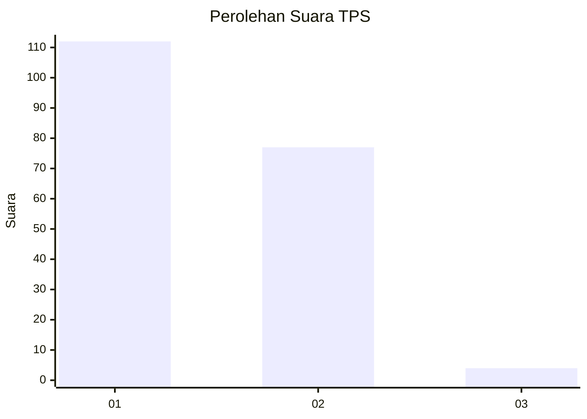
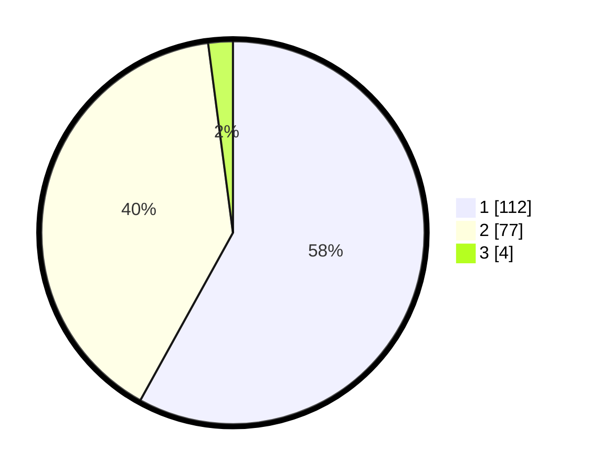

# Hasil

## Grafik

## Tabel

| No. | Nama Paslon    | Suara | Suara (raw) | Persentase |
|:--- |:-------------- | -----:| -----------:| ----------:|
| 1   | ANIES MUHAIMIN | 112   | [112][p-1]  | 58,03      |
| 2   | PRABOWO GIBRAN | 77    | [77][p-2]   | 39,90      |
| 3   | GANJAR MAHFUD  | 4     | [4][p-3]    | 2,07       |

[p-1]: https://github.com/gigit-pemilu/pemilu-2024-12-sumatera-utara/blob/main/pilpres/hitung-suara/sub/12-sumatera-utara/sub/71-kota-medan/sub/09-medan-amplas/sub/1001-amplas/sub/016-tps/sub/paslon-1.txt
[p-2]: https://github.com/gigit-pemilu/pemilu-2024-12-sumatera-utara/blob/main/pilpres/hitung-suara/sub/12-sumatera-utara/sub/71-kota-medan/sub/09-medan-amplas/sub/1001-amplas/sub/016-tps/sub/paslon-2.txt
[p-3]: https://github.com/gigit-pemilu/pemilu-2024-12-sumatera-utara/blob/main/pilpres/hitung-suara/sub/12-sumatera-utara/sub/71-kota-medan/sub/09-medan-amplas/sub/1001-amplas/sub/016-tps/sub/paslon-3.txt

## Foto C Plano

https://sirekap-obj-formc.kpu.go.id/41b3/pemilu/ppwp/12/71/09/10/01/1271091001016-20240215-031915--568a3504-6712-40dc-95a8-fcd99d444322.jpg

https://sirekap-obj-formc.kpu.go.id/41b3/pemilu/ppwp/12/71/09/10/01/1271091001016-20240215-031705--35042e0b-1714-4063-af5f-1a8601172b23.jpg

https://sirekap-obj-formc.kpu.go.id/41b3/pemilu/ppwp/12/71/09/10/01/1271091001016-20240215-031053--deb1b48a-a5de-449a-ab26-3896846ffac2.jpg

## Metadata

| Key        | Value               |
| ---------- | ------------------- |
| Time Stamp | 2024-02-26 00:00:00 |

