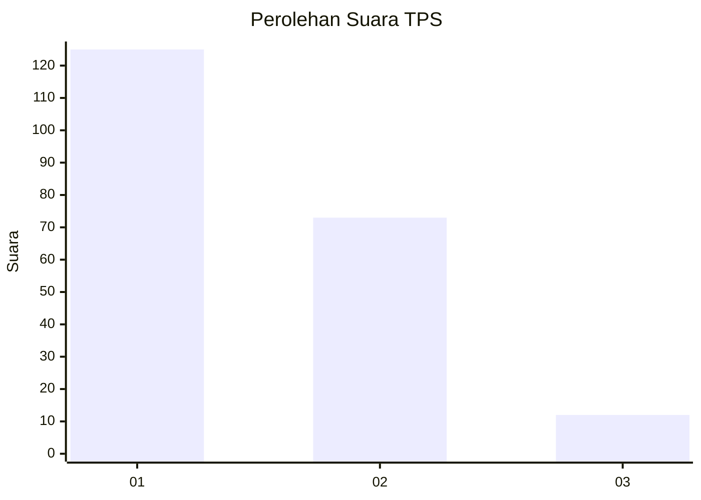
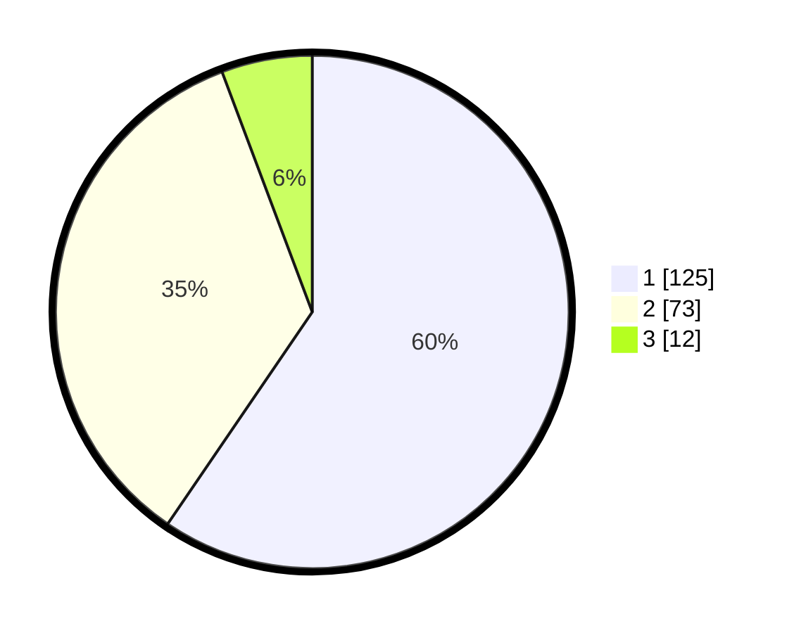

# Hasil

## Grafik

## Tabel

| No. | Nama Paslon    | Suara | Suara (raw) | Persentase |
|:--- |:-------------- | -----:| -----------:| ----------:|
| 1   | ANIES MUHAIMIN | 125   | [125][p-1]  | 59,52      |
| 2   | PRABOWO GIBRAN | 73    | [73][p-2]   | 34,76      |
| 3   | GANJAR MAHFUD  | 12    | [12][p-3]   | 5,71       |

[p-1]: https://github.com/gigit-pemilu/pemilu-2024-12-sumatera-utara/blob/main/pilpres/hitung-suara/sub/12-sumatera-utara/sub/71-kota-medan/sub/09-medan-amplas/sub/1001-amplas/sub/022-tps/sub/paslon-1.txt
[p-2]: https://github.com/gigit-pemilu/pemilu-2024-12-sumatera-utara/blob/main/pilpres/hitung-suara/sub/12-sumatera-utara/sub/71-kota-medan/sub/09-medan-amplas/sub/1001-amplas/sub/022-tps/sub/paslon-2.txt
[p-3]: https://github.com/gigit-pemilu/pemilu-2024-12-sumatera-utara/blob/main/pilpres/hitung-suara/sub/12-sumatera-utara/sub/71-kota-medan/sub/09-medan-amplas/sub/1001-amplas/sub/022-tps/sub/paslon-3.txt

## Foto C Plano

https://sirekap-obj-formc.kpu.go.id/dc63/pemilu/ppwp/12/71/09/10/01/1271091001022-20240215-144156--84c58fee-cd06-486d-be6d-692ee72b4247.jpg

https://sirekap-obj-formc.kpu.go.id/dc63/pemilu/ppwp/12/71/09/10/01/1271091001022-20240215-004136--6d83b518-361a-4c8f-a6a1-1a8299eefba0.jpg

https://sirekap-obj-formc.kpu.go.id/dc63/pemilu/ppwp/12/71/09/10/01/1271091001022-20240215-004509--ebf75879-6a1f-4cef-9d10-6205a8dcc3b7.jpg

## Metadata

| Key        | Value               |
| ---------- | ------------------- |
| Time Stamp | 2024-02-25 13:00:00 |

