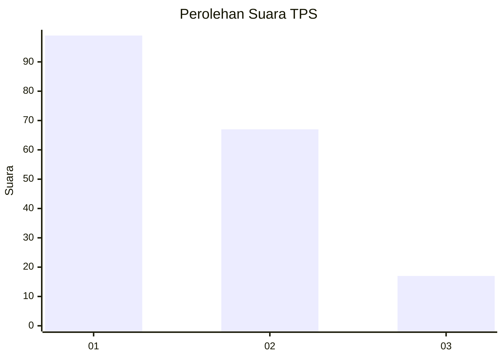
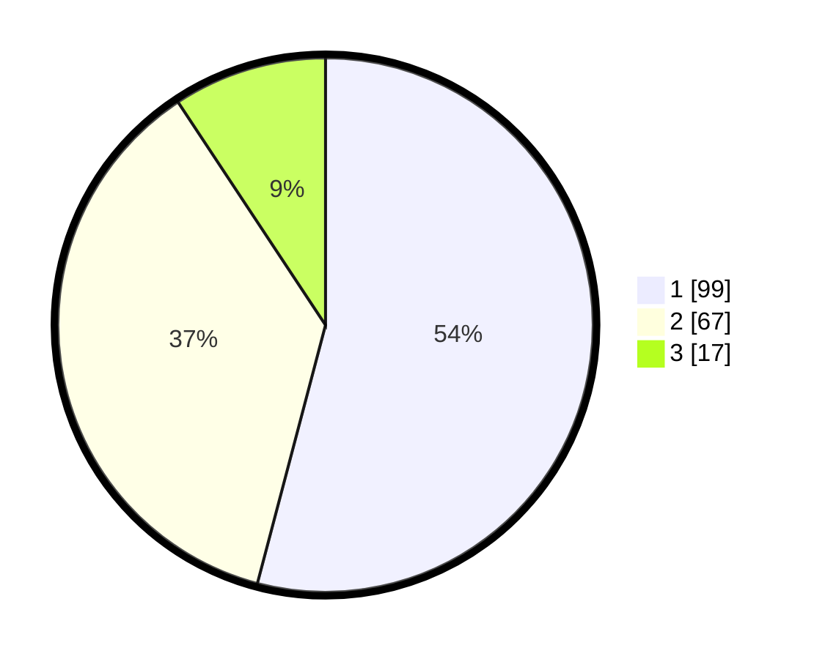

# Hasil

## Grafik

## Tabel

| No. | Nama Paslon    | Suara | Suara (raw) | Persentase |
|:--- |:-------------- | -----:| -----------:| ----------:|
| 1   | ANIES MUHAIMIN | 99    | [99][p-1]   | 54,10      |
| 2   | PRABOWO GIBRAN | 67    | [67][p-2]   | 36,61      |
| 3   | GANJAR MAHFUD  | 17    | [17][p-3]   | 9,29       |

[p-1]: https://github.com/gigit-pemilu/pemilu-2024/blob/main/pilpres/hitung-suara/sub/12-sumatera-utara/sub/71-kota-medan/sub/09-medan-amplas/sub/1001-amplas/sub/023-tps/sub/paslon-1.txt
[p-2]: https://github.com/gigit-pemilu/pemilu-2024/blob/main/pilpres/hitung-suara/sub/12-sumatera-utara/sub/71-kota-medan/sub/09-medan-amplas/sub/1001-amplas/sub/023-tps/sub/paslon-2.txt
[p-3]: https://github.com/gigit-pemilu/pemilu-2024/blob/main/pilpres/hitung-suara/sub/12-sumatera-utara/sub/71-kota-medan/sub/09-medan-amplas/sub/1001-amplas/sub/023-tps/sub/paslon-3.txt

## Foto C Plano

https://sirekap-obj-formc.kpu.go.id/8a76/pemilu/ppwp/12/71/09/10/01/1271091001023-20240214-221513--0b9e7d27-f091-40fe-968e-b092366b426d.jpg

https://sirekap-obj-formc.kpu.go.id/8a76/pemilu/ppwp/12/71/09/10/01/1271091001023-20240214-221625--99782628-48ee-4268-b732-3e4165b6651f.jpg

https://sirekap-obj-formc.kpu.go.id/8a76/pemilu/ppwp/12/71/09/10/01/1271091001023-20240214-221742--39d95046-f6c0-4062-ba7a-20515db6847a.jpg

## Metadata

| Key        | Value               |
| ---------- | ------------------- |
| Time Stamp | 2024-02-25 12:00:00 |

